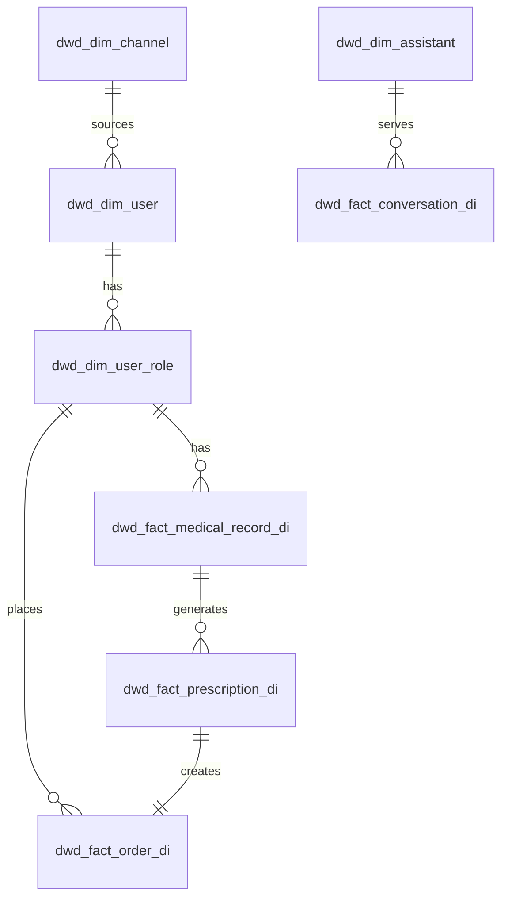

# DWD / DWS 模型清单与字段说明

> **粒度**：交易与健康事实以 **`role_id`** 为主；`user_id` 冗余在事实表便于账号级分析。  
> **关联**：[指标与维度字典](./2026-05-14-指标与维度字典.md)、[context/5. 数据模型与业务对象.md](../../context/公司业务信息/5.%20数据模型与业务对象.md)

---

## 一、DWD 维度表

| 逻辑表名 | 物理名（建议） | 主键 | 核心字段 | 来源 ODS |
|----------|----------------|------|----------|----------|
| 用户维 | `dwd_dim_user` | user_id | wework_id, union_id, channel_id, first_contact_at, last_active_at, status | ods_core_user |
| 角色维 | `dwd_dim_user_role` | role_id | user_id, role_name, relationship, health_tags, gender, birthday, status | ods_core_user_role |
| 渠道维 | `dwd_dim_channel` | channel_id | channel_code, channel_name, channel_type, cost_model | ods_core_channel |
| 医助维 | `dwd_dim_assistant` | assistant_id | name, team_id, status | ods_core_assistant |
| 医生维 | `dwd_dim_doctor` | doctor_id | name, title, status | ods_core_doctor |
| 药房维 | `dwd_dim_pharmacy` | pharmacy_id | name, region, status | ods_core_pharmacy |
| 日期维 | `dwd_dim_date` | calendar_date | y, q, m, d, weekday | 生成表 |

**脱敏列（对外视图）**：`mobile`, `id_card_no`, `real_name` 等不入默认分析视图，见安全文档。

---

## 二、DWD 事实表（明细）

| 逻辑表名 | 物理名（建议） | 粒度 | 主键/唯一键 | 关键维度外键 | 说明 |
|----------|----------------|------|---------------|--------------|------|
| 舌诊事实 | `dwd_fact_tongue_diagnosis_di` | 一次舌诊 | diagnosis_id | role_id, user_id | `created_at`, status |
| AI 问诊事实 | `dwd_fact_ai_consultation_di` | 一次会话 | ai_consult_id | role_id | rounds, trigger_action, status |
| 企微对话事实 | `dwd_fact_conversation_di` | 一次对话线程 | conversation_id | user_id, assistant_id | started_at, ended_at, message_count |
| 病历事实 | `dwd_fact_medical_record_di` | 一条病历 | record_id | role_id, conversation_id | status, completed_ts |
| 处方事实 | `dwd_fact_prescription_di` | 一张处方 | prescription_id | record_id, doctor_id, assistant_id | signature_status, signed_at |
| 订单事实 | `dwd_fact_order_di` | 一行订单 | order_id | role_id, user_id, prescription_id, pharmacy_id | payment_status, paid_at, amounts, fulfillment_status |
| 支付事件（可选退化） | `dwd_fact_payment_event_di` | 一次支付回调 | event_id | order_id | success, paid_at, channel_txn_id |
| 物流事实 | `dwd_fact_logistics_di` | 订单物流 | order_id | order_id | carrier, tracking_number, delivered_at |
| WMS 事件 | `dwd_fact_wms_event_di` | 一事件一行 | event_id | order_id | event_type, event_ts |
| 随访事实 | `dwd_fact_follow_up_di` | 一次随访 | followup_id | role_id, order_id, assistant_id | scheduled_date, completed_at, satisfaction |
| 复诊事实 | `dwd_fact_revisit_di` | 一条复诊 | revisit_id | role_id | status, completed_at |

**分区**：所有 `*_di` 表按 **`pt`（业务日）** 分区，分区键取自 **事件业务日期**（如 `date(paid_at)` 用于支付相关日表）。

---

## 三、漏斗事实（推荐独立宽表）

为减少多表关联成本，构建 **`dwd_fact_funnel_event_di`**（事件模型）：

| 列名 | 类型 | 说明 |
|------|------|------|
| event_id | string | 源系统主键或 hash |
| user_id | bigint | |
| role_id | bigint | 可空（F04 前） |
| funnel_step | string | F01…F10 |
| event_ts | timestamp | 步骤完成时间 |
| channel_id | bigint | 冗余 |
| assistant_id | bigint | 可空 |
| pt | string | 分区 |

**生成方式**：T+1 从各事实表 union 插入，每用户/角色每日每步 **保留首次达成时间**（`min(event_ts)`）用于日漏斗去重。

---

## 四、DWS 汇总表

### 4.1 漏斗日汇总 `dws_funnel_channel_assistant_1d`

| 列 | 说明 |
|----|------|
| pt | 统计日 |
| channel_id | |
| assistant_id | 可空（未分配医助） |
| cnt_f01 … cnt_f10 | 各步当日 **首次完成** 去重人数（主体字段见指标字典确认） |
| rate_f01_f04 | 转化率 |

**去重键（待业务确认后锁死）**：建议 **F01–F03 用 role_id**，**F04 及以后用 user_id 与 role_id 双计数列** 或统一为 `role_id`（若业务强制全流程绑定角色）。

### 4.2 GMV 日汇总 `dws_trade_gmv_1d`

| 列 | 说明 |
|----|------|
| pt | |
| channel_id | 来自 user 维 |
| role_id | |
| user_id | |
| order_cnt | 支付订单数 |
| gmv | sum(paid_amount) |

### 4.3 医助效率日汇总 `dws_assistant_efficiency_1d`

| 列 | 说明 |
|----|------|
| pt | |
| assistant_id | |
| conv_cnt | 当日新对话数 |
| median_first_resp_sec | 首响时长中位数 |
| median_sign_hours | 提交病历到签字时长中位数 |
| paid_order_cnt | 关联支付订单数 |

数据来源：`dwd_fact_conversation_di` + 消息明细（若有）+ `dwd_fact_order_di`。

### 4.4 账号级上卷 `dws_user_roll_up_1d`（可选）

用于管理层 **user_id** 大盘：从 `dws_trade_gmv_1d` 按 `user_id` 聚合，**规则**：GMV 对 `role_id` 订单求和后按 `user_id` 不重复累加（与财务口径核对）。

---

## 五、ER 关系（逻辑）

---

## 六、实施优先级（P0 → P1）

| 优先级 | 表 |
|--------|-----|
| P0 | user, user_role, channel, order, prescription, medical_record, funnel_event |
| P1 | conversation, payment_event, tongue, ai_consult |
| P2 | logistics, wms_event, follow_up, revisit |

---

## 修订历史

| 日期 | 版本 | 说明 |
|------|------|------|
| 2026-05-14 | v0.1 | 初稿 |
