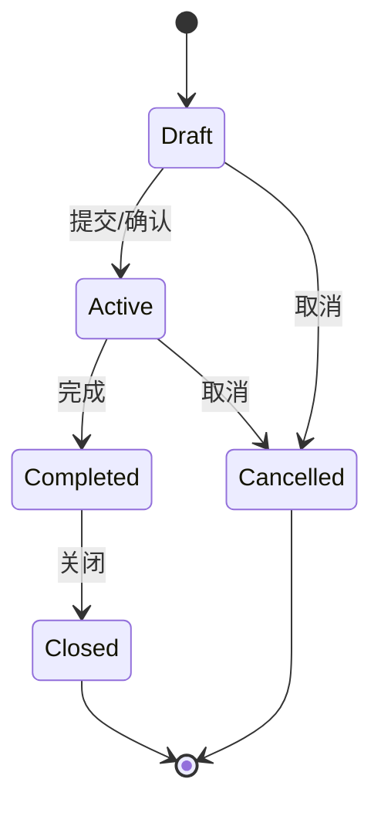
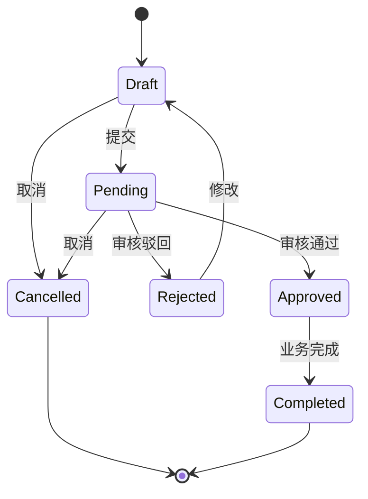

# 业务逻辑

> **最后更新**：2026-01-31  
> **维护者**：Vitamin

---

## 概述

本文档记录项目中涉及的核心业务逻辑和规则，作为AI理解业务的参考。

**说明**：此文档应根据具体项目的业务场景进行完善，当前为模板示例。

---

## 通用业务规则

### 单据状态管理

所有业务单据遵循统一的状态管理规则：

#### 标准状态定义

- **Draft（草稿）**：初始状态，可编辑、可删除
- **Active/Confirmed（生效/已确认）**：已生效状态，不可编辑
- **Completed（已完成）**：业务完成状态，不可编辑
- **Cancelled（已取消）**：取消状态，不可编辑
- **Closed（已关闭）**：关闭状态，不可编辑

#### 状态流转规则



#### 通用规则

- **R-G01**：只有Draft状态的单据可以编辑
- **R-G02**：只有Draft状态的单据可以删除
- **R-G03**：取消和关闭操作不可逆
- **R-G04**：单据编号系统自动生成，格式：[前缀]-YYYYMMDD-[序号]

---

### 字段通用规则

#### 必填字段规则

- **R-F01**：所有单据必须有唯一标识（id）
- **R-F02**：所有单据必须有编码（code），系统自动生成
- **R-F03**：所有单据必须有状态（status）
- **R-F04**：所有单据必须记录创建时间和创建人
- **R-F05**：所有单据必须记录更新时间和更新人

#### 数据验证规则

- **R-V01**：必填字段不能为空
- **R-V02**：数值字段必须在有效范围内
- **R-V03**：日期字段必须符合格式要求
- **R-V04**：枚举字段必须在可选值范围内

---

### 异常处理规则

#### 数据验证异常

- **触发条件**：提交时数据验证失败
- **处理规则**：阻止提交，提示具体错误字段
- **提示格式**："请填写必填项：[字段名]" 或 "[字段名]格式不正确"

#### 并发冲突异常

- **触发条件**：同一数据被多人同时修改
- **处理规则**：后提交的操作失败
- **提示信息**："数据已被他人修改，请刷新后重试"

#### 权限不足异常

- **触发条件**：用户无操作权限
- **处理规则**：阻止操作
- **提示信息**："您没有权限执行此操作"

---

## 特定业务场景（示例）

### 审批流程

#### 适用场景

- 采购申请单
- 费用申请单
- 其他需要审批的单据

#### 业务规则

- **R-A01**：提交后进入Pending（待审核）状态
- **R-A02**：审核通过进入Approved（已审核）状态
- **R-A03**：审核驳回返回Draft（草稿）状态，可修改后重新提交
- **R-A04**：审核中的单据可以被申请人取消

#### 状态流转



---

### 主从单据关联

#### 适用场景

- 订单-发货单
- 入库通知单-入库单
- 采购订单-采购入库单

#### 业务规则

- **R-M01**：从单据必须关联主单据
- **R-M02**：从单据的数量不能超过主单据的可用数量
- **R-M03**：主单据关闭时，必须检查从单据是否已全部完成
- **R-M04**：主单据取消时，关联的从单据自动取消

---

### 库存数据更新

#### 适用场景

- 入库单
- 出库单
- 调拨单

#### 业务规则

- **R-I01**：入库单确认后增加库存
- **R-I02**：出库单确认后减少库存
- **R-I03**：出库数量不能超过可用库存
- **R-I04**：取消入库单时扣减库存
- **R-I05**：取消出库单时增加库存

---

## 数据计算规则

### 金额计算

#### 明细行金额

```
明细行金额 = 数量 × 单价
```

#### 单据总金额

```
单据总金额 = Σ(明细行金额)
```

#### 规则

- **R-C01**：金额保留2位小数
- **R-C02**：使用四舍五入
- **R-C03**：总金额由明细行金额汇总，不可手动修改

---

### 数量计算

#### 可用数量

```
可用数量 = 已分配数量 - 已使用数量
```

#### 规则

- **R-Q01**：从单据数量不能超过主单据可用数量
- **R-Q02**：使用"最大余额法"分配数量，确保总量匹配

---

## 权限规则

### 角色定义

- **管理员（Admin）**：系统管理员，拥有所有权限
- **操作员（Operator）**：业务操作人员，创建和编辑自己的单据
- **审核员（Approver）**：业务审核人员，审核单据

### 通用权限规则

- **R-P01**：管理员拥有所有权限
- **R-P02**：操作员只能编辑和删除自己创建的Draft状态单据
- **R-P03**：审核员可以审核所有Pending状态的单据
- **R-P04**：所有角色都可以查看单据

---

## 编码规则

### 单据编号

#### 格式

```
[前缀]-YYYYMMDD-[序号]
```

#### 示例

- 采购订单：`PO-20260131-001`
- 入库单：`IN-20260131-001`
- 出库单：`OUT-20260131-001`

#### 规则

- **R-N01**：编号由系统自动生成，用户不可修改
- **R-N02**：序号从001开始，每天重新计数
- **R-N03**：编号必须唯一

---

## 时间规则

### 时间戳管理

- **R-T01**：创建时间（createdAt）在单据创建时自动生成
- **R-T02**：更新时间（updatedAt）在单据每次修改时自动更新
- **R-T03**：时间格式统一使用：YYYY-MM-DD HH:mm:ss

### 业务时间

- **R-T04**：业务日期（如入库日期、出库日期）由用户填写
- **R-T05**：默认值为当前日期

---

## 特殊场景处理

### 取消规则

#### 通用取消规则

- **R-X01**：Draft和Pending状态的单据可以取消
- **R-X02**：取消后状态变更为Cancelled
- **R-X03**：取消操作不可逆
- **R-X04**：取消时需要填写取消原因

#### 关联影响

- **R-X05**：取消主单据时，检查是否有关联从单据
- **R-X06**：如有关联从单据，提示无法取消或自动取消关联单据

---

### 关闭规则

#### 通用关闭规则

- **R-L01**：Completed状态的单据可以关闭
- **R-L02**：关闭后状态变更为Closed
- **R-L03**：关闭操作不可逆
- **R-L04**：关闭时需要填写关闭原因

---

## 业务术语表

| 术语       | 英文                     | 说明                       |
| ---------- | ------------------------ | -------------------------- |
| 单据       | Document                 | 业务单据，如订单、入库单等 |
| 主单据     | Master Document          | 被关联的单据，如采购订单   |
| 从单据     | Sub Document             | 关联主单据的单据，如入库单 |
| 可用数量   | Available Quantity       | 已分配但未使用的数量       |
| 最大余额法 | Maximum Remainder Method | 数量分配算法，确保总量匹配 |

---

## 注意事项

1. **本文档是示例模板**，实际使用时应根据具体项目的业务场景进行完善
2. **业务规则编号**：建议使用前缀区分不同类型的规则（如R-G通用规则、R-A审批规则等）
3. **持续更新**：随着项目演进，及时更新业务规则
4. **AI引用**：在生成PRD时，AI应引用此文档中的业务规则

---

**说明**：本文档是AI理解业务逻辑的重要参考，请根据项目实际情况持续完善。
