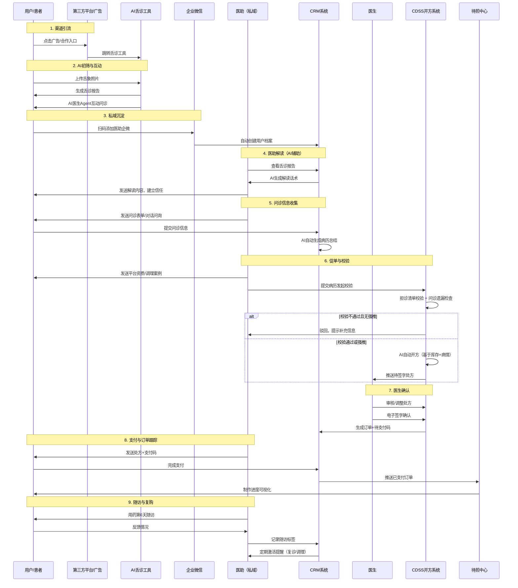
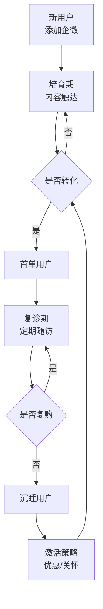
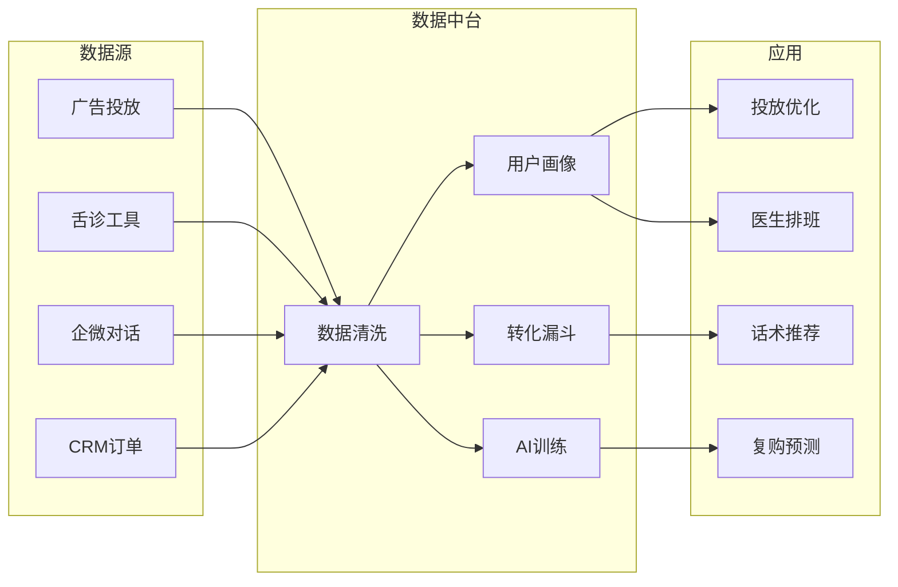

```markdown
# 中医健康管理平台 - 核心业务流程详解

> **文档类型**: 业务流程规范  
> **最后更新**: 2026-01-14  
> **适用范围**: 中医健康管理平台 - 业务流程参考

---

## 一、用户引流与转化全流程（核心闭环）

### 1.1 流程概述
**业务背景**: 通过多渠道投放AI舌诊工具，吸引用户进入私域，借助AI辅助医助完成从健康咨询到付费处方的转化。

**涉及角色**:
- 用户/患者（C端）
- 医助（私域运营）
- 医生（处方确认）
- 系统（AI助手、CRM、CDSS）

### 1.2 详细流程



### 1.3 关键节点说明

#### 节点1: 渠道引流
**触发方式**:
- 付费流量：百度大搜、腾讯广点通等
- 免费合作：合作商提供流量，我方分成
- 生态合作：互相提供流量或服务

**数据采集**:
- 渠道来源（UTM参数）
- 用户设备信息
- 点击时间、停留时长

#### 节点2: AI舌诊与互动
**输入数据**:
- 舌象照片（要求：自然光、无遮挡）
- 用户基础信息（年龄、性别、主要不适）

**AI输出**:
- 舌诊报告：舌质、舌苔、舌形、舌下络脉分析
- 中医辨证建议（如：脾虚湿盛、肝郁气滞）
- AI医生Agent问诊：3-5轮交互，补充关键症状

**转化触发点**:  
当用户表达“想和医生进一步沟通”或问诊轮次≥3次时，自动弹出医助企微二维码。

#### 节点3: 私域沉淀（企微添加）
**系统动作**:
- CRM自动创建用户档案（来源渠道、舌诊数据、问诊记录）
- 自动打标签：如 `新用户`、`舌象-脾虚`、`渠道-百度`
- 分配医助（根据区域/时段/医助负载）

**关键字段**:
| 字段 | 说明 | 示例 |
|-----|------|------|
| 用户ID | 系统唯一标识 | U_123456 |
| 企微外部联系人ID | 企微侧标识 | wm_xxxx |
| 初诊/复诊 | 诊次类型 | 初诊 |
| 最近活跃时间 | 最后一次互动时间 | 2026-01-14 |

#### 节点4: 医助解读（AI生成话术）
**操作人**: 医助

**AI话术生成逻辑**:
```
话术模板 = 
  问候语 + 
  舌诊结果摘要 + 
  风险提示（如有） + 
  信任建设（资质/案例/医生背书） + 
  问诊引导
```

**示例输出**:
> “您好，我是您的健康医助小陈。根据您的舌象，舌苔白腻、舌边齿痕明显，提示脾虚湿困。这种情况在熬夜、饮食不规律人群中很常见。我们平台的三甲中医师擅长调理此类问题，您可以先填写这个简短问诊表，我会帮您整理给医生看。”

**医助操作**:
- 可编辑AI生成话术后发送
- 若用户反应积极，进入问诊阶段；若冷淡，进入培育序列（定期发送养生内容）

#### 节点5: 问诊信息收集
**方式**:
- 结构化表单（推荐）：症状、既往史、用药史、过敏史、饮食睡眠二便等
- 自由对话：医助逐项提问，用户回复

**AI病历生成**:
- 基于企微对话记录，NLP提取关键信息
- 自动填充到病历模板（主诉、现病史、舌象、脉象（虚拟）、辨证依据）
- 医助可修改补充

**输出**: 结构化病历（JSON/XML），供CDSS使用

#### 节点6: 开方校验（关键质控）
**校验项目**:

| 校验类型 | 规则 | 不通过处理 |
|---------|------|-----------|
| 拒诊清单 | 孕妇、婴幼儿、危重症、严重过敏等 | 拒绝开方，引导线下就医 |
| 问诊遗漏 | 必填字段缺失（主诉、舌象、过敏史） | 提示医助补充 |
| 用药冲突 | 处方与已服药物相互作用 | 提醒医生确认 |
| 剂量范围 | 单味药剂量超出安全阈值 | 自动拦截 |

**强推机制**:  
特殊情况下（如老病号复诊、主任医师特批），可跳过非安全类校验，但系统记录强推日志备查。

#### 节点7: 处方生成与医生签字
**CDSS自动开方逻辑**:
```
推荐处方 = 
  病情匹配（辨证分型 → 基础方） +
  药房库存（只推荐有货药材） +
  个性化加减（症状权重 → 加减药物） +
  剂量计算（体重/年龄/病情严重度）
```

**医生App操作**:
1. 查看病历总结 + 问诊对话记录
2. 查看AI推荐处方
3. 可修改药物、剂量、用法
4. 电子签字（指纹/密码/面容）
5. 一键生成订单及支付码

**关键数据**:  
处方ID、医生ID、医助ID、用户ID、药材清单、总价、支付码有效期（24小时）

#### 节点8: 支付与订单跟踪
**支付后动作**:
- CRM更新订单状态为 `已支付`
- 自动推送至待煎中心（支持多药房，就近分配）
- 生成制作进度：`待煎煮` → `煎煮中` → `质检中` → `已发货` → `已签收`
- 用户可通过小程序/公众号实时查看进度

**未支付催付**:  
超过2小时未支付，系统自动发送提醒；超过24小时未支付，订单关闭，医助人工跟进。

#### 节点9: 随访与复诊
**随访时间轴**:
- 用药第6天：医助发送用药反馈表（效果、不良反应）
- 用药第15天：发送复诊提醒
- 用药第30天：激活话术（如“调理一个月了，可以复诊看看变化”）

**复诊流程差异**:
- 不重新采集舌象（可要求用户上传对比）
- 病历基于初诊+随访记录自动生成对比话术
- 诊次管理：通过`开始时间`和`结束时间`截取对话生成本次病历
- 开方时可参考历史处方

---

## 二、渠道管理流程（支撑GMV与用户增长）

### 2.1 渠道类型与模式

| 渠道类型 | 合作模式 | 成本结构 | 数据追踪 |
|---------|---------|---------|---------|
| 付费采买 | 百度大搜、广点通等 | CPC/CPM/CPS | UTM + 转化回传 |
| 免费合作 | 合作商提供流量 | 无预付，分成 | API对接 |
| 生态合作 | 互相导流 | 资源置换 | 双方对账 |

### 2.2 渠道引流到转化数据流


**关键指标**:
- 渠道转化率：CVR = 支付人数 / 点击人数
- 获客成本：CAC = 渠道费用 / 支付人数
- 投产比：ROI = GMV / 渠道费用

---

## 三、CRM客户管理核心流程（中优先级项目）

### 3.1 用户生命周期管理



### 3.2 医助工作台（CRM核心功能）

**功能模块**:
1. **用户列表**：按标签、活跃度、诊次筛选
2. **对话侧边栏**：企微内嵌，显示用户病历、舌象、历史订单
3. **AI话术库**：按场景推荐（解读/问诊/促单/随访）
4. **任务提醒**：待随访、待催付、待复诊
5. **数据看板**：个人转化率、响应时长、客单价

---

## 四、数据中台支撑流程（中优先级项目）

### 4.1 数据流向



---

## 五、流程设计原则（中医健康管理特色）

### 5.1 医疗合规原则
- **处方留痕**：每一张处方有完整的问诊记录、医生签字、AI校验日志
- **拒诊透明**：拒诊原因可追溯，支持用户申诉
- **数据隐私**：用户健康数据加密存储，医助仅可见自己负责的用户

### 5.2 AI辅助边界原则
- **AI不独立开方**：必须医生签字
- **AI话术可人工干预**：医助可修改任何AI生成内容
- **强推码需审批**：保留人工兜底通道

### 5.3 私域运营原则
- **拒绝骚扰**：用户可随时拉黑/退订
- **价值优先**：每次触达提供健康价值（知识/报告/优惠）
- **人设统一**：医助身份真实，禁止虚假承诺

---

## 六、流程优化方向

### 6.1 自动化优化（高优先级）
- **智能话术生成**：基于用户舌象+历史对话，自动生成千人千面话术
- **自动随访**：用药第6天自动发送随访表单，减少医助手工操作
- **智能分诊**：根据病情紧急度，优先分配给高年资医生

### 6.2 转化提升优化（高优先级）
- **多轮对话SOP**：沉淀高转化话术模板，新医助快速上手
- **处方预览优化**：支付前展示药材清单、功效说明、注意事项，降低犹豫
- **限时优惠**：首单减免、复诊折扣，系统自动计算并推送

### 6.3 体验优化（中优先级）
- **进度可视化**：从问诊到收货全流程用户端可见
- **舌象对比图**：复诊时自动生成舌象变化对比，增强信任
- **客服反馈入口**：用户可直接反馈问题，系统自动分配处理

---

## 七、附录：关键单据与状态定义

### 7.1 单据类型

| 单据 | 英文 | 说明 |
|-----|------|------|
| 用户档案 | User Profile | CRM创建，贯穿全生命周期 |
| 问诊单 | Consultation | 每次问诊生成一份 |
| 病历 | Medical Record | AI生成+医助补充 |
| 处方 | Prescription | 医生签字生效 |
| 订单 | Order | 支付后生成 |
| 随访记录 | Follow-up | 用药后定期创建 |

### 7.2 订单状态流转

```
待支付 → 已支付 → 煎煮中 → 已发货 → 已签收 → 已完成
   ↓         ↓
 已关闭    退款中 → 已退款
```

---

**文档版本**: V1.0  
**维护人**: 产品团队  
**下次更新**: 2026-03-01（根据实际运营反馈调整）
```