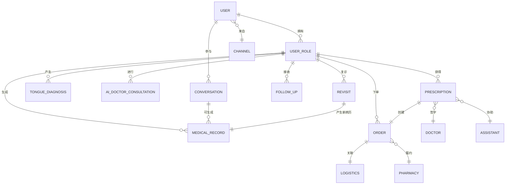
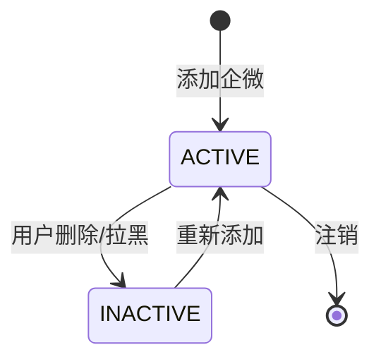
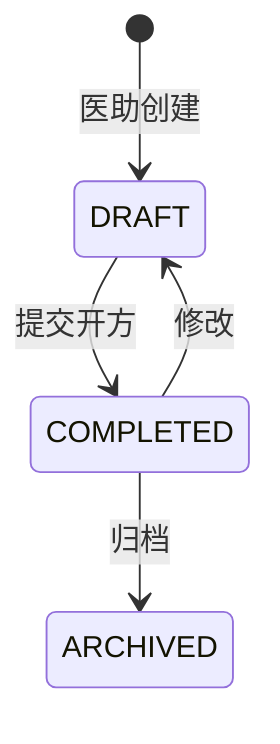
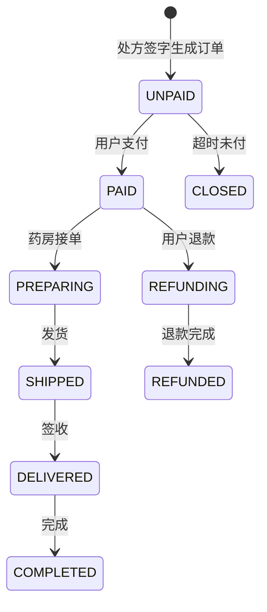

```markdown
# 中医健康管理平台 - 数据模型与业务对象

> **文档类型**: 数据规范  
> **最后更新**: 2026-01-14  
> **适用范围**: 多角色健康管理（本人/家人）数据模型设计

---

## 一、核心业务对象关系图

### 1.1 整体ER图



---

## 二、核心业务对象定义

### 2.1 用户对象(User)

#### 对象定义
用户是使用微信/企微并完成授权的真实个人。一个用户可添加多个家庭成员（本人/家人）。

#### 核心字段清单

| 字段英文名 | 字段中文名 | 类型 | 必填 | 说明 |
|-----------|-----------|------|------|------|
| user_id | 用户ID | BIGINT | 是 | 主键，系统生成 |
| wework_id | 企微外部联系人ID | VARCHAR(64) | 是 | 企业微信唯一标识 |
| union_id | 微信UnionID | VARCHAR(64) | 否 | 多应用统一标识 |
| mobile | 手机号 | VARCHAR(11) | 否 | 需脱敏 |
| nickname | 昵称 | VARCHAR(50) | 否 | 用户微信昵称 |
| avatar_url | 头像URL | VARCHAR(200) | 否 | 用户头像 |
| channel_id | 渠道ID | BIGINT | 是 | 来源渠道 |
| status | 状态 | VARCHAR(20) | 是 | ACTIVE/INACTIVE |
| first_contact_at | 首次添加时间 | DATETIME | 是 | 首次添加企微时间 |
| last_active_at | 最后活跃时间 | DATETIME | 是 | 最近一次互动时间 |
| created_at | 创建时间 | DATETIME | 是 | 系统时间 |
| updated_at | 更新时间 | DATETIME | 是 | 系统时间 |

#### 状态流转


---

### 2.2 用户角色对象(UserRole)

#### 对象定义
代表用户管理的家庭成员（本人、爸爸、妈妈、孩子等）。所有健康数据（舌诊、病历、处方、订单、随访、复诊）均归属于角色。

#### 核心字段清单

| 字段英文名 | 字段中文名 | 类型 | 必填 | 说明 |
|-----------|-----------|------|------|------|
| role_id | 角色ID | BIGINT | 是 | 主键 |
| user_id | 用户ID | BIGINT | 是 | 外键，关联user表 |
| role_name | 角色名称 | VARCHAR(20) | 是 | 如“本人”、“爸爸”、“妈妈” |
| relationship | 与用户关系 | VARCHAR(10) | 是 | SELF/PARENT/CHILD/SPOUSE/OTHER |
| real_name | 真实姓名 | VARCHAR(50) | 否 | 可选 |
| gender | 性别 | CHAR(1) | 否 | M/F/U |
| birthday | 出生日期 | DATE | 否 | 用于年龄计算 |
| id_card_no | 身份证号 | VARCHAR(18) | 否 | 加密存储 |
| health_tags | 健康标签 | JSON | 否 | 如“高血压”、“糖尿病” |
| is_default | 是否默认角色 | TINYINT | 是 | 0否/1是，每次对话默认选哪个 |
| status | 状态 | VARCHAR(20) | 是 | ACTIVE/INACTIVE |
| created_at | 创建时间 | DATETIME | 是 | 系统时间 |
| updated_at | 更新时间 | DATETIME | 是 | 系统时间 |

#### 关系枚举值
| 值 | 说明 |
|----|------|
| SELF | 本人 |
| PARENT | 父母 |
| CHILD | 子女 |
| SPOUSE | 配偶 |
| OTHER | 其他 |

#### 唯一约束
`(user_id, role_name)` 在同一个用户下角色名唯一。

---

### 2.3 渠道对象(Channel)

#### 对象定义
记录用户来源的营销渠道，用于归因分析和成本核算。

#### 核心字段清单

| 字段英文名 | 字段中文名 | 类型 | 必填 | 说明 |
|-----------|-----------|------|------|------|
| channel_id | 渠道ID | BIGINT | 是 | 主键 |
| channel_code | 渠道编码 | VARCHAR(32) | 是 | 唯一，如“baidu_sem” |
| channel_name | 渠道名称 | VARCHAR(50) | 是 | 如“百度大搜” |
| channel_type | 渠道类型 | VARCHAR(20) | 是 | PAID/FREE/ECO |
| cost_model | 成本模型 | VARCHAR(20) | 是 | CPC/CPM/CPS/NONE |
| partner_id | 合作方ID | VARCHAR(50) | 否 | 外部合作标识 |
| status | 状态 | VARCHAR(20) | 是 | ACTIVE/INACTIVE |

#### 渠道类型枚举
| 值 | 说明 |
|----|------|
| PAID | 付费采买 |
| FREE | 免费合作 |
| ECO | 生态合作 |

---

### 2.4 舌诊记录对象(TongueDiagnosis)

#### 对象定义
记录用户（针对某个角色）上传的舌象照片及AI分析结果。

#### 核心字段清单

| 字段英文名 | 字段中文名 | 类型 | 必填 | 说明 |
|-----------|-----------|------|------|------|
| diagnosis_id | 舌诊ID | BIGINT | 是 | 主键 |
| role_id | 角色ID | BIGINT | 是 | 外键 |
| image_url | 舌象图片URL | VARCHAR(200) | 是 | 存储地址 |
| image_md5 | 图片MD5 | VARCHAR(32) | 否 | 去重校验 |
| tongue_features | 舌象特征 | JSON | 是 | 舌质、舌苔、舌形等结构化数据 |
| ai_report | AI分析报告 | JSON | 是 | 包含辨证分型、建议等 |
| confidence_score | 置信度 | DECIMAL(3,2) | 否 | AI置信度0-1 |
| status | 状态 | VARCHAR(20) | 是 | ACTIVE/INVALID |
| created_at | 创建时间 | DATETIME | 是 | 系统时间 |

#### tongue_features JSON示例
```json
{
  "tongue_body_color": "pale_red",
  "tongue_coating": "white_greasy",
  "tongue_shape": "scalloped",
  "sublingual_veins": "mild_dark"
}
```

---

### 2.5 AI医生问诊记录对象(AIDoctorConsultation)

#### 对象定义
记录用户与AI医生Agent的多轮对话问诊内容，用于辅助筛选和生成初步建议。

#### 核心字段清单

| 字段英文名 | 字段中文名 | 类型 | 必填 | 说明 |
|-----------|-----------|------|------|------|
| ai_consult_id | AI问诊ID | BIGINT | 是 | 主键 |
| role_id | 角色ID | BIGINT | 是 | 外键 |
| conversation_log | 对话日志 | TEXT | 是 | 完整的用户与AI对话文本 |
| symptoms_extracted | 提取症状 | JSON | 是 | NLP提取的症状列表 |
| ai_suggestion | AI建议 | TEXT | 否 | 如“建议进一步咨询专业医生” |
| trigger_action | 触发动作 | VARCHAR(50) | 否 | 如“SHOW_WEWORK_QR” |
| finished_rounds | 完成轮次 | INT | 是 | 对话轮次数量 |
| status | 状态 | VARCHAR(20) | 是 | ACTIVE/ABANDONED/TRIGGERED |
| created_at | 创建时间 | DATETIME | 是 | 系统时间 |

---

### 2.6 企微对话对象(Conversation)

#### 对象定义
记录用户与医助（真人）在企业微信中的对话内容。不直接绑定角色，但可通过解析或医助手动关联到具体角色生成病历。

#### 核心字段清单

| 字段英文名 | 字段中文名 | 类型 | 必填 | 说明 |
|-----------|-----------|------|------|------|
| conversation_id | 对话ID | BIGINT | 是 | 主键 |
| user_id | 用户ID | BIGINT | 是 | 外键 |
| assistant_id | 医助ID | BIGINT | 是 | 外键 |
| external_id | 企微会话ID | VARCHAR(64) | 是 | 企微侧会话ID |
| transcript | 对话文本 | TEXT | 是 | 全部对话记录 |
| ai_suggestions | AI话术建议 | JSON | 否 | 实时AI推荐话术 |
| started_at | 对话开始时间 | DATETIME | 是 | 用户首次发消息时间 |
| ended_at | 对话结束时间 | DATETIME | 否 | 最后消息时间 |
| message_count | 消息总数 | INT | 是 | 统计字段 |

---

### 2.7 病历对象(MedicalRecord)

#### 对象定义
医助根据对话内容整理的标准化病历，是后续开方的基础。必须关联到具体的用户角色。

#### 核心字段清单

| 字段英文名 | 字段中文名 | 类型 | 必填 | 说明 |
|-----------|-----------|------|------|------|
| record_id | 病历ID | BIGINT | 是 | 主键 |
| role_id | 角色ID | BIGINT | 是 | 外键 |
| conversation_id | 对话ID | BIGINT | 否 | 关联的企微对话 |
| chief_complaint | 主诉 | TEXT | 是 | 用户最主要的症状描述 |
| present_illness | 现病史 | TEXT | 是 | 发病过程、诊疗经过 |
| tongue_image_ref | 舌象图片引用 | VARCHAR(200) | 否 | 关联舌诊记录图片 |
| pulse_info | 脉象 | VARCHAR(50) | 否 | 虚拟脉象（可选） |
| past_history | 既往史 | TEXT | 否 | 慢性病、手术史 |
| allergy_history | 过敏史 | TEXT | 否 | 药物/食物过敏 |
| syndrome_differentiation | 辨证分型 | VARCHAR(50) | 否 | 如“脾虚湿盛” |
| structured_data | 结构化数据 | JSON | 否 | 供AI开方使用 |
| ai_summary | AI生成摘要 | TEXT | 否 | 系统自动生成的病历摘要 |
| status | 状态 | VARCHAR(20) | 是 | DRAFT/COMPLETED/ARCHIVED |
| created_at | 创建时间 | DATETIME | 是 | 系统时间 |
| updated_at | 更新时间 | DATETIME | 是 | 系统时间 |

#### 状态流转


---

### 2.8 处方对象(Prescription)

#### 对象定义
医生根据病历开具的中药处方。需经医生电子签字后才能生成订单。

#### 核心字段清单

| 字段英文名 | 字段中文名 | 类型 | 必填 | 说明 |
|-----------|-----------|------|------|------|
| prescription_id | 处方ID | BIGINT | 是 | 主键 |
| record_id | 病历ID | BIGINT | 是 | 外键 |
| doctor_id | 医生ID | BIGINT | 是 | 开方医生 |
| assistant_id | 医助ID | BIGINT | 是 | 协助准备处方 |
| herb_list | 药材清单 | JSON | 是 | 药材、剂量、用法 |
| total_price | 总价 | DECIMAL(10,2) | 是 | 含配送费 |
| dosage_instruction | 用法用量 | TEXT | 是 | 煎煮方法、服用说明 |
| signature_status | 签字状态 | VARCHAR(20) | 是 | UNSIGNED/SIGNED/REJECTED |
| force_push_code | 强推码 | VARCHAR(20) | 否 | 主管授权跳过校验的码 |
| signed_at | 签字时间 | DATETIME | 否 | 医生确认时间 |
| status | 状态 | VARCHAR(20) | 是 | DRAFT/ACTIVE/EXPIRED/CLOSED |
| created_at | 创建时间 | DATETIME | 是 | 系统时间 |
| updated_at | 更新时间 | DATETIME | 是 | 系统时间 |

#### herb_list JSON示例
```json
[
  {"herb_name":"白术","dosage":"10g","usage":"煎服"},
  {"herb_name":"茯苓","dosage":"15g","usage":"煎服"}
]
```

#### 签名状态枚举
| 值 | 说明 |
|----|------|
| UNSIGNED | 待医生签字 |
| SIGNED | 已签字 |
| REJECTED | 医生驳回 |

---

### 2.9 订单对象(Order)

#### 对象定义
用户支付后生成的履约单据，关联到具体角色。

#### 核心字段清单

| 字段英文名 | 字段中文名 | 类型 | 必填 | 说明 |
|-----------|-----------|------|------|------|
| order_id | 订单ID | BIGINT | 是 | 主键 |
| order_no | 订单号 | VARCHAR(32) | 是 | 唯一，格式：O+时间戳+随机 |
| prescription_id | 处方ID | BIGINT | 是 | 外键 |
| role_id | 角色ID | BIGINT | 是 | 外键，冗余便于查询 |
| user_id | 用户ID | BIGINT | 是 | 外键，冗余 |
| pharmacy_id | 药房ID | BIGINT | 是 | 履约药房 |
| total_amount | 总金额 | DECIMAL(10,2) | 是 | 等于处方总价 |
| discount_amount | 优惠金额 | DECIMAL(10,2) | 是 | 促销/优惠券，默认0 |
| payable_amount | 应付金额 | DECIMAL(10,2) | 是 | =总金额-优惠 |
| paid_amount | 实付金额 | DECIMAL(10,2) | 是 | 用户实际支付 |
| payment_method | 支付方式 | VARCHAR(20) | 否 | WECHAT/ALIPAY |
| payment_status | 支付状态 | VARCHAR(20) | 是 | UNPAID/PAID/REFUNDING/REFUNDED |
| fulfillment_status | 履约状态 | VARCHAR(20) | 是 | PENDING/PREPARING/SHIPPED/DELIVERED |
| payment_code | 支付码 | VARCHAR(32) | 否 | 用于扫码支付 |
| paid_at | 支付时间 | DATETIME | 否 | 支付成功时间 |
| expired_at | 过期时间 | DATETIME | 是 | 支付码有效期，默认24h |
| created_at | 创建时间 | DATETIME | 是 | 系统时间 |
| updated_at | 更新时间 | DATETIME | 是 | 系统时间 |

#### 订单状态流转


---

### 2.10 物流信息对象(Logistics)

#### 对象定义
订单发货后的物流轨迹信息。

#### 核心字段清单

| 字段英文名 | 字段中文名 | 类型 | 必填 | 说明 |
|-----------|-----------|------|------|------|
| logistics_id | 物流ID | BIGINT | 是 | 主键 |
| order_id | 订单ID | BIGINT | 是 | 外键，1:1关系 |
| carrier | 承运商 | VARCHAR(50) | 是 | 如“顺丰”、“京东” |
| tracking_number | 运单号 | VARCHAR(50) | 是 | 快递单号 |
| status | 物流状态 | VARCHAR(20) | 是 | PICKUP/TRANSIT/DELIVERED/RETURN |
| track_history | 轨迹历史 | JSON | 否 | 时间节点+位置 |
| shipped_at | 发货时间 | DATETIME | 否 | 出库扫描时间 |
| delivered_at | 签收时间 | DATETIME | 否 | 用户签收时间 |
| created_at | 创建时间 | DATETIME | 是 | 系统时间 |
| updated_at | 更新时间 | DATETIME | 是 | 最后轨迹更新时间 |

#### 物流状态枚举
| 值 | 说明 |
|----|------|
| PICKUP | 已揽收 |
| TRANSIT | 运输中 |
| DELIVERED | 已签收 |
| RETURN | 退回中 |

---

### 2.11 随访记录对象(FollowUp)

#### 对象定义
用药后定期对用户（具体角色）进行的健康随访记录。

#### 核心字段清单

| 字段英文名 | 字段中文名 | 类型 | 必填 | 说明 |
|-----------|-----------|------|------|------|
| followup_id | 随访ID | BIGINT | 是 | 主键 |
| role_id | 角色ID | BIGINT | 是 | 外键 |
| order_id | 订单ID | BIGINT | 是 | 关联订单 |
| assistant_id | 医助ID | BIGINT | 是 | 执行随访的医助 |
| day_after_medication | 用药第几天 | INT | 是 | 如6、15、30 |
| feedback | 用户反馈 | TEXT | 否 | 效果、不适等 |
| satisfaction | 满意度 | VARCHAR(10) | 否 | SATISFIED/NEUTRAL/DISSATISFIED |
| next_plan | 后续建议 | TEXT | 否 | 复诊提醒等 |
| scheduled_date | 计划日期 | DATE | 是 | 计划随访日期 |
| completed_at | 完成时间 | DATETIME | 否 | 实际完成随访时间 |
| status | 状态 | VARCHAR(20) | 是 | PENDING/COMPLETED/SKIPPED |
| created_at | 创建时间 | DATETIME | 是 | 系统时间 |

---

### 2.12 复诊对象(Revisit)

#### 对象定义
记录用户为同一角色发起的复诊，关联原订单和新生成的病历。

#### 核心字段清单

| 字段英文名 | 字段中文名 | 类型 | 必填 | 说明 |
|-----------|-----------|------|------|------|
| revisit_id | 复诊ID | BIGINT | 是 | 主键 |
| role_id | 角色ID | BIGINT | 是 | 外键 |
| original_order_id | 原订单ID | BIGINT | 是 | 首次治疗的订单 |
| new_record_id | 新病历ID | BIGINT | 是 | 复诊生成的病历 |
| revisit_reason | 复诊原因 | VARCHAR(50) | 是 | EFFECT_IMPROVING/EFFECT_POOR/REFILL |
| scheduled_date | 计划复诊日期 | DATE | 否 | 系统推荐日期 |
| completed_at | 完成时间 | DATETIME | 否 | 新处方签字完成时间 |
| status | 状态 | VARCHAR(20) | 是 | PENDING/PROCESSING/COMPLETED/CANCELLED |
| created_at | 创建时间 | DATETIME | 是 | 系统时间 |
| updated_at | 更新时间 | DATETIME | 是 | 系统时间 |

#### 复诊原因枚举
| 值 | 说明 |
|----|------|
| EFFECT_IMPROVING | 效果改善，继续调理 |
| EFFECT_POOR | 效果不佳，调整方案 |
| REFILL | 仅续方，无变化 |

#### 复诊流程说明
复诊触发后，系统自动生成一条新的复诊记录，并创建新的病历（关联原订单）。后续流程与初诊一致：病历→处方→医生签字→订单。

---

### 2.13 医生对象(Doctor)

#### 对象定义
平台的签约医生，负责签字处方。

#### 核心字段清单

| 字段英文名 | 字段中文名 | 类型 | 必填 | 说明 |
|-----------|-----------|------|------|------|
| doctor_id | 医生ID | BIGINT | 是 | 主键 |
| name | 姓名 | VARCHAR(50) | 是 | 真实姓名 |
| title | 职称 | VARCHAR(50) | 是 | 如“主任医师” |
| hospital | 所属医院 | VARCHAR(100) | 否 | 可空 |
| license_no | 执业证号 | VARCHAR(50) | 是 | 唯一 |
| avatar_url | 头像 | VARCHAR(200) | 否 | 展示用 |
| specialties | 擅长领域 | VARCHAR(200) | 否 | 字符串标签 |
| status | 状态 | VARCHAR(20) | 是 | ACTIVE/INACTIVE |
| created_at | 创建时间 | DATETIME | 是 | 系统时间 |

---

### 2.14 医助对象(Assistant)

#### 对象定义
运营团队中负责用户沟通、病历整理、处方准备的运营人员。

#### 核心字段清单

| 字段英文名 | 字段中文名 | 类型 | 必填 | 说明 |
|-----------|-----------|------|------|------|
| assistant_id | 医助ID | BIGINT | 是 | 主键 |
| name | 姓名 | VARCHAR(50) | 是 | 花名或真实姓名 |
| wework_account | 企微账号 | VARCHAR(50) | 是 | 企业微信登录账号 |
| performance_tier | 业绩等级 | VARCHAR(10) | 是 | S/A/B/C |
| max_concurrent_users | 最大并发用户数 | INT | 是 | 同时接待上限 |
| status | 状态 | VARCHAR(20) | 是 | ACTIVE/BUSY/OFFLINE |
| created_at | 创建时间 | DATETIME | 是 | 系统时间 |

---

### 2.15 药房对象(Pharmacy)

#### 对象定义
提供中药代煎和配送服务的药房（待煎中心）。

#### 核心字段清单

| 字段英文名 | 字段中文名 | 类型 | 必填 | 说明 |
|-----------|-----------|------|------|------|
| pharmacy_id | 药房ID | BIGINT | 是 | 主键 |
| name | 名称 | VARCHAR(100) | 是 | 如“同仁堂煎药中心” |
| address | 地址 | VARCHAR(200) | 是 | 详细地址 |
| contact_phone | 联系电话 | VARCHAR(20) | 是 | 客服电话 |
| capacity | 日最大接单量 | INT | 是 | 产能限制 |
| shipping_scope | 配送范围 | JSON | 否 | 省市区列表 |
| status | 状态 | VARCHAR(20) | 是 | ACTIVE/INACTIVE |
| created_at | 创建时间 | DATETIME | 是 | 系统时间 |

---

## 三、字段命名规范

### 3.1 统一前缀

| 对象类型 | 表名 | 字段前缀示例 |
|---------|------|------------|
| 用户 | user | user_ |
| 用户角色 | user_role | role_ |
| 渠道 | channel | channel_ |
| 舌诊 | tongue_diagnosis | tongue_ |
| AI问诊 | ai_doctor_consultation | ai_consult_ |
| 企微对话 | conversation | conv_ |
| 病历 | medical_record | record_ |
| 处方 | prescription | presc_ |
| 订单 | order | order_ |
| 物流 | logistics | logistics_ |
| 随访 | follow_up | followup_ |
| 复诊 | revisit | revisit_ |
| 医生 | doctor | doctor_ |
| 医助 | assistant | assistant_ |
| 药房 | pharmacy | pharmacy_ |

### 3.2 常用字段后缀

| 后缀 | 含义 | 示例 |
|------|------|------|
| _id | 主键ID | user_id |
| _no | 业务编号 | order_no |
| _code | 业务编码 | channel_code |
| _name | 名称 | role_name |
| _date | 日期 | birthday |
| _at | 时间戳 | created_at |
| _by | 操作人 | created_by |
| _amount | 金额 | total_amount |
| _quantity | 数量 | message_count |
| _price | 单价 | total_price |
| _rate | 比率 | tax_rate |
| _status | 状态 | payment_status |

### 3.3 日期时间字段标准

| 字段名 | 类型 | 说明 |
|--------|------|------|
| created_at | DATETIME | 创建时间（系统时间） |
| updated_at | DATETIME | 最后更新时间（系统时间） |
| xxx_at | DATETIME | 业务时间戳（如paid_at） |
| xxx_date | DATE | 业务日期（如scheduled_date） |

### 3.4 状态字段标准

**字段名**: `status`  
**类型**: VARCHAR(20)  
**值格式**: 全大写下划线分隔，如`PENDING_PAYMENT`

---

## 四、枚举值标准定义

### 4.1 支付状态

| 枚举值 | 说明 |
|--------|------|
| UNPAID | 待支付 |
| PAID | 已支付 |
| REFUNDING | 退款中 |
| REFUNDED | 已退款 |

### 4.2 履约状态

| 枚举值 | 说明 |
|--------|------|
| PENDING | 待处理 |
| PREPARING | 备货/煎煮中 |
| SHIPPED | 已发货 |
| DELIVERED | 已签收 |
| COMPLETED | 已完成 |

### 4.3 用户/角色状态

| 枚举值 | 说明 |
|--------|------|
| ACTIVE | 正常 |
| INACTIVE | 停用 |
| BLACKLIST | 黑名单 |

### 4.4 对话状态

| 枚举值 | 说明 |
|--------|------|
| OPEN | 进行中 |
| CLOSED | 已结束 |
| ARCHIVED | 已归档 |

### 4.5 处方/订单状态

| 枚举值 | 说明 |
|--------|------|
| DRAFT | 草稿 |
| ACTIVE | 生效中 |
| EXPIRED | 已过期 |
| CLOSED | 已关闭 |
| CANCELLED | 已取消 |

---

## 五、数据一致性规则

### 5.1 主数据同步规则
- **用户、角色**：CRM为主，所有业务系统通过API实时查询
- **医生、医助**：后台管理维护，缓存到本地
- **药房**：运营维护，订单创建时选择可用药房

### 5.2 事务一致性规则
- **处方→订单**：强一致性，处方签字后立即生成订单（同一事务）
- **订单→支付**：最终一致性，支付回调触发履约流程
- **支付→物流**：异步消息，保证至少一次通知

### 5.3 数据校验规则
- **外键约束**：关联数据必须存在（如order.role_id须存在于user_role）
- **数量约束**：金额≥0，数量≥0
- **状态约束**：状态流转需符合状态机（如已支付订单不能直接回到未支付）
- **角色约束**：所有健康数据（病历、处方、订单、随访）的role_id必须属于对应的user_id

### 5.4 角色数据隔离规则
- 不同角色之间健康数据默认不可互相访问（除非医助或用户主动切换）
- 查询接口必须带role_id，禁止跨角色批量查询

---

## 六、数据设计最佳实践

### 6.1 表设计原则
- **单表单一职责**：如病历表不存储处方信息
- **头行分离**：订单头-订单行（本模型中订单行合并至处方明细）
- **冗余适度**：order表冗余user_id和role_id，避免多表关联
- **JSON灵活存储**：舌象特征、药材清单等使用JSON，适应业务变化

### 6.2 索引设计原则
- **主键索引**：自增BIGINT
- **唯一索引**：订单号、处方ID、企微会话ID
- **普通索引**：外键(user_id, role_id, order_id)、状态(status)、时间(created_at)
- **组合索引**：(user_id, status)、(role_id, created_at)

### 6.3 分区分表策略
- **按时间分区**：订单表、随访表可按月分区
- **按user_id哈希**：企微对话表用户量大时可分库分表
- **历史归档**：1年以上已完成的订单归档到历史表

### 6.4 性能优化建议
- **避免大事务**：处方签字和订单生成事务宜小
- **批量操作**：随访提醒使用批量查询+批量推送
- **缓存热数据**：用户最近角色、医助会话列表缓存在Redis
- **异步处理**：物流轨迹更新、随访计划生成使用消息队列

---

**文档版本**: V1.0  
**维护人**: 产品团队  
**下次更新**: 2026-03-01（根据业务迭代调整）
```