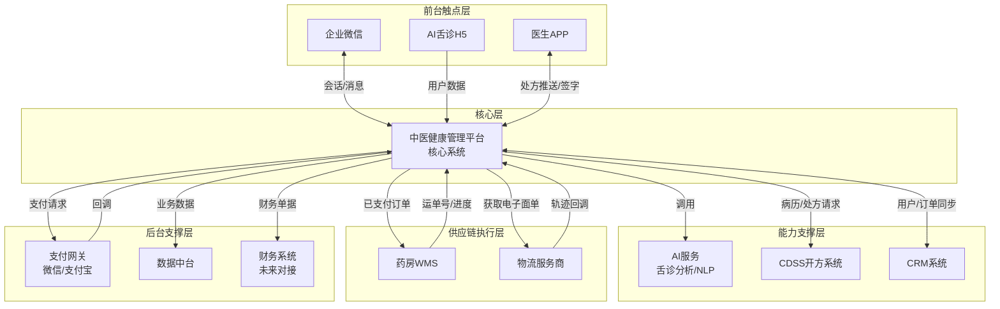

```markdown
# 中医健康管理平台 - 系统功能清单与上下游集成系统

> **文档类型**: 系统架构资料  
> **最后更新**: 2026-01-14  
> **适用范围**: 多角色健康管理平台系统规划与集成

---

## 一、平台核心功能模块清单

### 1.1 用户侧功能（C端）

| 模块 | 子功能 | 说明 |
|------|--------|------|
| **渠道引流** | AI舌诊H5 | 独立页面，支持拍照/上传舌象 |
| | AI医生Agent问诊 | 多轮对话，提取症状 |
| | 企微二维码展示 | 自动弹出医助企微 |
| **用户中心** | 微信/企微授权登录 | 一键授权，获取用户信息 |
| | 家庭成员管理 | 添加/编辑/删除本人、父母、配偶、子女等角色 |
| | 默认角色设置 | 每次对话默认归属角色 |
| **健康档案** | 舌诊记录 | 历史舌象图片与AI报告 |
| | AI问诊记录 | 历史AI对话与建议 |
| | 病历查看 | 医助整理后的正式病历 |
| **处方与订单** | 处方详情 | 药材清单、用法用量、价格 |
| | 在线支付 | 微信支付/支付宝扫码 |
| | 订单跟踪 | 支付状态、煎煮进度、物流轨迹 |
| | 历史订单 | 按角色筛选历史订单 |
| **随访与复诊** | 随访反馈 | 用药效果、不良反应填写 |
| | 复诊申请 | 一键发起复诊，生成新病历 |
| | 舌象对比 | 复诊时对比历史舌象变化 |
| **消息通知** | 企微消息 | 支付成功、发货、随访提醒 |
| | 模板消息 | 服务通知（需用户订阅） |

### 1.2 医助侧功能（运营后台）

| 模块 | 子功能 | 说明 |
|------|--------|------|
| **工作台** | 待办任务 | 待解读、待问诊、待催付、待随访 |
| | 用户列表 | 按渠道、标签、活跃度筛选 |
| | 对话侧边栏 | 企微内嵌，展示用户档案、病历、订单 |
| **AI辅助工具** | 舌诊解读话术生成 | 自动生成解读文本 |
| | 对话实时话术推荐 | NLP分析用户消息，推荐回复 |
| | 病历自动生成 | 基于对话内容NLP提取，自动填充病历 |
| | 随访话术模板 | 第6/15/30天标准话术 |
| **用户管理** | 用户角色切换 | 对话时切换当前服务角色 |
| | 标签管理 | 手动添加/修改健康标签 |
| | 黑名单管理 | 拉黑恶意用户 |
| **病历管理** | 病历创建/编辑 | 手动修改AI生成的病历 |
| | 病历提交校验 | 调用CDSS接口进行拒诊清单校验 |
| | 强推码申请 | 特殊情况下申请主管授权强推 |
| **处方与订单** | 处方准备 | 选择病历，提交CDSS生成推荐处方 |
| | 处方发送医生 | 推送至医生APP待签字 |
| | 催付管理 | 手动或自动发送催付消息 |
| | 订单查询 | 按角色/订单号查询 |
| **随访管理** | 随访计划 | 系统自动生成第6/15/30天任务 |
| | 随访执行 | 发送表单，记录反馈 |
| | 复诊提醒 | 定期激活用户复诊 |
| **数据看板** | 个人转化率 | 添加企微→问诊完成→支付转化 |
| | 响应时长 | 医助平均响应时间 |
| | 客单价 | 平均每订单金额 |
| | 复购率 | 同一角色二次以上订单比例 |

### 1.3 医生侧功能（医生APP）

| 模块 | 子功能 | 说明 |
|------|--------|------|
| **待办任务** | 待签字处方 | 医助提交的待审核处方列表 |
| | 待调整处方 | AI推荐处方需人工修改 |
| **病历查看** | 病历详情 | 主诉、现病史、舌象、辨证依据 |
| | 对话记录 | 查看用户与医助的完整对话 |
| | 历史处方 | 该角色的历史处方，辅助决策 |
| **处方处理** | AI处方展示 | 系统自动生成的推荐方 |
| | 手动调整 | 修改药材、剂量、用法 |
| | 驳回 | 填写驳回原因，返回医助 |
| | 电子签字 | 指纹/密码/面容确认签字 |
| **个人中心** | 排班设置 | 可接单时段 |
| | 签名维护 | 更新电子签名样式 |

### 1.4 管理后台功能（运营/管理员）

| 模块 | 子功能 | 说明 |
|------|--------|------|
| **渠道管理** | 渠道配置 | 创建/编辑渠道，设置成本模型 |
| | 渠道数据看板 | 各渠道UV、企微添加数、支付数、ROI |
| **用户管理** | 用户列表 | 查询、导出、状态管理 |
| | 角色管理 | 查看所有家庭成员 |
| **医生管理** | 医生入驻 | 基本信息、执业证上传 |
| | 医生排班 | 手动调整医生接单状态 |
| **医助管理** | 医助账号 | 企微账号绑定、业绩等级 |
| | 会话分配规则 | 轮询/空闲优先 |
| **药房管理** | 药房信息 | 地址、产能、配送范围 |
| | 订单派单规则 | 按距离/产能自动分配 |
| **处方与订单** | 订单审核 | 异常订单人工干预 |
| | 退款处理 | 审批退款申请 |
| **强推码管理** | 强推码生成 | 主管生成一次性强推码 |
| | 强推日志 | 查看所有强推开方记录 |
| **系统配置** | 拒诊清单规则 | 配置不可开方的人群/症状 |
| | 问诊必填字段 | 配置病历必填项 |
| | 随访模板 | 编辑随访话术和时间轴 |
| **数据报表** | GMV报表 | 按日/周/月/渠道统计 |
| | 转化漏斗 | 各阶段转化率 |
| | 用户留存 | 复购率、流失率 |
| | 医助绩效 | 各医助转化数据 |

---

## 二、上下游集成系统全景图



---

## 三、关键系统集成说明

### 3.1 企业微信集成（最高优先级）

#### 系统定义
- **作用**: 医助与用户实时沟通
- **用户**: 医助、用户
- **核心价值**: 私域运营主阵地

#### 核心集成接口

| 接口名称 | 方向 | 频率 | 说明 |
|---------|------|-----|------|
| 用户添加回调 | 企微→平台 | 实时 | 用户添加医助企微时触发 |
| 消息接收 | 企微→平台 | 实时 | 用户发送消息回调 |
| 消息发送 | 平台→企微 | 实时 | 医助回复消息 |
| 模板消息推送 | 平台→企微 | 实时 | 支付成功、发货、随访提醒 |
| 会话存档 | 平台→企微 | 定时拉取 | 获取完整对话记录 |

#### 关键业务流程
1. **用户添加**: 用户扫码添加医助企微 → 企微回调 → 平台创建用户档案
2. **对话辅助**: 用户发送消息 → 企微回调 → 平台调用NLP生成话术推荐 → 医助侧边栏展示
3. **主动推送**: 平台生成随访任务 → 调用企微模板消息 → 用户收到提醒

### 3.2 支付网关集成（高优先级）

#### 系统定义
- **作用**: 订单在线支付
- **用户**: 用户
- **核心价值**: 交易闭环

#### 核心集成接口

| 接口名称 | 方向 | 频率 | 说明 |
|---------|------|-----|------|
| 创建支付单 | 平台→支付 | 实时 | 生成支付二维码 |
| 支付结果回调 | 支付→平台 | 实时 | 异步通知支付结果 |
| 退款申请 | 平台→支付 | 实时 | 用户/运营发起退款 |
| 退款回调 | 支付→平台 | 实时 | 退款结果通知 |

#### 关键业务流程
- **支付流程**: 医生签字 → 平台生成订单+支付码 → 用户扫码 → 支付网关回调 → 更新订单状态 → 推送药房履约

### 3.3 药房WMS集成（高优先级）

#### 系统定义
- **作用**: 中药代煎中心作业管理
- **用户**: 药房操作员
- **核心价值**: 订单履约与进度可视化

#### 核心集成接口

| 接口名称 | 方向 | 频率 | 说明 |
|---------|------|-----|------|
| 订单推送 | 平台→WMS | 实时 | 已支付订单推送给药房 |
| 进度回传 | WMS→平台 | 实时 | 备货中、煎煮中、已发货等状态 |
| 运单号回传 | WMS→平台 | 实时 | 发货时回传快递单号 |
| 异常上报 | WMS→平台 | 实时 | 库存不足、煎煮异常等 |

#### 关键业务流程
- **履约流程**: 订单支付 → 平台分配药房 → 推送订单 → 药房接单 → 煎煮 → 发货 → 回传运单号 → 平台更新物流状态

### 3.4 CDSS开方系统集成（高优先级）

#### 系统定义
- **作用**: 中医辅助决策，推荐处方
- **用户**: 医助、医生（间接）
- **核心价值**: 标准化开方，提高效率

#### 核心集成接口

| 接口名称 | 方向 | 频率 | 说明 |
|---------|------|-----|------|
| 病历校验 | 平台→CDSS | 实时 | 拒诊清单、问诊遗漏检查 |
| 处方推荐 | 平台→CDSS | 实时 | 基于病历+药房库存推荐处方 |
| 强推记录 | 平台→CDSS | 实时 | 记录强推开方日志 |

#### 关键业务流程
- **开方流程**: 医助提交病历 → 平台调用CDSS校验 → 校验通过后推荐处方 → 推送医生签字

### 3.5 AI服务集成（中优先级）

#### 系统定义
- **作用**: 舌象分析、NLP话术生成、病历生成
- **用户**: 医助、用户
- **核心价值**: AI赋能，提升效率

#### 核心集成接口

| 接口名称 | 方向 | 频率 | 说明 |
|---------|------|-----|------|
| 舌象分析 | 平台→AI | 实时 | 上传图片，返回舌诊报告 |
| 话术生成 | 平台→AI | 实时 | 根据用户角色+舌象生成解读话术 |
| 病历生成 | 平台→AI | 实时 | 基于对话文本生成结构化病历 |
| 随访话术 | 平台→AI | 实时 | 生成个性化随访内容 |

### 3.6 CRM系统集成（中优先级）

#### 系统定义
- **作用**: 长期客户关系管理
- **用户**: 运营人员
- **核心价值**: 用户生命周期运营

#### 核心集成接口

| 接口名称 | 方向 | 频率 | 说明 |
|---------|------|-----|------|
| 用户档案同步 | 平台↔CRM | 实时 | 用户、角色信息同步 |
| 订单同步 | 平台→CRM | 实时 | 支付订单同步至CRM |
| 随访记录同步 | 平台→CRM | 实时 | 用于营销触发 |
| 标签同步 | 平台↔CRM | 实时 | 健康标签、运营标签 |

### 3.7 数据中台集成（中优先级）

#### 系统定义
- **作用**: 数据汇聚与智能分析
- **用户**: 数据分析师、管理层
- **核心价值**: 驱动业务决策

#### 核心集成接口

| 接口名称 | 方向 | 频率 | 说明 |
|---------|------|-----|------|
| 用户行为数据 | 平台→中台 | 实时/离线 | 点击、对话、支付等事件 |
| 业务数据同步 | 平台→中台 | 离线（T+1） | 订单、病历等维度数据 |
| 画像标签 | 中台→平台 | 每日 | 用户画像标签回写 |
| 转化漏斗 | 中台→BI | 每日 | 各渠道转化分析 |

---

## 四、集成技术方案

### 4.1 集成模式

| 模式 | 适用场景 | 技术选型 |
|------|---------|---------|
| 实时接口 | 支付回调、处方推送、企微消息 | RESTful API (HTTPS + JSON) |
| 消息队列 | 高并发异步场景（如订单推送药房） | RabbitMQ / Kafka |
| 定时批量 | 数据同步、报表导出 | SFTP + 定时任务 |
| 回调订阅 | 物流轨迹、支付结果 | Webhook |

### 4.2 数据一致性策略

| 数据类型 | 主系统 | 一致性要求 | 策略 |
|---------|--------|-----------|------|
| 用户档案 | 平台 | 强一致 | 实时同步至CRM |
| 订单状态 | 平台 | 强一致 | 支付回调+本地事务 |
| 处方签字 | 平台+医生APP | 最终一致 | 状态机+补偿重试 |
| 物流轨迹 | 物流商 | 最终一致 | 异步回调+定时拉取 |
| 财务单据 | 平台 | 最终一致 | T+1对账 |

### 4.3 异常处理机制

| 异常类型 | 处理方式 | 说明 |
|---------|---------|------|
| 接口超时 | 重试3次（指数退避） | 支付回调、药房推送 |
| 数据不一致 | 对账任务+告警 | 每日自动对账，差异人工处理 |
| 消息丢失 | 消息确认机制+死信队列 | 保证至少一次送达 |
| 系统故障 | 熔断降级 | 核心链路（支付）优先保障 |

### 4.4 安全与合规

| 要求 | 实现方式 |
|------|---------|
| 接口鉴权 | HMAC-SHA256签名 / OAuth2.0 |
| 数据加密 | HTTPS传输 + 敏感字段AES加密（身份证、手机号） |
| 健康数据隐私 | 病历、舌象仅授权医助和医生可看 |
| 日志审计 | 所有关键操作（签字、强推）记录操作人、时间、IP |

---

## 五、系统优先级与实施路线

### Phase 1（P0 - 核心闭环 - 4个月）
**目标**: 跑通“引流→企微→问诊→病历→处方→支付→药房”主链路

| 序号 | 系统/模块 | 说明 |
|------|----------|------|
| 1 | AI舌诊H5 + AI医生Agent | 用户端引流工具 |
| 2 | 企微集成 | 添加用户、接收/发送消息、会话存档 |
| 3 | 医助工作台（基础版） | 用户列表、对话侧边栏、AI话术生成 |
| 4 | 病历管理（基础版） | 手动/自动生成病历 |
| 5 | CDSS集成 | 校验+推荐处方 |
| 6 | 医生APP（基础版） | 待签字、处方调整、签字 |
| 7 | 支付网关集成 | 微信支付扫码+回调 |
| 8 | 药房WMS集成（基础版） | 订单推送、进度回传 |

### Phase 2（P1 - 体验与增长 - 3个月）
**目标**: 提升转化率，支持多渠道，完善数据

| 序号 | 系统/模块 | 说明 |
|------|----------|------|
| 1 | 家庭成员管理 | 多角色支持 |
| 2 | 随访与复诊 | 第6/15/30天自动随访，复诊流程 |
| 3 | 渠道管理+UTM | 多渠道归因、ROI分析 |
| 4 | 数据中台（基础） | 用户行为采集、转化漏斗 |
| 5 | 物流跟踪集成 | 获取运单号、轨迹推送 |
| 6 | 管理后台报表 | GMV、转化率、医助绩效 |

### Phase 3（P2 - 全面优化 - 3个月）
**目标**: 智能化、自动化、业财一体

| 序号 | 系统/模块 | 说明 |
|------|----------|------|
| 1 | CRM深度集成 | 标签体系、营销自动化 |
| 2 | AI话术优化 | 基于历史对话训练的个性化话术 |
| 3 | 财务系统对接 | 凭证自动生成、对账 |
| 4 | 智能分单 | 自动分配药房、医助 |
| 5 | 医生APP增强 | 历史处方对比、批量签字 |
| 6 | 舌象对比AI | 复诊时自动生成舌象变化分析 |

---

**文档版本**: V1.0  
**维护人**: 产品团队  
**下次更新**: 2026-04-01
```