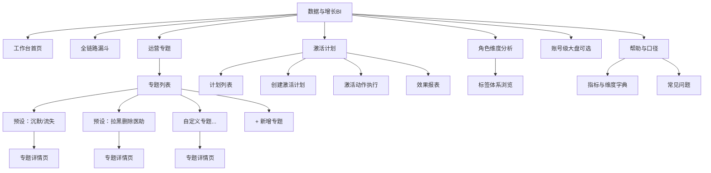

# 数据中台与BI看板：信息架构与页面布局（V2.0）

> **文档类型**：信息架构（IA）+ 页面线框说明  
> **版本**：V2.0  
> **创建日期**：2026-05-17  
> **关联**：[PRD.md](./PRD.md)第8章、[field-list.md](./field-list.md)、[用户标签体系.md](./用户标签体系.md)  
> **基于**：PRD V1.5（含专题管理、激活计划、效果报表）

---

## 1. 概述与变更说明

### 1.1 与V1.0的主要差异

| 变更项 | V1.0（信息架构和页面局部.md） | V2.0（本文档） |
|--------|-------------------------------|----------------|
| 运营专题 | 固定3个子页（沉默/流失、拉黑、医助排行） | 专题列表页 + 预设专题 + 自定义新增专题 + 专题详情页 |
| 激活计划 | 无 | 新增：激活计划管理页、计划创建、激活动作执行 |
| 效果报表 | 无 | 新增：计划效果报表页（标签变化对比、趋势图） |
| 标签体系 | 未独立展示 | 新增：标签体系浏览页（三大维度标签浏览） |
| 状态流转 | 无 | 新增：计划状态流转可视化面板 |

### 1.2 核心结论

- **一级导航**共6组：**工作台**、**全链路漏斗**、**角色维度分析**、**运营专题**（含专题管理与激活）、**账号级大盘（可选）**、**帮助与口径**。
- **运营专题**下拆分为：专题列表、专题详情、激活计划管理、效果报表四个核心子页面。
- **布局范式**：桌面端优先，**顶栏+数据条+筛选条+内容区（上卡下表/左图右表）**；全站固定展示**业务日`pt`**。
- **嵌入场景**：若嵌入医助工作台，仅开放**医助漏斗简版**与**本人服务概览**子路径。

---

## 2. 信息架构（站点地图）

### 2.1 导航树



### 2.2 逻辑路径与命名

| 逻辑路径 | 页面名称 | 说明 |
|----------|----------|------|
| `/bi` | 工作台首页 | 入口总览、快捷跳转、数据就绪状态 |
| `/bi/funnel` | 全链路漏斗 | 主漏斗与趋势 |
| `/bi/profile` | 角色维度分析 | 画像分布与明细 |
| `/bi/profile/tags` | 标签体系浏览 | 三大维度标签浏览与分布统计 |
| `/bi/topic` | 专题列表 | 预设专题 + 自定义专题管理 |
| `/bi/topic/:id` | 专题详情 | 专题条件、用户列表、对比分析、运营行动入口 |
| `/bi/topic/create` | 新增专题 | 标签组合选择、命名、实时预览、保存 |
| `/bi/plan` | 激活计划列表 | 全部计划（筛选状态/专题/时间）；计划状态流转操作 |
| `/bi/plan/create` | 创建激活计划 | 关联专题 → 确认用户 → 编辑消息 → 提交 |
| `/bi/plan/:id` | 计划详情 | 计划信息、状态、操作（取消/关闭）、效果入口 |
| `/bi/plan/:id/report` | 效果报表 | 标签变化对比、7天趋势、用户明细 |
| `/bi/account-gmv` | 账号级GMV | **独立入口**，与角色页分离 |
| `/bi/help` | 帮助与口径 | 外链指标字典、版本公告 |

### 2.3 角色可见性

| 导航节点 | 系统管理员 | 数据工程师 | 渠道运营 | 医助主管 | 医助 | 数据分析师 |
|----------|------------|------------|----------|----------|------|------------|
| 工作台首页 | ✅ | ✅ | ✅ | ✅ | ✅ | ✅ |
| 全链路漏斗 | ✅ | ✅ | 本渠道 | ✅（可选配置） | 本人/本组 | ✅（脱敏） |
| 角色维度分析 | ✅ | ✅ | 本渠道 | ✅ | 受限 | ✅（脱敏） |
| 标签体系浏览 | ✅ | ✅ | ✅ | ✅ | ❌ | ✅ |
| 专题列表 | ✅ | ✅ | 本渠道 | ✅ | ❌ | ✅ |
| 专题详情 | ✅ | ✅ | 本渠道 | ✅ | 受限（本人相关） | ✅（脱敏） |
| 新增专题 | ✅ | ❌ | ✅ | ✅ | ❌ | ✅ |
| 激活计划列表 | ✅ | ❌ | ✅（本计划） | ✅（本团队） | ❌ | ✅（仅查看） |
| 创建激活计划 | ✅ | ❌ | ✅ | ✅ | ❌ | ✅（仅供分析） |
| 效果报表 | ✅ | ✅ | ✅（本计划） | ✅（本团队） | ❌ | ✅（脱敏） |
| 账号级大盘 | ✅ | ✅ | ✅审批 | ✅ | 视配置 | ✅ |

---

## 3. 全局框架布局

### 3.1 线框（ASCII）

```
┌──────────────────────────────────────────────────────────────────────────┐
│ 顶栏：产品名 | 环境staging水印 | 全局搜索(可选) | 帮助 | 用户/退出       │
├──────────────────────────────────────────────────────────────────────────┤
│ 数据条：数据截至 pt=yyyy-MM-dd（T+1） | 数据就绪●/⚠ | 公告(可关闭)     │
├──────────────┬───────────────────────────────────────────────────────────┤
│ 侧栏导航      │ 筛选条：业务日 | 渠道 | 医助 | 其他维度… | [应用] [重置] │
│ ·工作台       ├───────────────────────────────────────────────────────────┤
│ ·全链路漏斗   │ 内容区（见各页「页面局部」）                               │
│ ·角色分析  ▸  │                                                          │
│   └标签体系   │                                                          │
│ ·运营专题  ▸  │                                                          │
│   └专题列表   │                                                          │
│   └新增专题   │                                                          │
│ ·激活计划  ▸  │                                                          │
│   └计划列表   │                                                          │
│   └创建计划   │                                                          │
│ ·账号大盘(选) │                                                          │
│ ·帮助         ├───────────────────────────────────────────────────────────┤
│              │ 页脚：指标口径链接 | 反馈工单 | 版本号                      │
└──────────────┴───────────────────────────────────────────────────────────┘
```

### 3.2 区域尺寸与响应

| 区域 | 桌面（≥1280px） | 说明 |
|------|-----------------|------|
| 侧栏 | 宽度220～240px，可折叠 | 折叠后顶栏增加「菜单」图标展开 |
| 筛选条 | 占满内容区宽度，筛项换行 | 核心筛项始终可见 |
| 内容区 | 剩余宽度 | 卡片栅格12列 |
| 窄屏（<1280px） | 侧栏默认折叠 | 筛选收起到「更多筛选」抽屉 |

---

## 4. 页面局部：工作台首页（`/bi`）

### 4.1 布局线框

```
┌─────────────────────────────────────────────────────────────┐
│ 筛选：无或仅「业务日」                                        │
├─────────────────────────────────────────────────────────────┤
│ 第一行：4张KPI卡（昨日）                                      │
│ [昨日加微] [昨日F10人数] [昨日GMV] [任务状态●/⚠]             │
├───────────────────────────────┬─────────────────────────────┤
│ 左：快捷入口（大按钮/卡片）      │ 右：公告与版本             │
│ ·全链路漏斗 ·角色分析 ·专题    │ ·口径变更摘要              │
│ ·激活计划  ·标签浏览           │ ·最近回补记录              │
│ ·账号大盘(有权限才显示)        │ ·最近激活计划摘要           │
└───────────────────────────────┴─────────────────────────────┘
```

### 4.2 组件清单

| 区域 | 组件 | 数据/行为 |
|------|------|-----------|
| KPI卡 | 指标卡×4 | 绑定`pt=昨日`；任务状态来自调度元数据 |
| 快捷入口 | 卡片导航 | 跳转各子路径；未授权项不展示 |
| 公告区 | 富文本列表 | 运营/数据配置，支持已读标记 |
| 激活计划摘要 | 卡片 | 展示最近3条计划的名称、状态、创建时间 |

---

## 5. 页面局部：全链路漏斗（`/bi/funnel`）

### 5.1 布局线框

```
┌─────────────────────────────────────────────────────────────┐
│ 筛选条：业务日范围 | 渠道多选 | 医助 | 转化主体单选 | 应用/重置│
├─────────────────────────────────────────────────────────────┤
│ 概览卡片区（横向4卡）                                         │
│ [F01人数] [F10人数] [总转化率] [GMV]                          │
├───────────────────────────────┬─────────────────────────────┤
│ 左：漏斗主图（60%宽）          │ 右：环节转化率条形（40%）   │
│ F01→F10 可点击                │ 与左联动高亮               │
├─────────────────────────────────────────────────────────────┤
│ 趋势区：折线（F10或GMV按日）                                  │
└─────────────────────────────────────────────────────────────┘
```

### 5.2 交互说明

| 元素 | 交互 | 备注 |
|------|------|------|
| 漏斗步骤块 | 单击打开右侧**抽屉**：步骤定义、去重规则、Top渠道 | 抽屉宽度480px |
| 转化主体 | 切换后**整页刷新**并Toast提示当前主体 | 防与账号页混淆 |
| 导出 | 工具栏「导出」→仅聚合维度时可用；明细走审批 | 见PRD R12 |

---

## 6. 页面局部：角色维度分析（`/bi/profile`）

### 6.1 布局线框

```
┌─────────────────────────────────────────────────────────────┐
│ 筛选：业务日(单日) | 服务阶段 | 意向层级 | 基础画像 | 行为交互│
│       | 应用/重置                                             │
├───────────────────────────┬─────────────────────────────────┤
│ 上左：意向层级分布饼图      │ 上右：成交与调理阶段柱状图     │
├───────────────────────────┴─────────────────────────────────┤
│ 中：健康摘要TopN（脱敏文本列表或词云占位）                     │
├─────────────────────────────────────────────────────────────┤
│ 下：趋势（沉默数/流失数，近30日）                             │
├─────────────────────────────────────────────────────────────┤
│ 底：明细表（分页）                                            │
│ 列：role_id | channel | service_stage | 意向层级 | 标签摘要   │
│ 操作列：[查看专题] [标签详情]                                 │
└─────────────────────────────────────────────────────────────┘
```

### 6.2 表格列与操作

| 列 | 宽度建议 | 说明 |
|----|----------|------|
| role_id | 固定 | 禁止展示手机号等可反识别字段 |
| channel | 中 | |
| service_stage | 中 | 枚举见field-list |
| 意向层级 | 中 | 高/中/低/流失风险/已流失 |
| tag_summary | 自适应 | 脱敏摘要 |
| 操作 | 固定 | 「查看专题」下拉：跳转关联专题；「标签详情」打开抽屉 |

---

## 7. 页面局部：标签体系浏览（`/bi/profile/tags`）

### 7.1 布局线框

```
┌─────────────────────────────────────────────────────────────┐
│ 标题：私域用户分层运营标签体系                                 │
├─────────────────────────────────────────────────────────────┤
│ Tab切换：[维度一：基础画像] [维度二：行为交互] [维度三：转化状态]│
├─────────────────────────────────────────────────────────────┤
│ 当前维度下的标签分类列表                                      │
│ ┌──────────────────────────────────────────────────────┐    │
│ │ 标签分类 | 标签示例 | 说明 | 用户分布（柱状mini图）  │    │
│ ├──────────────────────────────────────────────────────┤    │
│ │ 年龄段   | 18-25/26-35/... | 基于注册信息 | ▇▇▇▆▃▁ │    │
│ │ 健康状态 | 糖尿病/高血压/... | AI打标 | ▇▅▃▂       │    │
│ │ ...      |                                           │    │
│ └──────────────────────────────────────────────────────┘    │
├─────────────────────────────────────────────────────────────┤
│ 底部：典型用户分层运营示例（卡片组）                           │
│ [沉默高意向用户] [报价后未支付] [首单服药中复购潜力]           │
│ 每张卡展示：标签组合条件 + 当前命中人数 + 建议运营策略         │
└─────────────────────────────────────────────────────────────┘
```

### 7.2 组件说明

| 区域 | 组件 | 数据/行为 |
|------|------|-----------|
| Tab | 维度切换 | 切换展示不同维度的标签分类表 |
| 标签表 | 表格 + 分布mini图 | 数据来自画像宽表统计，T+1更新 |
| 分布图 | 行内迷你柱状图 | 展示各标签值的用户占比 |
| 典型示例卡 | 卡片组 | 点击跳转到专题列表筛选或直接创建专题 |
| 标签来源 | 图标标注 | rule/model/crm_sync/manual 用不同颜色图标标识 |

---

## 8. 页面局部：运营专题

### 8.1 专题列表页（`/bi/topic`）

```
┌─────────────────────────────────────────────────────────────┐
│ 标题：运营专题                               [+ 新增专题]     │
├─────────────────────────────────────────────────────────────┤
│ 筛选：专题类型（预设/自定义/全部） | 搜索专题名称              │
├─────────────────────────────────────────────────────────────┤
│ 预设专题区（始终置顶，不可删除）                               │
│ ┌─────────────────────┐ ┌─────────────────────┐            │
│ │ 📋 沉默/流失         │ │ 📋 拉黑删除医助      │            │
│ │ 条件：SILENT/CHURN   │ │ 条件：关系破裂/黑名单│            │
│ │ 当前命中：1,234人    │ │ 当前命中：89人       │            │
│ │ [查看详情]           │ │ [查看详情]           │            │
│ └─────────────────────┘ └─────────────────────┘            │
├─────────────────────────────────────────────────────────────┤
│ 自定义专题区                                                 │
│ ┌─────────────────────┐ ┌─────────────────────┐            │
│ │ 📋 报价后沉默高意向   │ │ 📋 首单服药复购潜力  │            │
│ │ 条件：3标签AND组合    │ │ 条件：2标签组合      │            │
│ │ 当前命中：456人      │ │ 当前命中：312人      │            │
│ │ [查看] [编辑] [删除] │ │ [查看] [编辑] [删除] │            │
│ └─────────────────────┘ └─────────────────────┘            │
└─────────────────────────────────────────────────────────────┘
```

### 8.2 新增专题页（`/bi/topic/create`）

```
┌─────────────────────────────────────────────────────────────┐
│ 标题：新增自定义专题                                          │
├─────────────────────────────────────────────────────────────┤
│ Step 1：选择标签条件                                          │
│ ┌───────────────────────────────────────────────────────┐   │
│ │ 维度一：基础画像        [多选下拉]                     │   │
│ │ 维度二：行为交互        [多选下拉]                     │   │
│ │ 维度三：转化状态        [多选下拉]                     │   │
│ │ 逻辑关系：(AND) / (OR)  [切换按钮]                    │   │
│ └───────────────────────────────────────────────────────┘   │
├─────────────────────────────────────────────────────────────┤
│ Step 2：实时预览                                             │
│ ┌───────────────────────────────────────────────────────┐   │
│ │ 当前条件命中用户数：1,234 人                           │   │
│ │ [预览用户列表（前20条）]                               │   │
│ └───────────────────────────────────────────────────────┘   │
├─────────────────────────────────────────────────────────────┤
│ Step 3：命名与保存                                           │
│ ┌───────────────────────────────────────────────────────┐   │
│ │ 专题名称：[________________]                           │   │
│ │ 专题描述（选填）：[________________]                   │   │
│ │                            [取消]  [保存专题]          │   │
│ └───────────────────────────────────────────────────────┘   │
└─────────────────────────────────────────────────────────────┘
```

### 8.3 专题详情页（`/bi/topic/:id`）

```
┌─────────────────────────────────────────────────────────────┐
│ 面包屑：运营专题 > 沉默/流失                                  │
│ 标题：沉默/流失              [编辑条件](仅自定义) [创建激活计划]│
├─────────────────────────────────────────────────────────────┤
│ 专题定义区（折叠面板）                                        │
│ 筛选条件：service_stage ∈ {SILENT, CHURN}                    │
│ 数据来源：T+1批量计算 | 定义见R05                             │
├─────────────────────────────────────────────────────────────┤
│ 筛选：业务日 | 渠道 | 医助 | 应用/重置                        │
├───────────────────────────────┬─────────────────────────────┤
│ 左：趋势图（命中人数 近30日）  │ 右：渠道/意向分布堆叠条     │
├───────────────────────────────┴─────────────────────────────┤
│ 对比分析区                                                   │
│ 专题用户 vs 全量用户：意向层级分布 | 成交阶段分布 | 渠道分布   │
├─────────────────────────────────────────────────────────────┤
│ 用户列表（分页表格）                                          │
│ 列：role_id | 渠道 | 服务阶段 | 意向层级 | 标签摘要 | 操作    │
│ 操作：[导出选中/全量（审批）]                                 │
├─────────────────────────────────────────────────────────────┤
│ 医助侧视图（主管可见）                                        │
│ 表格：医助 | 关联沉默用户数 | 7日接待量 | 操作（仅查看）       │
└─────────────────────────────────────────────────────────────┘
```

---

## 9. 页面局部：激活计划

### 9.1 计划列表页（`/bi/plan`）

```
┌─────────────────────────────────────────────────────────────┐
│ 标题：激活计划管理                            [+ 创建新计划]  │
├─────────────────────────────────────────────────────────────┤
│ 筛选：计划状态（全部/草稿/待审批/执行中/已完成/已关闭/已取消）│
│       | 关联专题 | 创建时间范围 | 创建人 | 搜索计划名称        │
├─────────────────────────────────────────────────────────────┤
│ 计划列表表格                                                 │
│ 列：计划名称 | 关联专题 | 状态(标签色) | 用户数 | 发送时间     │
│     | 创建人 | 创建时间 | 操作                                │
│                                                             │
│ 状态标签色彩：                                               │
│ DRAFT=灰 PENDING=蓝 APPROVED=绿 REJECTED=红                 │
│ EXECUTING=橙 COMPLETED=深绿 CANCELLED=灰删除线 CLOSED=深灰   │
│                                                             │
│ 操作列（按状态动态展示）：                                    │
│ · DRAFT → [编辑] [提交审批] [取消]                            │
│ · PENDING → [撤回] [取消]                                    │
│ · APPROVED → [执行] [取消]                                   │
│ · COMPLETED → [查看效果] [关闭]                              │
│ · CLOSED → [查看效果] [复制计划]                              │
│ · CANCELLED → [复制计划]                                     │
└─────────────────────────────────────────────────────────────┘
```

### 9.2 创建激活计划页（`/bi/plan/create`）

```
┌─────────────────────────────────────────────────────────────┐
│ 标题：创建激活计划                                            │
├─────────────────────────────────────────────────────────────┤
│ Step 1：关联专题                                             │
│ ┌───────────────────────────────────────────────────────┐   │
│ │ 选择已有专题：[下拉选择：沉默/流失 | 拉黑删除 | 自定义…]│   │
│ │ 或：[+ 直接新增专题]（跳转新增专题流程）               │   │
│ └───────────────────────────────────────────────────────┘   │
├─────────────────────────────────────────────────────────────┤
│ Step 2：确认用户列表                                         │
│ ┌───────────────────────────────────────────────────────┐   │
│ │ 当前专题命中用户数：1,234 人                           │   │
│ │ 用户列表预览（前10条）：                               │   │
│ │ role_id | 渠道 | 服务阶段 | 意向层级                   │   │
│ │ ...                                                   │   │
│ └───────────────────────────────────────────────────────┘   │
├─────────────────────────────────────────────────────────────┤
│ Step 3：编辑激活动作                                         │
│ ┌───────────────────────────────────────────────────────┐   │
│ │ 消息类型：[文本 ○] [图片 ○]                            │   │
│ │ 消息内容：[富文本编辑器，支持{用户昵称}变量]            │   │
│ │ 通知医助：[✓ 是]                                      │   │
│ └───────────────────────────────────────────────────────┘   │
├─────────────────────────────────────────────────────────────┤
│ Step 4：命名与提交                                           │
│ ┌───────────────────────────────────────────────────────┐   │
│ │ 计划名称：[________________]                           │   │
│ │ 系统生成计划ID：plan_20260517_001                      │   │
│ │                   [保存草稿]  [提交审批]               │   │
│ └───────────────────────────────────────────────────────┘   │
└─────────────────────────────────────────────────────────────┘
```

### 9.3 计划详情页（`/bi/plan/:id`）

```
┌─────────────────────────────────────────────────────────────┐
│ 面包屑：激活计划 > 沉默用户召回-05月第2批                      │
│ 标题 + 状态标签：[COMPLETED ●]        [查看效果] [关闭计划]   │
├─────────────────────────────────────────────────────────────┤
│ 基本信息卡                                                   │
│ 计划ID：plan_20260515_003                                   │
│ 关联专题：沉默/流失                                          │
│ 创建人：张运营 | 创建时间：2026-05-15 10:30                   │
│ 用户数：1,234 | 消息类型：文本                                │
├─────────────────────────────────────────────────────────────┤
│ 状态流转时间线                                               │
│ ●DRAFT(05-15 10:30) → ●PENDING(10:35) → ●APPROVED(11:00)   │
│ → ●EXECUTING(11:05) → ●COMPLETED(11:12)                    │
├─────────────────────────────────────────────────────────────┤
│ 消息内容预览                                                 │
│ "亲爱的{用户昵称}，好久没联系了，最近身体…"                   │
├─────────────────────────────────────────────────────────────┤
│ 发送结果摘要                                                 │
│ 成功发送：1,180人 | 失败：54人（已删除医助）                   │
│ [查看失败明细]                                               │
└─────────────────────────────────────────────────────────────┘
```

### 9.4 效果报表页（`/bi/plan/:id/report`）

```
┌─────────────────────────────────────────────────────────────┐
│ 面包屑：激活计划 > 沉默用户召回-05月第2批 > 效果报表           │
├─────────────────────────────────────────────────────────────┤
│ 计划摘要卡                                                   │
│ 计划名称 | 关联专题 | 发送时间 | 发送人数 | 到达人数           │
├─────────────────────────────────────────────────────────────┤
│ 核心指标对比区（横向4卡）                                     │
│ [开口率变化]   [删除率变化]  [意向提升率]  [成交转化率变化]    │
│  12%→28%↑      3%→5%↑       8%→15%↑       2%→4%↑           │
│  +16pp         +2pp          +7pp          +2pp              │
├─────────────────────────────────────────────────────────────┤
│ 趋势图区                                                     │
│ 激活后7天标签变化趋势（折线/柱状）                            │
│ X轴：Day1 ~ Day7 | Y轴：指标值                              │
│ 图例：开口率 / 删除率 / 意向提升率                            │
├─────────────────────────────────────────────────────────────┤
│ 数据表格（按日）                                             │
│ 日期 | 开口率 | 删除率 | 意向提升率 | 成交转化率              │
│ Day1 | 14%   | 3.2%  | 9%        | 2.1%                    │
│ Day2 | 18%   | 3.5%  | 11%       | 2.5%                    │
│ ...                                                         │
├─────────────────────────────────────────────────────────────┤
│ 用户明细（可展开）                                           │
│ role_id | 激活前标签 | 激活后标签(T+1) | 变化标识             │
│ （脱敏，仅展示标签变化，不展示PII）                           │
└─────────────────────────────────────────────────────────────┘
```

---

## 10. 页面局部：账号级大盘（`/bi/account-gmv`）

### 10.1 布局线框

```
┌─────────────────────────────────────────────────────────────┐
│ 标题条（固定文案）：账号粒度GMV（user_id）  [返回角色分析]    │
├─────────────────────────────────────────────────────────────┤
│ 筛选：业务日范围 | 渠道 | 应用/重置                           │
├─────────────────────────────────────────────────────────────┤
│ KPI：付费账号数 | GMV | 客单价                               │
├─────────────────────────────────────────────────────────────┤
│ 趋势折线 + 渠道堆叠（可选）                                   │
└─────────────────────────────────────────────────────────────┘
```

**禁止**：与本模块其他页使用**同一浏览器Tab标题**且不展示粒度文案。

---

## 11. 页面局部：帮助与口径（`/bi/help`）

| 区块 | 内容 |
|------|------|
| 指标口径 | 外链至`analysis/data-platform`指标字典或内部Wiki |
| 版本公告 | 列表：日期、版本、影响指标、是否需重看昨日 |
| 常见问题 | 折叠列表：T+1含义、为何与CRM不一致、如何申请导出 |
| 标签体系说明 | 链接到标签体系浏览页（`/bi/profile/tags`） |

---

## 12. 弹窗与模态框

### 12.1 取消计划确认弹窗

```
┌─────────────────────────────────────────┐
│ ⚠️ 确认取消计划                          │
├─────────────────────────────────────────┤
│ 计划名称：沉默用户召回-05月第2批          │
│ 当前状态：PENDING                        │
│                                         │
│ 取消原因（必填，最少10字）：             │
│ [________________________________]      │
│                                         │
│ ⚠️ 取消后不可恢复，请确认操作。          │
│                                         │
│              [放弃]     [确认取消]       │
└─────────────────────────────────────────┘
```

### 12.2 关闭计划确认弹窗

```
┌─────────────────────────────────────────┐
│ 确认关闭计划                             │
├─────────────────────────────────────────┤
│ 计划名称：沉默用户召回-05月第2批          │
│ 当前状态：COMPLETED                      │
│                                         │
│ 关闭后效果报表将定稿锁定，不再更新数据。 │
│ 如需继续追踪，建议等待效果追踪期结束。   │
│                                         │
│              [放弃]     [确认关闭]       │
└─────────────────────────────────────────┘
```

### 12.3 导出审批弹窗

```
┌─────────────────────────────────────────┐
│ 申请导出用户列表                         │
├─────────────────────────────────────────┤
│ 导出范围：当前专题全量用户（1,234人）     │
│ 导出字段：role_id, channel, stage, tags │
│ 用途说明（必填）：[________________]     │
│                                         │
│ 📎 导出文件将含水印，有效期7天。         │
│                                         │
│              [取消]     [提交审批]       │
└─────────────────────────────────────────┘
```

---

## 13. 全局组件规范

| 组件 | 规范 |
|------|------|
| 数据就绪●/⚠ | ●绿：昨日`pt`已成功；⚠黄：延迟；灰：冻结中 |
| Toast | 成功2s自动关闭、错误常驻至用户关闭 |
| 空状态 | 插图+「无数据」+建议调整筛选+链到帮助 |
| 抽屉 | 从右侧滑入，Esc关闭，遮罩点击关闭，宽度480px |
| 导出按钮 | 二级菜单：「导出当前图表数据」「申请明细导出」 |
| 状态标签 | 圆角标签，颜色编码见§9.1；hover展示状态说明 |
| 面包屑 | 超过2级路径时展示；首项始终为一级导航页 |
| 步骤条 | 用于创建专题、创建计划等多步表单；当前步高亮 |
| 确认弹窗 | 破坏性操作（取消/关闭/删除）必须确认；输入验证 |

---

## 14. 页面间跳转关系

```mermaid
flowchart LR
  profile[角色维度分析] -->|行内"查看专题"| topic_detail[专题详情页]
  topic_list[专题列表] -->|点击专题卡| topic_detail
  topic_detail -->|"创建激活计划"按钮| plan_create[创建激活计划]
  topic_detail -->|"导出"| export_modal[导出审批弹窗]
  plan_list[计划列表] -->|"创建新计划"| plan_create
  plan_create -->|提交成功| plan_detail[计划详情]
  plan_detail -->|"查看效果"| plan_report[效果报表]
  plan_detail -->|"取消计划"| cancel_modal[取消确认弹窗]
  plan_detail -->|"关闭计划"| close_modal[关闭确认弹窗]
  plan_list -->|"复制计划"| plan_create
  hub[工作台] -->|快捷入口| topic_list
  hub -->|快捷入口| plan_list
  profile -->|"标签体系"入口| tag_browse[标签体系浏览]
  tag_browse -->|典型示例卡点击| topic_list
```

---

## 15. 与设计/前端协作清单

- [ ] 设计Token与现有管理后台对齐（色板、字号、圆角）。
- [ ] 侧栏菜单图标与文案冻结，与权限配置同步。
- [ ] 嵌入iframe时高度自适应与postMessage安全白名单。
- [ ] 无障碍：图表区提供「数据表视图」切换以满足读屏（P2）。
- [ ] 专题列表卡片组件统一设计规范（预设 vs 自定义视觉区分）。
- [ ] 计划状态标签色彩方案确认（8种状态色编码）。
- [ ] 效果报表图表组件选型（柱状+折线组合图）。
- [ ] 步骤条组件样式（创建专题3步、创建计划4步）。
- [ ] 取消/关闭弹窗的文案与交互确认。

---

## 16. 修订记录

| 版本 | 日期 | 修订内容 | 修订人 |
|------|------|----------|--------|
| V1.0 | 2026-05-15 | 初版：IA、全局框架与各页面线框（见`信息架构和页面局部.md`） | 产品 |
| V2.0 | 2026-05-17 | 基于PRD V1.5重构：新增专题管理（预设+自定义）、激活计划管理、效果报表、标签体系浏览、状态流转可视化、弹窗规范、页面跳转关系图 | 产品 |
