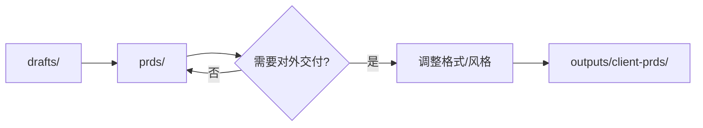

# 最终交付物 (Outputs)

本文件夹用于存放**对外交付的最终成品**。包括PRD、PPT、汇报材料、交接文档等各类正式交付物。

---

## 📍 使用场景

### 什么时候用这个文件夹？

- ✅ 需要给客户交付正式PRD文档
- ✅ 向上级汇报产品规划
- ✅ 跨团队协作需要正式文档
- ✅ 需求评审会的演示材料
- ✅ 交付给开发/测试/运营的正式手册

### outputs/ vs prds/ 的区别

| 维度     | prds/                 | outputs/                    |
| :------- | :-------------------- | :-------------------------- |
| **受众** | **内部**开发/测试团队 | **外部**客户/上级/跨团队    |
| **内容** | **需求文档**为主      | **各类成品**（不局限于PRD） |
| **格式** | 详细技术规格          | 精美、可演示                |
| **风格** | 开发视角              | 业务视角                    |
| **示例** | 字段清单、API规格     | 汇报PPT、产品手册           |

---

## 📁 文件夹说明

### client-prds/

**对外交付的正式PRD文档**

**适用场景**：

- 交付给客户的PRD
- 提交给上级的正式需求文档
- 跨团队协作的正式文档
- 已定稿的产品规划文档

**特点**：

- 格式规范、排版精美
- 内容完整、经过多轮评审
- 版本号明确
- 面向业务受众（减少技术细节）

**来源**：
从`prds/`中选择需要对外交付的PRD，复制并调整格式。

---

### presentations/

**汇报演示材料**

**适用场景**：

- 需求评审PPT
- 产品规划汇报
- 项目进展汇报
- 对外分享材料
- 培训课件

**特点**：

- 可视化强、图表丰富
- 逻辑清晰、结论先行
- 适合演讲和展示
- 时间控制（通常15-30分钟）

**常见类型**：

- 需求评审PPT
- 季度/年度产品规划
- 技术方案评审
- 用户调研报告

---

### handoff-docs/

**交接文档**

**适用场景**：

- 开发交接文档（给开发团队）
- 测试说明文档（给测试团队）
- 运营手册（给运营团队）
- 产品使用指南（给最终用户）
- 培训材料（给新人）

**特点**：

- 面向特定受众
- 操作步骤详细
- 包含关键注意事项
- FAQ章节

**常见类型**：

- 《XX系统开发交接文档》
- 《XX功能测试说明》
- 《XX系统运营手册》
- 《XX产品使用指南》

---

### archive/

**归档的历史交付物**

**归档条件**：

- 不再使用的交付物
- 已被新版本替代
- 项目结束

**命名格式**：`[文件名]-YYYYMMDD/`

---

## 📋 文件命名规范

### 正式PRD文档

格式：`[模块名]PRD_v[版本号]_[日期].md`

**示例**：

- `采购管理PRD_v1.0_20260201.md`
- `库存中心PRD_v2.1_20260215.md`

---

### 演示文档

格式：`[主题]_[受众]_[日期].[扩展名]`

**示例**：

- `库存系统需求评审_技术团队_20260201.pptx`
- `Q1产品规划_管理层_20260115.pdf`
- `用户调研报告_产品团队_20260120.pptx`

---

### 交接文档

格式：`[系统名]_[文档类型]_v[版本号].md`

**示例**：

- `订单系统_开发交接文档_v1.0.md`
- `库存中心_测试说明_v1.2.md`
- `ERP系统_运营手册_v2.0.pdf`

---

## 🔄 工作流程

### 从prds到outputs的流转



**具体步骤**：

1. **草稿阶段**：在`drafts/`中创建初稿
2. **内部迭代**：移至`prds/`完善和评审
3. **选择交付**：确定需要对外交付的文档
4. **调整格式**：
   - 移除过于技术化的内容
   - 优化排版和格式
   - 增加可视化元素
   - 添加封面和版本信息
5. **复制到outputs**：保留在`prds/`，复制到`outputs/`
6. **版本管理**：每次重大修订更新版本号
7. **归档处理**：不再使用的文档移至`archive/`

---

## ✅ 质量标准

放入outputs的文档必须满足：

### 内容质量

- ✅ 经过完整的内部评审
- ✅ 格式规范、无明显错误
- ✅ 版本号清晰
- ✅ 内容完整、逻辑清晰

### 对外适配

- ✅ 适合目标受众（客户/上级/跨团队）
- ✅ 业务语言为主（减少技术术语）
- ✅ 排版精美、可读性强
- ✅ 包含必要的背景说明

### 正式性

- ✅ 有封面和版本信息
- ✅ 有修订记录
- ✅ 有作者和日期
- ✅ 适合对外展示

---

## 📊 不同交付物的侧重点

### PRD（client-prds/）

**面向客户/上级**：

- ✅ 强调业务价值
- ✅ 强调用户故事和场景
- ✅ 减少技术实现细节
- ✅ 增加可视化（流程图、效果图）

**vs prds/中的PRD**：

- prds/：字段类型用`Decimal(18,2)`
- outputs/：字段类型用"金额（精确到分）"

---

### PPT（presentations/）

**汇报演示**：

- ✅ 结论先行（第一页给结论）
- ✅ 数据可视化（图表优于表格）
- ✅ 逻辑清晰（总-分-总结构）
- ✅ 时间控制（每页1-2分钟）

**典型结构**：

1. 背景与目标
2. 核心方案（3-5页）
3. 价值与收益
4. 风险与应对
5. 下一步行动

---

### 交接文档（handoff-docs/）

**操作指南**：

- ✅ 步骤化（Step 1, 2, 3...）
- ✅ 截图辅助说明
- ✅ 注意事项高亮
- ✅ 常见问题FAQ

**典型结构**：

1. 系统概述
2. 核心功能
3. 操作指南（分步骤）
4. 注意事项
5. FAQ

---

## 💡 最佳实践

### 1. 严格把关

只有经过正式审核的文档才放入outputs。

### 2. 版本管理

每次交付都应有明确的版本号和交付日期。

### 3. 定期备份

outputs文件夹定期备份，避免丢失重要交付物。

### 4. 权限管理

如果涉及敏感信息（客户数据、商业策略），注意访问权限控制。

### 5. 格式统一

同一类型的交付物使用统一的模板和格式。

---

## 🎯 产出checklist

### PRD交付前

- [ ] 内容完整，逻辑闭环
- [ ] 格式规范，排版精美
- [ ] 版本号和日期清晰
- [ ] 适合目标受众
- [ ] 经过内部评审

### PPT交付前

- [ ] 结论先行
- [ ] 图表清晰
- [ ] 逻辑流畅
- [ ] 时间控制合理
- [ ] 演讲稿准备（如需要）

### 交接文档交付前

- [ ] 操作步骤完整
- [ ] 截图清晰
- [ ] 注意事项明确
- [ ] FAQ覆盖常见问题
- [ ] 受众能独立操作

---

## ⚠️ 注意事项

- **不要混淆**：outputs是对外交付，prds是内部开发文档
- **保留副本**：prds/中保留技术版本，outputs/是业务版本
- **敏感信息**：对外交付前检查是否包含敏感信息
- **版本同步**：outputs/中的PRD更新时，确保prds/也同步

---

## 🔄 与其他文件夹的关系

| 文件夹        | 关系                                            |
| :------------ | :---------------------------------------------- |
| **prds/**     | outputs/的PRD主要来源于prds/（调整格式后）      |
| **drafts/**   | 演示材料可能在drafts/中草拟，定稿后移至outputs/ |
| **analysis/** | 汇报PPT可能引用analysis/中的业务分析结论        |
| **assets/**   | 演示材料使用assets/中的图片、流程图             |

---

## 🎓 示例场景

### 场景1: 客户交付PRD

```bash
# 1. 从prds/复制
cp prds/purchase-order/PRD.md outputs/client-prds/采购订单PRD_v1.0_20260201.md

# 2. 调整内容
- 移除技术实现细节
- 增加业务场景说明
- 优化排版格式

# 3. 添加封面和版本信息
```

### 场景2: 需求评审会

```bash
# 1. 创建PPT草稿
在drafts/中创建 "库存系统需求评审.pptx"

# 2. 完善内容
- 引用prds/中的核心需求
- 引用assets/中的流程图
- 添加演讲notes

# 3. 定稿后移至outputs
mv drafts/库存系统需求评审.pptx outputs/presentations/库存系统需求评审_技术团队_20260201.pptx
```

### 场景3: 开发交接

```bash
# 1. 基于prds/创建交接文档
参考prds/purchase-order/PRD.md

# 2. 调整为开发视角
- 强调技术实现要点
- 补充API接口说明
- 添加数据库设计
- 列出关键注意事项

# 3. 输出到handoff-docs/
保存为 outputs/handoff-docs/采购订单系统_开发交接文档_v1.0.md
```
