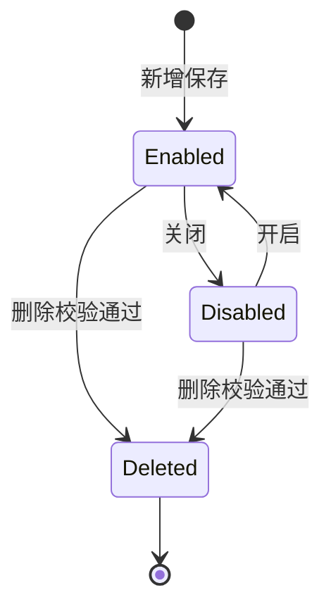

# 渠道管理与流量管理产品需求文档（PRD）

- **文档类型**：PRD
- **模块**：渠道管理与流量管理（channel-traffic-management）
- **版本**：V1.0
- **创建日期**：2026-05-17
- **最后更新**：2026-05-17
- **作者**：产品（AI辅助起草）
- **原型依据**：渠道管理与流量管理增删改查页面截图（2026-05-17）
- **关联上下文**：`context/公司业务信息/1. 公司&业务介绍.md`、`4. 核心业务流程详解.md`、`5. 数据模型与业务对象.md`、`6. 系统功能清单和上下游集成系统.md`

## 1. 需求背景与目标

### 1.1 业务背景

榕树家中医通过百度、广点通、快手、微博、第三方合作等渠道投放 AI 舌诊、问诊、快测等应用，将用户引导至 H5、小程序，再由医生、医助团队和医助承接。当前渠道与承接配置分散，流量分配依赖人工维护，运营无法稳定控制不同渠道、应用版本、医生、团队和医助之间的分配比例。

本需求建设统一的渠道管理与流量管理后台，支撑运营配置渠道、应用、应用版本、渠道和应用版本绑定关系，并按权重将新进入流量分配给医生、服务团队和医助。

### 1.2 需求目标

| 目标编号 | 目标描述 | 衡量方式 |
|----------|----------|----------|
| G01 | 统一维护渠道、应用、版本及渠道-应用配置 | 渠道和应用配置可在后台完成增删改查与启停 |
| G02 | 支持医生、团队、医助三层流量分配 | 新流量可根据配置命中医生、团队和医助 |
| G03 | 支持权重化分配与指定医助实验流量 | 权重、占比展示正确；指定医助优先命中 |
| G04 | 保障配置变更安全 | 必填、唯一性、启停、删除、关联校验生效 |

### 1.3 需求范围

**包含**：

- 渠道列表、新增/编辑渠道、删除渠道、启停渠道。
- 应用列表、新增/编辑应用、版本管理、删除应用、启停应用。
- 渠道应用配置：为渠道绑定应用、版本、权重。
- 医生流量分配：按平台、渠道、服务医生配置权重。
- 团队流量分配：按平台、渠道、服务团队配置权重。
- 医助流量分配：团队通用、指定医助两类配置。
- 分配规则、异常处理、权限与验收标准。

**不包含**：

- 医生、医助、团队主数据维护。
- 历史已分配用户的自动重分配。

### 1.4 原型地址
https://www.figma.com/design/XSGET6qQ0UtUVgfqI7B1k6/CRM%E5%AE%A2%E6%88%B7%E8%BD%AC%E5%8C%96%E7%9B%B8%E5%85%B3?node-id=295-4472&p=f&t=gtW6A2x3u37YdWFI-0

## 2. 角色与权限

| 角色 | 菜单权限 | 数据权限 | 说明 |
|------|----------|----------|------|
| 超级管理员 | 渠道管理、流量管理 | 全部数据权限 | 可维护全部渠道、应用、版本和流量分配配置 |
| 普通角色 | 无 | 无 | 不展示渠道管理和流量管理菜单 |
| CRM管理员 | 渠道管理、流量管理 | 全部数据权限 | 可维护全部渠道、应用、版本和流量分配配置 |
| AIGC管理员（待确认） | 渠道管理、流量管理 | 指定部门数据权限 | 可维护授权部门范围内配置 |
| 流量组长 | 流量管理-医助流量分配 | 本部门及以下数据权限 | 不展示渠道管理；不展示医生流量分配、团队流量分配 |
| 医生 | 无 | 无 | 不展示渠道管理和流量管理菜单 |
| 医助 | 无 | 无 | 不展示渠道管理和流量管理菜单 |

## 3. 功能清单

| 编号 | 功能名称 | 功能描述 | 优先级 |
|------|----------|----------|--------|
| F01 | 渠道列表 | 按渠道名称、渠道标识、应用标识、状态筛选渠道，展示渠道基础信息和操作入口 | P0 |
| F02 | 新增/编辑渠道 | 维护平台名称、渠道名称、渠道标识、是否子渠道 | P0 |
| F03 | 渠道应用配置 | 为渠道绑定应用、版本、权重，支持移除和保存 | P0 |
| F04 | 应用列表 | 按应用名称、应用标识、状态筛选应用，展示版本与状态 | P0 |
| F05 | 新增/编辑应用 | 维护应用名称、应用标识、ID类型、ID取值、获客方式、备注、状态 | P0 |
| F06 | 版本管理 | 查看、添加、删除、启停应用版本 | P0 |
| F07 | 医生流量分配 | 按平台、渠道、服务医生筛选，配置医生权重 | P0 |
| F08 | 团队流量分配 | 按平台、渠道、服务团队筛选，配置服务团队权重 | P0 |
| F09 | 医助流量分配-团队通用 | 按团队配置医助通用承接权重 | P0 |
| F10 | 医助流量分配-指定医助 | 按渠道和团队配置指定医助实验流量 | P0 |
| F11 | 批量修改权重 | 对勾选记录批量调整权重 | P1 |
| F12 | 分配记录 | 记录新流量命中的渠道、应用版本、医生、团队、医助和结果 | P1 |

## 4. 页面与交互

### 4.1 渠道管理-渠道列表

**筛选项**：

| 筛选项 | 控件 | 说明 |
|--------|------|------|
| 渠道名称 | 输入框 | 支持精确或模糊查询 |
| 应用名称 | 输入框 | 查询已配置指定应用的渠道 |
| 状态 | 下拉单选 | 在线/关闭 |

**列表字段**：

| 列名 | 说明 |
|------|------|
| 平台名称 | 渠道所属平台，如百度商业推广 |
| 渠道名称 | 渠道展示名称 |
| 渠道标识 | 系统识别来源的唯一标识 |
| 子渠道信息 | 展示子渠道关联信息，无则展示 `-` |
| 应用列表 | 已绑定应用列表，无则展示 `-` |
| 状态 | 在线/关闭 |
| 操作 | 编辑、应用配置、删除 |

**交互规则**：

- 点击“添加渠道”打开新增渠道弹窗。
- 点击“编辑”打开编辑渠道弹窗，字段回显。
- 点击“应用配置”打开应用配置弹窗。
- 点击“删除”需二次确认，存在生效配置时禁止删除。

### 4.2 新增/编辑渠道弹窗

| 字段 | 控件 | 必填 | 说明 |
|------|------|------|------|
| 平台名称 | 下拉选择 | 是 | 选择渠道所属平台 |
| 渠道名称 | 输入框 | 是 | 示例：百度h5 |
| 渠道标识 | 输入框 | 是 | 示例：`baidu_doctor_h5` |
| 子渠道 | 单选 | 是 | 关闭/开启，默认关闭 |

弹窗支持取消、保存。保存失败时提示具体字段或规则原因。

### 4.3 渠道管理-应用列表

**筛选项**：应用名称、应用标识、状态。

**列表字段**：应用名称、应用标识、ID 类型、ID 取值、获客方式、在用版本号、备注、状态、最新版本时间、操作。

**行内操作**：编辑、版本管理、删除。

### 4.4 新增/编辑应用弹窗

| 字段 | 控件 | 必填 | 说明 |
|------|------|------|------|
| 应用名称 | 输入框 | 是 | 如问诊、快测、舌诊 |
| 应用标识 | 输入框 | 是 | 全局唯一 |
| ID 类型 | 下拉选择 | 否 | 如第三方传入 |
| ID 取值 | 输入框 | 否 | 对应外部 ID |
| 获客方式 | 下拉选择 | 否 | 如链接 |
| 备注 | 多行输入 | 否 | 说明应用用途 |
| 状态 | 单选 | 是 | 开启/关闭，默认开启 |

### 4.5 版本管理弹窗

展示当前应用名称、版本号、备注、状态、版本时间、操作。

- “添加版本”新增一行版本配置。
- 版本状态支持开启/关闭。
- 删除版本需校验是否存在生效渠道应用配置。
- 关闭版本不可被新增应用配置引用，历史配置保留。

### 4.6 应用配置弹窗

展示当前设置的渠道，如“百度商业推广 / 百度商业推广 / baidu_business_promotion 渠道”。

| 字段 | 控件 | 说明 |
|------|------|------|
| 应用名称 | 下拉选择 | 仅可选择开启状态应用 |
| 版本号 | 下拉选择 | 仅可选择开启状态版本 |
| 状态 | 读取 | 开启/关闭 |
| 权重 | 数字输入 | 范围 0-100 |
| 版本时间 | 文本 | 版本创建或更新时间 |
| 操作 | 文本按钮 | 移除 |

点击“添加应用”新增配置行。保存时校验同一渠道下应用版本配置不重复。

### 4.7 流量管理-医生流量分配

**筛选项**：平台名称、渠道名称、渠道标识、服务医生。

**列表展示**按渠道分组，组头展示平台名称、渠道名称、渠道标识、医生分配类型。组内展示医生名称、占比、权重、操作。

**操作**：新增、编辑、批量修改权重、删除、单行删除。

新增/编辑弹窗字段：平台名称、渠道、医生分配方式、医生名、权重、占比。
医生分配方式支持自主分配医生/第三方指定医生。

### 4.8 流量管理-团队流量分配

**筛选项**：平台名称、渠道名称、服务团队。

**列表展示**按渠道分组，组头展示平台名称、渠道名称、渠道标识、医生分配、流量类型。组内展示服务团队、占比、权重、操作。

新增/编辑弹窗字段：平台名称、渠道、流量分配类型、团队名、权重、占比。流量分配类型支持团队通用、指定医助。

### 4.9 流量管理-医助流量分配

医助流量分配包含二级页签：团队通用、指定医助。

**团队通用**：

- 筛选项：服务团队、医助姓名。
- 列表字段：医助名称、所属团队、所属医生、占比、权重。
- 支持批量修改权重。

**指定医助**：

- 筛选项：平台名称、渠道名称、服务团队、医助名。
- 列表按渠道与服务团队分组，组头展示平台名称、渠道名称、渠道标识、医生分配、服务团队。
- 组内展示医助名称、占比、权重、操作。
- 支持添加医助、批量修改权重、删除。

## 5. 核心业务规则

| 编号 | 规则描述 | 适用场景 |
|------|----------|----------|
| R01 | 平台名称、渠道名称、渠道标识为渠道必填项 | 新增/编辑渠道 |
| R02 | 渠道标识全局唯一，不允许重复 | 新增/编辑渠道 |
| R03 | 应用名称、应用标识为应用必填项，应用标识全局唯一 | 新增/编辑应用 |
| R04 | 应用版本关闭后不可被新增配置引用，历史配置保留但不再承接新流量 | 版本启停、应用配置 |
| R05 | 删除渠道、应用、版本、医生、团队、医助前需校验是否存在生效配置 | 删除操作 |
| R06 | 权重修改保存后立即影响新进入流量，历史已分配用户不重分配 | 权重保存 |
| R07 | 批量修改权重仅对已勾选记录生效 | 批量修改 |
| R08 | 删除分配明细后，该对象不再参与后续分配 | 删除明细 |

### 5.1 分配计算规则

- 权重范围为 0-100，仅允许整数。
- 占比 = 当前明细权重 / 同一分配组内启用明细权重合计。
- 同一分配组内所有启用项权重合计为 0 时，规则不可启用。
- 单项权重为 0 时，占比展示 0%，不参与实际分配。
- 分配组按平台、渠道、分配类型和上级承接对象确定。

## 6. 状态与流转

### 6.1 状态定义

| 对象 | 状态 | 说明 |
|------|------|------|
| 渠道 | 在线 | 可被应用配置引用，可承接新流量 |
| 渠道 | 关闭 | 不可承接新流量，不可被新增配置引用 |
| 应用 | 开启 | 可被渠道应用配置引用 |
| 应用 | 关闭 | 不可被新增配置引用 |
| 版本 | 开启 | 可被渠道应用配置引用 |
| 版本 | 关闭 | 不可被新增配置引用 |

### 6.2 状态流转图

## 7. 异常处理

| 异常场景 | 触发条件 | 系统处理 | 提示信息 |
|----------|----------|----------|----------|
| 必填缺失 | 保存时必填字段为空 | 阻止保存 | 请填写必填项：字段名 |
| 标识重复 | 渠道标识或应用标识已存在 | 阻止保存 | 标识已存在，请更换 |
| 权重越界 | 权重小于0或大于100 | 阻止保存 | 权重范围为0-100 |
| 删除受限 | 存在生效配置或历史承接关系 | 阻止删除 | 当前对象存在生效配置，不可删除 |
| 并发修改 | 保存时配置版本已变化 | 后提交失败 | 配置已被他人修改，请刷新后重试 |

## 8. 验收标准

### 8.1 渠道管理

| 验收项 | 验收方式 | 通过标准 |
|--------|----------|----------|
| 新增渠道 | 构造完整和缺失字段数据 | 完整数据保存成功，缺失必填阻断 |
| 唯一性校验 | 使用重复渠道标识保存 | 保存失败并提示重复 |
| 列表查询 | 输入渠道标识、应用标识、状态 | 返回结果符合筛选条件 |
| 应用配置 | 为渠道绑定应用版本和权重 | 保存成功并在渠道列表可见 |
| 删除校验 | 删除存在生效配置的渠道 | 删除被阻断 |

### 8.2 应用管理

| 验收项 | 验收方式 | 通过标准 |
|--------|----------|----------|
| 新增应用 | 输入应用名称和应用标识 | 保存成功并出现在应用列表 |
| 版本管理 | 新增、启停、删除版本 | 版本状态和版本时间展示正确 |
| 关闭版本引用 | 关闭版本后新增应用配置 | 关闭版本不可选 |
| 应用启停 | 关闭应用 | 不可被新增配置引用 |

### 8.3 流量分配

| 验收项 | 验收方式 | 通过标准 |
|--------|----------|----------|
| 医生分配 | 配置医生权重并模拟新流量 | 新流量按医生规则命中 |
| 团队分配 | 配置团队权重并模拟新流量 | 新流量按团队规则命中 |
| 医助团队通用 | 配置团队内医助权重 | 占比按同组权重计算 |
| 指定医助优先 | 同时存在指定医助和团队通用 | 新流量优先命中指定医助 |
| 批量修改 | 勾选多条记录批量修改权重 | 仅勾选记录发生变化 |
| 删除明细 | 删除医生/团队/医助明细 | 后续新流量不再命中该对象 |

## 9. 权限说明

### 9.1 菜单权限

| 角色 | 渠道管理 | 流量管理 | 医生流量分配 | 团队流量分配 | 医助流量分配 |
|------|----------|----------|--------------|--------------|--------------|
| 超级管理员 | 有 | 有 | 有 | 有 | 有 |
| 普通角色 | 无 | 无 | 无 | 无 | 无 |
| CRM管理员 | 有 | 有 | 有 | 有 | 有 |
| AIGC管理员 | 有 | 有 | 有 | 有 | 有 |
| 流量组长 | 无 | 有 | 无 | 无 | 有 |
| 医生 | 无 | 无 | 无 | 无 | 无 |
| 医助 | 无 | 无 | 无 | 无 | 无 |

### 9.2 数据权限

| 角色 | 数据权限 |
|------|----------|
| 超级管理员 | 全部数据权限 |
| CRM管理员 | 全部数据权限 |
| AIGC管理员 | 指定部门数据权限 |
| 流量组长 | 本部门及以下数据权限 |
| 普通角色 | 无 |
| 医生 | 无 |
| 医助 | 无 |

### 9.3 操作权限

| 页面/对象 | 可操作角色 | 查看 | 新增 | 编辑 | 删除 | 启停 | 批量修改 |
|-----------|------------|------|------|------|------|------|----------|
| 渠道列表 | 超级管理员、CRM管理员、AIGC管理员 | 有 | 有 | 有 | 有 | 有 | - |
| 应用列表 | 超级管理员、CRM管理员、AIGC管理员 | 有 | 有 | 有 | 有 | 有 | - |
| 版本管理 | 超级管理员、CRM管理员、AIGC管理员 | 有 | 有 | 有 | 有 | 有 | - |
| 应用配置 | 超级管理员、CRM管理员、AIGC管理员 | 有 | 有 | 有 | 有 | - | - |
| 医生流量分配 | 超级管理员、CRM管理员、AIGC管理员 | 有 | 有 | 有 | 有 | - | 有 |
| 团队流量分配 | 超级管理员、CRM管理员、AIGC管理员 | 有 | 有 | 有 | 有 | - | 有 |
| 医助流量分配 | 超级管理员、CRM管理员、AIGC管理员、流量组长 | 有 | 有 | 有 | 有 | - | 有 |

### 9.4 权限校验规则

- 普通角色、医生、医助不展示渠道管理和流量管理菜单。
- 流量组长仅展示流量管理下的医助流量分配，不展示渠道管理、医生流量分配、团队流量分配。
- AIGC管理员（待确认）仅可查看和维护指定部门范围内的数据。
- 流量组长仅可查看和维护本部门及以下范围内的医助流量分配数据。
- 无菜单权限时，前端不展示入口；直接访问 URL 时，后端仍需返回无权限。

## 10. 修订记录

| 版本 | 日期 | 修订内容 | 修订人 |
|------|------|----------|--------|
| V1.0 | 2026-05-17 | 初始版本，覆盖渠道管理与流量分配 CRUD、规则、异常和验收 | 产品（AI辅助起草） |
| V1.1 | 2026-05-17 | 根据角色权限图更新菜单权限、数据权限和操作权限矩阵 | 产品（AI辅助起草） |
