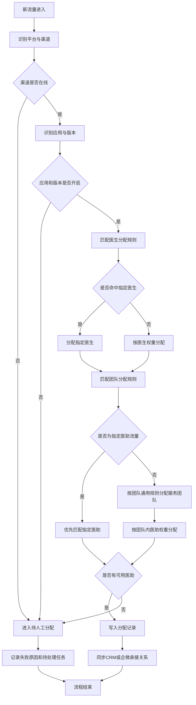
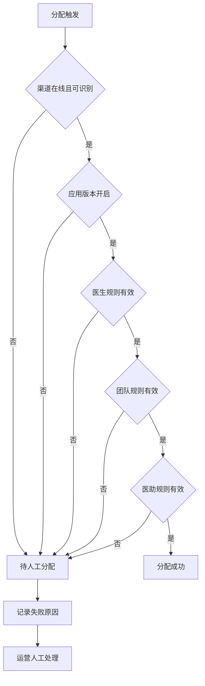

# 渠道管理与流量管理业务流程推演

- **文档类型**：业务流程推演
- **业务场景**：渠道识别与医生/团队/医助流量分配
- **版本**：V1.0
- **创建日期**：2026-05-17
- **分析人员**：产品（AI辅助起草）

## 1. 业务背景

流量运营在渠道管理中维护平台、渠道、应用和版本，在流量管理中配置医生、服务团队和医助的承接权重。用户从广告、合作入口或第三方平台进入舌诊、问诊、快测等应用后，系统需要识别来源并自动完成分配，减少人工派单，提高渠道承接效率。

## 2. 主流程



## 3. 配置流程

### 3.1 渠道配置流程

1. 运营进入渠道管理-渠道列表。
2. 点击“添加渠道”，填写平台名称、渠道名称、渠道标识、是否子渠道。
3. 系统校验必填项和渠道标识唯一性。
4. 保存成功后，渠道默认在线，可在列表中编辑、配置应用或删除。

### 3.2 应用与版本配置流程

1. 运营进入渠道管理-应用列表。
2. 点击“添加应用”，填写应用名称、应用标识、ID 类型、ID 取值、获客方式、备注、状态。
3. 保存应用后，通过“版本管理”维护版本号、备注、状态。
4. 开启状态的应用和版本可用于渠道应用配置。

### 3.3 渠道应用配置流程

1. 运营在渠道列表点击“应用配置”。
2. 系统展示当前渠道信息。
3. 运营添加应用，选择应用名称、版本号并填写权重。
4. 系统校验应用和版本均为开启状态，且同一渠道下应用版本不重复。
5. 保存后，新流量可按渠道识别到对应应用和版本。

### 3.4 医生流量配置流程

1. 运营进入流量管理-医生流量分配。
2. 点击“新增”，选择平台名称、渠道和医生分配方式。
3. 选择医生并填写权重。
4. 系统计算同组占比。
5. 保存后，新流量按指定医生或医生权重命中服务医生。

### 3.5 团队流量配置流程

1. 运营进入流量管理-团队流量分配。
2. 点击“新增”，选择平台名称、渠道和流量分配类型。
3. 选择服务团队并填写权重。
4. 系统计算同组占比。
5. 保存后，新流量按团队通用或指定医助类型进入下一层分配。

### 3.6 医助流量配置流程

1. 运营进入流量管理-医助流量分配。
2. 若配置团队内通用承接，进入“团队通用”页签，按服务团队筛选医助并维护权重。
3. 若配置特殊渠道或实验流量，进入“指定医助”页签，选择平台、渠道、服务团队和医助并维护权重。
4. 系统按同组权重计算占比。
5. 保存后，指定医助规则优先于团队通用规则。

## 4. 数据推演

### 4.1 示例配置

```json
{
  "channel": {
    "platform_name": "百度",
    "channel_name": "百度舌诊H5",
    "channel_code": "baidu_h5",
    "status": "ONLINE"
  },
  "app": {
    "app_name": "舌诊",
    "app_code": "1",
    "version_no": "V2",
    "status": "ENABLED"
  },
  "doctor_rules": [
    { "doctor_name": "朱子玉", "weight": 50, "ratio": "50.00%" },
    { "doctor_name": "李付印", "weight": 50, "ratio": "50.00%" }
  ],
  "team_rules": [
    { "team_name": "流量A组", "weight": 50, "ratio": "50.00%" },
    { "team_name": "流量E组", "weight": 50, "ratio": "50.00%" }
  ],
  "assistant_rules": [
    { "assistant_name": "潘月hll", "team_name": "流量A组", "weight": 50, "ratio": "100.00%" }
  ]
}
```

### 4.2 新流量进入

```json
{
  "lead_id": "L202605170001",
  "platform_name": "百度",
  "channel_code": "baidu_h5",
  "app_code": "1",
  "version_no": "V2",
  "entered_at": "2026-05-17 23:20:00"
}
```

### 4.3 分配结果

```json
{
  "record_id": "AR202605170001",
  "lead_id": "L202605170001",
  "channel_code": "baidu_h5",
  "app_code": "1",
  "version_no": "V2",
  "doctor_name": "李付印",
  "team_name": "流量A组",
  "assistant_name": "潘月hll",
  "allocation_result": "SUCCESS",
  "allocated_at": "2026-05-17 23:20:01"
}
```

## 5. 异常流程



## 6. 关键节点说明

| 节点编号 | 节点名称 | 触发条件 | 处理逻辑 | 输出结果 | 异常处理 |
|----------|----------|----------|----------|----------|----------|
| N01 | 渠道识别 | 新流量进入 | 根据平台和渠道标识匹配渠道 | 命中渠道 | 未命中进入人工队列 |
| N02 | 应用版本识别 | 渠道命中 | 根据应用标识和版本匹配配置 | 命中应用版本 | 关闭或缺失进入人工队列 |
| N03 | 医生分配 | 应用版本有效 | 指定医生优先，否则按权重 | 分配医生 | 无有效医生进入人工队列 |
| N04 | 团队分配 | 医生命中 | 按渠道和医生匹配团队规则 | 分配服务团队 | 无有效团队进入人工队列 |
| N05 | 医助分配 | 团队命中 | 指定医助优先，否则团队通用 | 分配医助 | 无有效医助进入人工队列 |
| N06 | 记录同步 | 分配完成 | 写入分配记录并同步 CRM/企微 | 承接关系生效 | 同步失败记录重试任务 |

## 7. 边界场景

| 场景 | 处理规则 |
|------|----------|
| 权重为0 | 占比展示0%，不参与实际分配 |
| 同组权重合计为0 | 禁止启用该分配组 |
| 修改权重 | 仅影响保存后的新流量 |
| 删除明细 | 后续新流量不再命中该对象，历史记录保留 |
| 指定医助和团队通用同时存在 | 优先命中指定医助 |
| 用户重复进入 | 使用原分配结果，不自动改派 |
| 医助离职或关闭 | 不参与新分配，命中时进入人工队列 |

## 8. 修订记录

| 版本 | 日期 | 修订内容 | 修订人 |
|------|------|----------|--------|
| V1.0 | 2026-05-17 | 初始版本 | 产品（AI辅助起草） |

