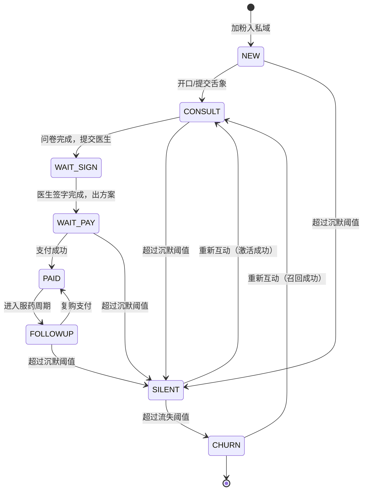
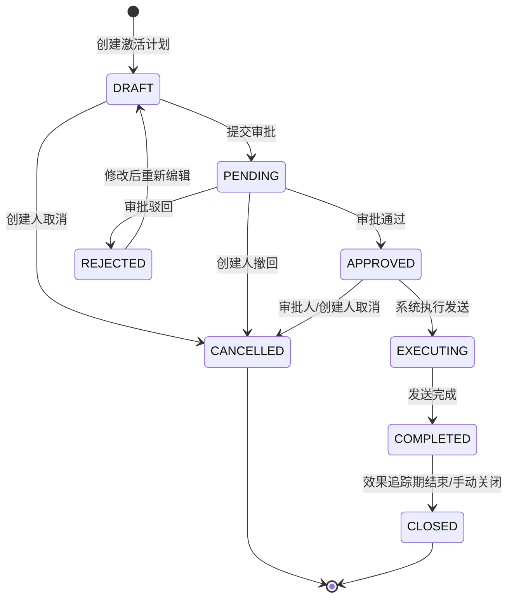

```markdown
# 数据中台与T+1 BI看板产品需求文档（PRD）

- **文档类型**：PRD
- **模块**：数据中台与BI看板（data-platform-bi）
- **版本**：V1.6
- **创建日期**：2026-05-14
- **最后更新**：2026-05-17
- **作者**：产品（AI辅助起草）
- **关联上下文**：`context/公司业务信息/2. 项目定义&项目背景信息.md`、`4. 核心业务流程详解.md`、`5. 数据模型与业务对象.md`、`6. 系统功能清单和上下游集成系统.md`
- **技术规格引用**：`analysis/data-platform/`

## 1. 需求背景与目标

### 1.1 业务背景

平台以AI舌诊引流、企微私域转化、医助服务、医生签字与支付履约为核心闭环。当前存在数据孤岛、缺少统一BI、决策依赖手工Excel等问题，无法稳定支撑全链路漏斗优化；用户分层运营（含流失、拉黑医助等专题分析）。

数据平台建设已明确以下核心任务，主要关注加企微后用户激活场景：

- 数据挖掘与决策应用双模块架构：数据挖掘侧从多数据源（数据库状态、AI对话分析等）提取标签，形成用户维度标签体系；决策应用侧基于挖掘结果构建看板、报表，并支持专题用户、激活等运营动作。
- 以维度标签体系为基础，通过数据仓库和AI分析构建用户画像，实现专题用户与激活动作的闭环流程。
- 承担全公司运营决策支撑，为各部门提供数据看板与报表服务，支撑运营指标优化。

### 1.2 需求目标

| 目标编号 | 目标描述 | 衡量方式（建议） |
|----------|----------|------------------|
| G01 | 建立分层数据仓库，统一主数据与指标口径，支撑多业务方取数分析 | 核心主题域DWD表上线率、指标字典评审通过 |
| G02 | 建设用户基础数据整合与标签体系（基础画像、行为交互、转化状态），并支持标签溯源 | 画像宽表T+1稳定产出、三大维度标签清单上线，标签引用来源完整率≥95% |
| G03 | 提供T+1 BI看板：全链路转化漏斗与角色维度分析（含专题入口：流失/拉黑） | 看板UAT通过、与抽样数据对账通过 |
| G04 | 实现专题用户激活动作闭环：默认展示流失/拉黑专题，支持自定义新增专题、计划管理、企微消息发送、效果评估 | 专题与激活功能上线、首次激活活动执行并产出效果报表 |

### 1.3 需求范围

**包含**：

- 数据入仓与整合（核心平台库、企微关键事件、CRM映射、支付结果、WMS可选）。
- 数仓分层（ODS/DWD/DWS/ADS）及自助取数规范（限定层级与分区）。
- T+1标签长表、用户画像宽表（含私域分层运营三大维度标签）、专题集市（沉默/流失、拉黑医助汇总）。
- BI看板：漏斗、角色维度分析、专题下钻；可选 user_id账号级上卷 独立入口。
- 专题用户与激活动作：默认展示流失/拉黑预设专题，支持自定义新增专题（基于标签组合），通过企微对专题用户群发送激活消息，效果报表展示激活前后标签变化（如开口率、删除率等）。
- 实时/T+1双模式：关键指标（加粉、交易转化）支持实时更新；用户画像与标签默认T+1。

**不包含**（可作为后续版本）：

- 全链路秒级实时大屏（本版本以T+1为主；允许另立项小时级增量）。
- 替代CDSS/核心交易系统的事务能力。
- 非结构化对话全文的默认入仓展示（默认禁止，见安全规则）。

## 2. 角色与权限

| 角色 | 核心诉求 |
|------|----------|
| 管理员 | 全量权限、任务运维、口径配置审批 |
| 数据分析师 | 渠道漏斗、医助服务转化、用户分层运营、专题分析 |
| 医助 | 接收激活任务通知 |

## 3. 功能清单

| 编号 | 功能名称 | 功能描述 | 优先级 |
|------|----------|----------|--------|
| F01 | 统一数据采集与入ODS | 核心库CDC或日增量；支付/WMS/CRM/企微按约定入ODS，带批次与对账元数据 | P0 |
| F02 | DWD/DWS主题建模 | 用户、角色、渠道、订单、病历、对话等明细与汇总；漏斗事件模型 | P0 |
| F03 | T+1标签与画像 | 标签元数据、长表、画像宽表（含基础画像、行为交互、转化状态三大维度）；标签需关联引用来源（reference表） | P0 |
| F05 | BI看板-全链路漏斗 | 三大分析模块：①每日数据统计（初诊转化漏斗F01~F10、按药物类型/初复诊拆分的订单金额）；②医助服务统计（人效漏斗、成交数据）；③渠道维度统计（渠道→子渠道→产品→版本层级核心指标、产品级转化漏斗如舌诊产品的首页→舌象→报告→对话→小结→留资） | P0 |
| F06 | BI看板-用户维度分析 | 画像分布、交易分档、服务阶段、沉默趋势；专题入口；支持按意向层级、成交与调理阶段下钻分析 | P0 |
| F08 | 专题集市ADS与计划管理 | 默认展示"沉默/流失"和"拉黑删除医助"两个预设专题；支持自定义新增专题（选择标签组合生成专题用户列表）；专题用户列表支持导出、创建激活计划（计划ID）；计划支持效果追踪 | P0 |
| F09 | 激活动作执行与效果报表 | 对专题用户群采取某个动作，比如通过企微向专题用户群发送激活消息；激活后医助接收通知；生成效果报表，展示激活前后标签变化（开口率、删除率等） | P0 |

## 3.1 字段说明

> 完整物理字段清单见 [`field-list.md`](./field-list.md)，此处列出产品层面关键逻辑字段与枚举定义。

### 3.1.1 漏斗日汇总 `dws_funnel_channel_assistant_1d`

| 字段名 | 类型 | 必填 | 说明 |
|--------|------|------|------|
| pt | STRING | 是 | 业务日分区，格式 `yyyy-MM-dd` |
| channel_id | BIGINT | 否 | 渠道维度，可空表示未知 |
| assistant_id | BIGINT | 否 | 医助维度，可空表示未分配 |
| cnt_f01 ~ cnt_f10 | BIGINT | 是 | 漏斗步骤F01～F10当日完成去重人数 |

### 3.1.2 订单金额日汇总（按药物类型/初复诊） `dws_order_drug_visit_1d`

| 字段名 | 类型 | 必填 | 说明 |
|--------|------|------|------|
| pt | STRING | 是 | 业务日分区，格式 `yyyy-MM-dd` |
| channel_id | BIGINT | 否 | 渠道维度 |
| assistant_id | BIGINT | 否 | 医助维度 |
| drug_type | STRING | 是 | 药物类型：DECOCTION（汤剂）/ PILL（丸剂）/ OTHER（其他） |
| visit_type | STRING | 是 | 就诊类型：FIRST（初诊）/ REVISIT（复诊） |
| order_cnt | BIGINT | 是 | 支付成功订单数 |
| gmv | DECIMAL(18,2) | 是 | 实付金额合计（R01） |

### 3.1.3 医助成交日汇总 `dws_assistant_trade_1d`

| 字段名 | 类型 | 必填 | 说明 |
|--------|------|------|------|
| pt | STRING | 是 | 业务日分区 |
| assistant_id | BIGINT | 是 | 医助ID |
| first_order_cnt | BIGINT | 是 | 初诊支付成功订单数 |
| first_gmv | DECIMAL(18,2) | 是 | 初诊实付金额合计 |
| revisit_order_cnt | BIGINT | 是 | 复诊支付成功订单数 |
| revisit_gmv | DECIMAL(18,2) | 是 | 复诊实付金额合计 |
| total_order_cnt | BIGINT | 是 | 总订单数（= first + revisit） |
| total_gmv | DECIMAL(18,2) | 是 | 总实付金额 |

### 3.1.4 渠道产品转化日汇总 `dws_channel_product_conversion_1d`

| 字段名 | 类型 | 必填 | 说明 |
|--------|------|------|------|
| pt | STRING | 是 | 业务日分区 |
| channel | STRING | 是 | 渠道（如 baidu_doctor_h5） |
| sub_channel | STRING | 否 | 子渠道 |
| product | STRING | 是 | 投放产品（如 舌诊、体质测试） |
| product_version | STRING | 否 | 产品版本 |
| page_pv | BIGINT | 是 | 首页PV |
| page_uv | BIGINT | 是 | 首页UV |
| upload_pv | BIGINT | 否 | 舌象上传PV（仅舌诊类产品适用） |
| report_cnt | BIGINT | 否 | 报告生成数（如舌诊报告数） |
| report_user_cnt | BIGINT | 否 | 报告生成去重用户数（舌诊报告人次） |
| dialog_cnt | BIGINT | 否 | 对话数 |
| valid_dialog_cnt | BIGINT | 否 | 有效对话数 |
| avg_dialog_turns | DECIMAL(8,2) | 否 | 平均对话轮次 |
| avg_summary_turns | DECIMAL(8,2) | 否 | 平均出小结轮次 |
| summary_cnt | BIGINT | 否 | 小结数 |
| summary_user_cnt | BIGINT | 否 | 小结去重用户数（小结人次） |
| lead_cnt | BIGINT | 否 | 留资数 |
| wechat_add_cnt | BIGINT | 是 | 加企微数 |

### 3.1.5 GMV日汇总（总量） `dws_trade_gmv_1d`

| 字段名 | 类型 | 必填 | 说明 |
|--------|------|------|------|
| pt | STRING | 是 | 业务日分区 |
| channel_id | BIGINT | 否 | 来自用户维度 |
| role_id | BIGINT | 否 | 服务对象 |
| user_id | BIGINT | 否 | 账号 |
| order_cnt | BIGINT | 是 | 支付成功订单数 |
| gmv | DECIMAL(18,2) | 是 | 实付金额合计（见R01） |

### 3.1.6 角色画像宽表 `ads_role_profile_wide_1d`

| 字段名 | 类型 | 必填 | 说明 |
|--------|------|------|------|
| pt | STRING | 是 | 业务日分区 |
| role_id | BIGINT | 是 | 主键之一 |
| user_id | BIGINT | 是 | 关联账号 |
| channel_id | BIGINT | 否 | 账号渠道 |
| relationship | STRING | 是 | 角色与用户关系，见枚举 §3.1.9 |
| health_tag_summary | STRING | 否 | 脱敏摘要，禁止默认放原文JSON |
| paid_order_cnt_30d | BIGINT | 是 | 近30日支付订单数 |
| gmv_30d | DECIMAL(18,2) | 是 | 近30日实付金额 |
| last_paid_date | DATE | 否 | 最近支付业务日 |
| last_active_date | DATE | 否 | 最近活跃业务日 |
| silence_days | INT | 是 | pt与last_active_date之差 |
| service_stage | STRING | 是 | 服务阶段，见枚举 §3.1.10 |
| risk_blacklist_flag | TINYINT | 是 | 0否 / 1是 |
| risk_block_wework_flag | TINYINT | 是 | 0否 / 1是 |

### 3.1.7 标签实例长表 `dwd_fact_tag_instance_di`

| 字段名 | 类型 | 必填 | 说明 |
|--------|------|------|------|
| pt | STRING | 是 | 标签生效业务日 |
| role_id | BIGINT | 是 | 主粒度 |
| user_id | BIGINT | 是 | 冗余关联 |
| tag_id | BIGINT | 是 | 关联标签元数据 |
| tag_value | STRING | 是 | 枚举编码或数值字符串 |
| source | STRING | 是 | 标签来源，见枚举 §3.1.11 |
| reference_id | STRING | 否 | 引用来源事件ID，见R14 |
| etl_time | TIMESTAMP | 是 | 写入时间 |

### 3.1.8 激活计划表 `ads_activation_plan`

| 字段名 | 类型 | 必填 | 说明 |
|--------|------|------|------|
| plan_id | STRING | 是 | 唯一计划标识，系统自动生成 |
| plan_name | STRING | 是 | 运营自定义计划名称，最大长度100 |
| status | STRING | 是 | 计划状态，见枚举 §3.1.12 |
| select_condition | JSON | 是 | 专题标签条件快照（维度+标签值+AND/OR逻辑） |
| topic_id | STRING | 否 | 关联专题ID（预设专题或自定义专题） |
| user_count | BIGINT | 是 | 专题命中用户数 |
| msg_type | STRING | 否 | 消息类型：TEXT / IMAGE |
| msg_content | TEXT | 否 | 激活话术内容 |
| send_time | TIMESTAMP | 否 | 实际发送时间 |
| send_count | BIGINT | 否 | 成功发送人数 |
| fail_count | BIGINT | 否 | 发送失败人数 |
| created_by | STRING | 是 | 创建人 |
| created_at | TIMESTAMP | 是 | 创建时间 |
| updated_at | TIMESTAMP | 是 | 最后更新时间 |

### 3.1.9 枚举：relationship（角色关系）

| 枚举值 | 说明 |
|--------|------|
| SELF | 本人 |
| PARENT | 父母 |
| CHILD | 子女 |
| SPOUSE | 配偶 |
| OTHER | 其他 |

### 3.1.10 枚举：service_stage（服务阶段）

| 枚举值 | 说明 |
|--------|------|
| NEW | 新进入私域，未完成关键问诊动作 |
| CONSULT | 问诊/病历推进中 |
| WAIT_SIGN | 待医生签字 |
| WAIT_PAY | 待支付 |
| PAID | 已支付 |
| FOLLOWUP | 随访期 |
| SILENT | 沉默（达到沉默阈值，默认7天） |
| CHURN | 流失（达到流失阈值，默认30天） |

### 3.1.11 枚举：source（标签来源）

| 枚举值 | 说明 |
|--------|------|
| rule | 规则标签（基于明确业务条件） |
| model | 模型标签（AI/算法生成） |
| crm_sync | CRM同步 |
| manual | 人工标注 |

### 3.1.12 枚举：plan_status（激活计划状态）

| 枚举值 | 状态名称 | 说明 |
|--------|----------|------|
| DRAFT | 草稿 | 已关联专题并保存条件，未执行 |
| PENDING | 待审批 | 激活动作已提交，等待审批（见R12） |
| APPROVED | 审批通过 | 已批准，等待执行发送 |
| REJECTED | 审批驳回 | 审批不通过，可修改后重新提交 |
| EXECUTING | 执行中 | 正在通过企微API发送消息 |
| COMPLETED | 已完成 | 发送完成，效果追踪中 |
| CANCELLED | 已取消 | 手动取消，见取消规则 §16 |
| CLOSED | 已关闭 | 效果追踪结束，归档，见关闭规则 §17 |

### 3.1.13 枚举：drug_type（药物类型）

| 枚举值 | 说明 |
|--------|------|
| DECOCTION | 汤剂 |
| PILL | 丸剂 |
| OTHER | 其他（如膏方、茶饮等） |

### 3.1.14 枚举：visit_type（就诊类型）

| 枚举值 | 说明 |
|--------|------|
| FIRST | 初诊（用户首次成交） |
| REVISIT | 复诊（非首次成交，含复购） |

## 4. 业务规则

| 规则编号 | 规则描述 | 适用场景 |
|----------|----------|----------|
| R01 | 付费成功以订单payment_status=PAID且paid_at非空为准；GMV默认取实付金额paid_amount | GMV、支付转化率 |
| R02 | 标签与画像主粒度为user_id维度；账号级报表须走独立上卷表并标明粒度 | 画像、CRM人群、专题分析 |
| R03 | 漏斗步骤的进入/完成条件、去重主体（user_id或role_id）以指标字典为准，变更需走评审 | 漏斗看板、实验对比 |
| R04 | 拉黑/解除关系以企微回调与平台状态对账优先级为准，映射到role_id的规则需固化 | 拉黑专题、风险标签 |
| R05 | 沉默/流失定义采用可配置阈值（默认建议沉默7天、流失30天，可调整） | 专题ADS、运营策略 |
| R06 | 敏感数据默认不出现在ADS/BI默认数据集：完整病历文本、对话全文、明文手机号/身份证等 | 全模块 |
| R07 | 日切与时区统一为业务日pt（默认Asia/Shanghai）；报表展示须标注数据截至昨日 | BI与对外同步 |
| R08 | 归因若同时存在首触点与末次付费触点，须分卡或分字段展示，禁止混用单一字段解释ROI | 渠道分析 |
| R09 | 标签版本：标签计算逻辑变更须递增calc_version，历史pt分区在回补完成前不得静默覆盖对外口径说明 | 标签、CRM回写 |
| R10 | 漏斗冻结：已发布的日报pt在T+2日内仅允许因数据订正触发回补，须留审计记录 | 漏斗、管理考核 |
| R11 | 自助SQL：查询必须带分区条件pt（或等价范围）；禁止无分区全表扫描 | 自助分析 |
| R12 | 人群导出：导出role_id/user_id列表须走审批，文件含水印与下载有效期 | CRM、外呼 |
| R13 | 专题与计划：每个专题用户群创建激活计划时须生成唯一计划ID，计划需记录创建人、关联专题（含标签条件）、创建时间、激活状态 | 专题激活、效果评估 |
| R14 | 标签引用溯源：每个标签值（尤其是AI打标）必须关联引用来源（reference），指向具体数据源事件（如对话原文、行为事件），支持反向校验 | 标签可信度、数据质量 |
| R15 | 实时与离线模式：关键指标（加粉、交易转化）支持实时更新（秒级至分钟级）；用户画像、标签宽表默认T+1，按需可配置小时级增量 | 看板展示、运营行动 |

### 4.1 术语与定义

| 术语 | 英文/缩写 | 定义 |
|------|-----------|------|
| 业务日 | pt | 统计分区日期，默认按Asia/Shanghai日历日切分 |
| 服务对象/角色 | role_id | 家庭成员健康与订单归属粒度，见业务对象UserRole |
| 账号 | user_id | 企微/微信侧用户主账号 |
| T+1 | T+1 | 业务日D结束后，在D+1的约定窗口前完成计算与看板刷新 |
| ODS/DWD/DWS/ADS | 数仓分层 | 贴源、明细、汇总、应用层，见技术规格 |
| GMV | GMV | 本PRD默认指实付口径，见R01 |
| 计划ID | plan_id | 一次专题激活动作的唯一标识，关联专题与效果归因 |
| 引用表 | reference | 存储标签来源信息的表，链接标签值与原始事件（如对话、行为） |

### 4.2 私域用户分层运营标签体系

以下标签体系作为用户画像宽表（F03）及用户维度分析（F06）的核心基础。

#### 维度一：基础画像

| 标签分类 | 标签示例 | 说明 |
|----------|----------|------|
| 年龄 | 中青年（<35岁）、中老年（35-70岁）、老年（>70岁） | |
| 诊前调理阶段 | 未用过任何调理、自行吃中成药、自行食疗/运动、线下医院/医馆调理中、其他医生调理中 | |
| 疾病名称 | 脾胃虚弱、失眠、湿气重、补肾、口腔问题、其他 | 用户主诉或问诊记录提取 |
| 决策角色 | 自主决策、需子女同意、代他人咨询 | |
| 心理与障碍类型 | 价格敏感型、信任缺失型、自主调理型、流程障碍型、服务体验差型、客观障碍型 | |

#### 维度二：行为转化

| 标签分类 | 标签值 | 说明 |
|----------|--------|------|
| 对话状态（含流程配合度） | 未开口、已开口未完成舌象、已完成舌象未完成问卷、已完成问卷未报价、报价后沉默、已拒绝、已拉黑、流程中断待恢复 | |
| 互动频次 | 高活跃（日互动）、中活跃（周互动）、低活跃（沉默>7天） | |
| 意向层级 | 高意向 | 主动提问、认可分析、已完成舌象+问卷，接近决策 |
| | 中意向 | 有症状、犹豫、正在其他地方调理或对比 |
| | 低意向 | 无紧迫需求、仅咨询不行动、不配合流程 |
| | 流失风险 | 报价后沉默、中断流程、超过48小时未回复 |
| | 已流失 | 已拒绝、已拉黑、明确表示不需要 |
| 成交阶段 | 未成交 - 已报价未付款 | 已出方案和价格，用户未支付 |
| | 未成交 - 流程中断未恢复 | 舌象、问卷、缴费等环节卡住 |
| | 未成交 - 明确拒绝 | 用户直接表示不需要或不信任 |
| | 待确认支付 | 已开方但未付款 |
| | 已支付 - 首单7天汤剂 - 服药中 | 首诊成交，服药第1-6天 |
| | 已支付 - 首单7天汤剂 - 已完成首疗程 | 7天结束，未复购 |
| | 已支付 - 复购丸剂 - 服药中 | 高客单价产品，长期调理中 |
| | 已支付 - 多次复购 - 长期调理 | 多次复购，形成习惯 |
| | 已支付 - 退款/取消 | 付款后退款或取消订单 |
| | 停药/休眠 | 曾经成交，>30天无互动 |

**完整标签体系一览（两大维度汇总）**

- **维度一 基础画像**：年龄、诊前调理阶段、疾病名称、决策角色、心理与障碍类型
- **维度二 行为转化**：对话状态、互动频次、意向层级、成交阶段

**典型用户分层运营示例**

| 用户类型 | 典型标签组合 | 运营动作 |
|----------|--------------|----------|
| 高意向但未成交 | 中老年+脾胃虚弱+诊前自行吃成药+心理=信任缺失型+对话状态=已完成问卷未报价+意向层级=高意向 | 前置资质、案例，先共情再报价，推7天小单 |
| 已支付首单服药中 | 中青年+失眠+意向层级=高意向+成交与调理阶段=已支付-首单7天汤剂-服药中 | 第5-6天主动触达，舌象对比+症状打分，推丸剂复购 |
| 流失风险 | 任何画像+对话状态=报价后沉默+互动频次=低活跃+意向层级=流失风险 | 24小时后发免费食疗方案+柔性提醒 |
| 诊前未开口 | 年龄+健康状态+诊前调理阶段=无调理+对话状态=未开口+意向层级=低意向 | 24小时内发首次引导话术（舌象+简明问诊），不直接推销 |

**详细说明（节选）**：

- **R02：主粒度与上卷**  
  - 业务对象中健康与订单多归属家庭成员角色，故标签/画像以user_id为主键。  
  - 若管理层需要账号级汇总，须单独构建user_id粒度汇总表，并在BI菜单与卡片标题中声明账号级，避免与角色级混读。
- **R04：拉黑映射**  
  - 企微侧事件常为role_id（详见《业务流程》与指标字典评审项）。
- **R14：标签引用溯源**  
  - 每个标签值（尤其是AI打标）需关联引用来源，例如对话中用户说“我有糖尿病” → 打标“糖尿病”，引用指向该对话原文（脱敏后存储）。数据质量校验时可反向验证。

## 5. 业务流程说明（索引）

端到端业务流程（采集、建模、标签、看板消费、专题激活、异常处理）见同目录：

- `business-process.md`

## 5.1 状态与流转

本节定义核心业务对象的状态机，补充 `business-process.md` 中端到端流程的状态细节。

### 5.1.1 服务阶段（service_stage）状态定义

| 状态值 | 状态名称 | 状态说明 |
|--------|----------|----------|
| NEW | 新进入 | 用户加粉后初始状态，未完成关键问诊动作 |
| CONSULT | 问诊中 | 已开始问诊/舌象/问卷等流程推进 |
| WAIT_SIGN | 待签字 | 医生审核处方/报告签字中 |
| WAIT_PAY | 待支付 | 已出方案和价格，等待用户支付 |
| PAID | 已支付 | 首次或复购支付成功 |
| FOLLOWUP | 随访期 | 在服药周期内，医助跟进中 |
| SILENT | 沉默 | 超过沉默阈值（默认7天）无互动 |
| CHURN | 流失 | 超过流失阈值（默认30天）无互动，或明确拒绝/拉黑 |

### 5.1.2 服务阶段状态流转图



### 5.1.3 服务阶段流转条件

| 流转 | 触发条件 | 自动/人工 | 备注 |
|------|----------|-----------|------|
| [*] → NEW | 企微加粉回调成功 | 自动 | 系统默认初始状态 |
| NEW → CONSULT | 用户发送首条消息或提交舌象 | 自动 | 对话状态同步更新 |
| CONSULT → WAIT_SIGN | 问卷提交完成，进入医生审核队列 | 自动 | |
| WAIT_SIGN → WAIT_PAY | 医生签字并出具方案 | 自动 | |
| WAIT_PAY → PAID | payment_status=PAID 且 paid_at 非空（R01） | 自动 | |
| PAID → FOLLOWUP | 订单履约后进入随访期 | 自动 | 默认支付后T+1进入 |
| FOLLOWUP → PAID | 复购支付成功 | 自动 | |
| 任意 → SILENT | silence_days ≥ 沉默阈值（默认7天，可配置R05） | T+1批量计算 | |
| SILENT → CHURN | silence_days ≥ 流失阈值（默认30天，可配置R05） | T+1批量计算 | |
| SILENT/CHURN → CONSULT | 用户重新互动 | 自动 | 激活/召回成功 |

### 5.1.4 激活计划（plan_status）状态定义

| 状态值 | 状态名称 | 状态说明 |
|--------|----------|----------|
| DRAFT | 草稿 | 已关联专题并保存条件，未提交执行 |
| PENDING | 待审批 | 激活动作已提交，等待审批 |
| APPROVED | 审批通过 | 已批准，等待执行发送 |
| REJECTED | 审批驳回 | 审批不通过，可修改后重新提交 |
| EXECUTING | 执行中 | 正在通过企微API批量发送消息 |
| COMPLETED | 已完成 | 发送完成，进入效果追踪期 |
| CANCELLED | 已取消 | 手动取消（见 §16 取消规则） |
| CLOSED | 已关闭 | 效果追踪结束，计划归档（见 §17 关闭规则） |

### 5.1.5 激活计划状态流转图



### 5.1.6 激活计划流转条件

| 流转 | 触发条件 | 操作人权限 | 备注 |
|------|----------|------------|------|
| [*] → DRAFT | 运营在专题详情页或激活页面创建计划 | 渠道运营/医助主管/数据分析师 | 生成唯一plan_id（R13） |
| DRAFT → PENDING | 点击"提交审批" | 创建人 | 关联专题与消息内容不可为空 |
| PENDING → APPROVED | 审批人点击"通过" | 管理员/主管 | 见权限矩阵§11"执行激活动作" |
| PENDING → REJECTED | 审批人点击"驳回"并填写原因 | 管理员/主管 | 驳回原因必填 |
| REJECTED → DRAFT | 创建人修改后保存 | 创建人 | 保留历史版本记录 |
| APPROVED → EXECUTING | 系统自动触发或手动点击"立即执行" | 系统/创建人 | |
| EXECUTING → COMPLETED | 发送任务执行完毕 | 系统 | 部分失败时仍标记COMPLETED，失败详情见X08 |
| COMPLETED → CLOSED | 效果追踪期（默认7天）到期自动关闭，或管理员手动关闭 | 系统/管理员 | 不可逆 |
| DRAFT/PENDING/APPROVED → CANCELLED | 创建人或管理员手动取消 | 创建人/管理员 | 见 §16 取消规则 |

## 6. 非功能需求

| 类别 | 要求 |
|------|------|
| 时效 | 默认T+1；每日任务在约定窗口内完成（建议06:00前）；关键指标（加粉、交易转化）支持实时更新（≤1分钟延迟） |
| 可用 | 核心看板月可用性目标与任务重跑机制需运维侧确认（建议≥99%依赖云SLA） |
| 安全 | 分级脱敏、权限、审计、环境隔离（见技术规格） |
| 可维护 | 指标与标签需版本化（calc_version），支持回溯重算；标签引用表需支持审计 |

## 7. 验收标准（UAT）

| 编号 | 验收项 | 通过条件 |
|------|--------|----------|
| A01 | 漏斗看板-每日转化 | 与业务抽样至少100单路径核对F01~F10人数一致（允许已知口径差异备案）；仅统计初诊流程 |
| A01a | 漏斗看板-每日订单金额 | 按药物类型（汤剂/丸剂）、初复诊拆分的订单数与金额与财务侧日报交叉校验，差异≤0.5%或备案说明 |
| A01b | 漏斗看板-医助服务人效 | 医助维度F01~F10各步人数与总量一致；排行榜数据与明细表可交叉验证 |
| A01c | 漏斗看板-医助成交数据 | 医助维度初诊/复诊订单数与金额之和等于总量；与每日订单金额数据可交叉验证 |
| A01d | 漏斗看板-渠道核心数据 | 渠道→子渠道→产品→版本层级数据可展开折叠；加企微率计算正确（PV/UV两种口径） |
| A01e | 漏斗看板-渠道产品转化漏斗 | 以舌诊产品为例，验证首页PV、舌象上传PV、舌诊报告数、对话数、小结数、留资数逐级递减合理；各转化率与折损率计算正确 |
| A02 | GMV | 与财务/订单侧日报差异0或备案说明 |
| A03 | 画像宽表 | user_id主键唯一；分区pt连续无断档（除维护窗口）；含三大维度标签，转化状态含意向层级与成交阶段两个子维度 |
| A04 | 权限 | 渠道账号不可见其他渠道；医助仅本人/本组 |
| A05 | 合规 | 默认数据集无L4/L3明文违规字段（按《数据安全与治理规范》抽检） |
| A06 | 异常提示 | X01～X03场景下用户可见提示文案与「前日数据」回退策略符合本文第9章 |
| A07 | 权限矩阵 | 第11章矩阵抽样走查（每类角色≥2账号）无越权 |
| A08 | 口径变更 | 执行一次模拟回补后，版本号与公告链路可追溯（R09/R10） |
| A09 | 标签体系验收 | 画像宽表中标签值与4.2定义一致；支持按意向层级、成交与调理阶段分别下钻分析 |
| A10 | 标签溯源 | 随机抽取≥10个AI打标标签，均能在reference表中找到来源事件（对话原文或行为日志） |
| A11 | 专题与激活 | 运营可使用预设专题或自定义新增专题，基于专题用户列表创建激活计划并生成计划ID；成功发送激活消息（测试环境），效果报表显示激活前后标签变化（如开口率变化） |
| A12 | 实时指标 | 加粉数、支付成功数在发生后1分钟内反映在对应看板或报表上（抽样验证） |
| A13 | 状态流转 | 激活计划的8个状态流转路径均可正常执行（正常路径+取消路径+驳回路径），状态变更有审计日志 |

## 8. 页面与交互（BI看板）


### 8.1 全局布局与公共组件

| 区域 | 内容 | 交互规则 |
|------|------|----------|
| 顶栏 | 产品名、环境标识（prod/staging）、当前用户 | staging环境水印加粗展示 |
| 数据条 | 数据截至：pt=yyyy-MM-dd（T+1为昨日业务日）；实时指标区域单独标注"实时" | 与卡片副标题一致，禁止仅写「最新」 |
| 筛选条 | 业务日范围（默认最近7日/30日可切换）、渠道、医助、素材（若有） | 渠道/医助选项受行级权限过滤 |
| 页脚 | 指标口径链接（跳转指标字典Markdown或Wiki锚点）、反馈入口 | 反馈生成工单并关联看板/卡片ID |

### 8.2 全链路漏斗页

全链路漏斗页分为三大数据分析模块，分别从时间维度、医助维度和渠道维度提供多角度数据洞察。

#### 8.2.0 交互模型与筛选架构

##### 交互层级

```
一级 Tab（统计类型）: 每日数据统计 | 医助服务统计 | 渠道维度统计
    ↓ 选中后展示该类型的专属筛选栏
    ↓ 筛选栏下方
二级 Tab（数据子类）: 例如每日转化数据 | 每日订单金额数据
    ↓
核心区域: 上方可选图表（简单辅助） + 下方横纵坐标数据表（核心）
```

**设计原则：**

1. 用户先选择一级 Tab（统计类型），页面展示该类型的专属筛选栏
2. 筛选栏统一控制该类型下所有二级 Tab 的数据
3. 核心展示为**横坐标×纵坐标的数据表**，表格上方可放简单图表辅助可视化
4. 每个筛选栏末尾均有「查询」和「重置」按钮

##### 8.2.0.1 每日数据统计 — 筛选项

| 筛选项 | 类型 | 默认值 | 说明 |
|--------|------|--------|------|
| 时间筛选 | 日期范围 | 今日 → 过去全部 | 支持选择具体时间段（日维度） |
| 渠道筛选 | 快捷标签+更多 | 全部渠道 | 快捷选项：全部渠道、渠道1、渠道2、渠道3；点击「更多」展开全部渠道列表 |
| 团队筛选 | 下拉 | 全部 | 按团队/组筛选 |
| 操作 | 按钮组 | — | 「查询」「重置」 |

> 该筛选栏同时控制二级 Tab：**每日转化数据** | **每日订单金额数据**

##### 8.2.0.2 医助服务统计 — 筛选项

| 筛选项 | 类型 | 默认值 | 说明 |
|--------|------|--------|------|
| 时间筛选（快捷） | 标签切换 | 今日 | 快捷选项：今日、昨日、近7天、近30天 |
| 时间筛选（自定义） | 日期范围 | — | 与快捷互斥，选择具体时间段（日维度） |
| 维度 | 单选标签 | 按时 | 按时（默认）、按日、按周、按月 |
| 渠道搜索 | 搜索框 | — | 输入渠道名称模糊搜索 |
| 医助名称搜索 | 搜索框 | — | 输入医助名称模糊搜索 |
| 操作 | 按钮组 | — | 「查询」「重置」 |

> 该筛选栏同时控制二级 Tab：**医助服务人效统计** | **医助成交数据**

##### 8.2.0.3 渠道维度统计 — 筛选项

| 筛选项 | 类型 | 默认值 | 说明 |
|--------|------|--------|------|
| 时间筛选（快捷） | 标签切换 | 今日 | 快捷选项：今日、昨日、近7天、近30天 |
| 时间筛选（自定义） | 日期范围 | — | 与快捷互斥，选择具体时间段（日维度） |
| 维度 | 单选标签 | 按时 | 按时（默认）、按日、按周、按月 |
| 渠道筛选 | 快捷标签+更多 | 全部渠道 | 快捷选项：全部渠道、渠道1、渠道2、渠道3；点击「更多」展开 |
| 团队筛选 | 下拉 | 全部 | 按团队/组筛选 |
| 操作 | 按钮组 | — | 「查询」「重置」 |

> 该筛选栏控制：**渠道核心数据概览**（产品详细转化数据通过操作列「查看详情」进入独立页面）

---

#### 8.2.1 每日数据统计

##### 8.2.1.1 每日转化数据统计

> **统计口径**：仅统计**初诊流程**转化，从加企微到付费确认的完整链路。

| 漏斗步骤 | 指标名称 | 说明 |
|----------|----------|------|
| F01 | 加企微数 | 当日通过各渠道新增企微好友去重人数 |
| F02 | 首响数 | 医助对新加好友首次响应的去重人数 |
| F03 | 开口数 | 用户主动发送首条消息的去重人数 |
| F04 | 舌象上传数 | 用户提交舌象图片的去重人数 |
| F05 | 问卷完成数 | 用户完成健康问卷的去重人数 |
| F06 | 辩证完成数 | AI/医生完成辩证出小结的去重人数 |
| F07 | 报价数 | 向用户出具方案与价格的去重人数 |
| F08 | 签字数 | 医生签字完成的去重人数 |
| F09 | 支付数 | 支付成功的去重人数（R01） |
| F10 | 确认数 | 付费确认（含药房发货确认等最终节点）的去重人数 |

**展示内容：**

| 区块 | 内容 | 格式 |
|------|------|------|
| 概览卡 | F01加企微人数、F10确认人数、整体转化率（F10/F01）、当日初诊GMV | 数字+环比箭头 |
| 漏斗图 | F01→F10各步人数与环节转化率（每步/上一步） | 漏斗或条形图，点击可下钻到「步骤明细说明」抽屉 |
| 趋势图 | 所选范围内每日F01、F10、整体转化率折线 | 折线图，双轴可选 |
| 明细表 | 按日期展示F01~F10各步人数与各环节转化率 | 表格，支持排序、导出聚合数据 |

##### 8.2.1.2 每日订单金额数据

> **统计口径**：按业务日统计订单与金额，分别按药物类型、初复诊两个维度拆分。

**按药物类型拆分：**

| 指标 | 说明 |
|------|------|
| 汤剂订单数 | 当日药物类型为汤剂的支付成功订单数 |
| 汤剂订单金额 | 当日汤剂订单实付金额合计（R01） |
| 丸剂订单数 | 当日药物类型为丸剂的支付成功订单数 |
| 丸剂订单金额 | 当日丸剂订单实付金额合计（R01） |

**按初复诊拆分：**

| 指标 | 说明 |
|------|------|
| 初诊订单数 | 当日首次成交用户的支付成功订单数 |
| 初诊金额 | 当日初诊订单实付金额合计 |
| 复诊订单数 | 当日非首次成交（复购）用户的支付成功订单数 |
| 复诊金额 | 当日复诊订单实付金额合计 |

**汇总指标：**

| 指标 | 说明 |
|------|------|
| 总订单数 | 当日全部支付成功订单数（= 汤剂+丸剂 = 初诊+复诊） |
| 总订单金额 | 当日全部实付金额合计 |

**展示内容：**

| 区块 | 内容 | 格式 |
|------|------|------|
| 汇总概览卡 | 总订单数、总金额、初诊占比、复诊占比 | KPI卡片+环比 |
| 药物类型分析 | 汤剂/丸剂订单数与金额对比 | 分组柱状图或堆叠柱状图 |
| 初复诊分析 | 初诊/复诊订单数与金额对比 | 分组柱状图或饼图 |
| 趋势图 | 所选范围内每日总金额、初诊金额、复诊金额趋势 | 折线图 |
| 明细表 | 按日期展示：汤剂订单数、汤剂金额、丸剂订单数、丸剂金额、初诊订单数、初诊金额、复诊订单数、复诊金额、总订单数、总金额 | 表格，支持排序与导出 |

---

#### 8.2.2 医助服务统计

##### 8.2.2.1 医助服务人效统计

> **统计维度**：以医助（assistant_id）为主维度，在筛选的时间段内汇总每个医助的转化数据。

| 指标 | 说明 |
|------|------|
| 加企微数 | 该医助在筛选时段内分配到的新加企微好友去重人数 |
| 首响数 | 该医助在筛选时段内首次响应新好友的去重人数 |
| 开口数 | 该医助服务的用户主动开口去重人数 |
| 舌象上传数 | 该医助服务的用户提交舌象去重人数 |
| 问卷完成数 | 该医助服务的用户完成问卷去重人数 |
| 辩证完成数 | 该医助服务的用户辩证完成去重人数 |
| 报价数 | 该医助服务的用户报价去重人数 |
| 签字数 | 该医助服务的用户签字完成去重人数 |
| 支付数 | 该医助服务的用户支付成功去重人数 |
| 确认数 | 该医助服务的用户付费确认去重人数 |
| 整体转化率 | 确认数 / 加企微数 |

**展示内容：**

| 区块 | 内容 | 格式 |
|------|------|------|
| 排行榜 | 医助按整体转化率或确认数排序的TopN | 水平条形图 |
| 明细表 | 每行一个医助，列出F01~F10各步人数与整体转化率 | 表格，支持按列排序、搜索医助 |
| 对比图 | 选中多个医助时展示各步转化率对比 | 折线/雷达图（可选P1） |

##### 8.2.2.2 医助成交数据

> **统计维度**：以医助（assistant_id）为主维度，在筛选时段内汇总每个医助的订单与金额数据。

| 指标 | 说明 |
|------|------|
| 初诊订单数 | 该医助服务的初诊用户支付成功订单数 |
| 初诊金额 | 该医助服务的初诊订单实付金额合计 |
| 复诊订单数 | 该医助服务的复诊用户支付成功订单数 |
| 复诊金额 | 该医助服务的复诊订单实付金额合计 |
| 总订单数 | 初诊订单数 + 复诊订单数 |
| 总订单金额 | 初诊金额 + 复诊金额 |

**展示内容：**

| 区块 | 内容 | 格式 |
|------|------|------|
| 汇总概览卡 | 全部医助合计：总订单数、总金额、平均单人金额 | KPI卡片 |
| 排行榜 | 医助按总金额或总订单数排序的TopN | 水平条形图 |
| 明细表 | 每行一个医助，列出初诊订单数、初诊金额、复诊订单数、复诊金额、总订单数、总金额 | 表格，支持排序、导出 |

---

#### 8.2.3 渠道维度统计

##### 8.2.3.1 渠道核心数据概览

> **统计维度**：以渠道（channel）→ 子渠道（sub_channel）→ 投放产品（product）→ 产品版本（product_version）为层级，在所选时间段内汇总核心指标。

| 指标 | 说明 |
|------|------|
| 首页PV | 该渠道/产品的落地页页面浏览量 |
| 首页UV | 该渠道/产品的落地页独立访客数 |
| 加企微数 | 通过该渠道/产品最终添加企微的去重人数 |
| 加企微率(PV) | 加企微数 / 首页PV |
| 加企微率(UV) | 加企微数 / 首页UV |

**展示内容：**

| 区块 | 内容 | 格式 |
|------|------|------|
| 渠道汇总卡 | 全渠道合计首页PV、UV、加企微数、加企微率 | KPI卡片+环比 |
| 层级钻取表 | 行：渠道 → 子渠道 → 产品 → 版本（可展开/折叠）；列：首页PV、首页UV、加企微数、加企微率PV、加企微率UV、**操作** | 树形表格，支持展开子级；操作列含「查看详情」链接 |
| 趋势图 | 选中某个渠道/产品后展示所选时段每日首页PV、加企微数趋势 | 折线图 |

> **操作列 — 查看详情**：点击后进入「产品详细转化数据页」，默认选中当前行对应的渠道、产品和版本。

##### 8.2.3.1a 产品详细转化数据页

> **入口**：渠道核心数据概览表 → 操作列「查看详情」
> **上下文**：默认筛选条件继承自上一级已选的渠道、产品、产品版本；时间范围继承全局筛选栏设置。

**筛选项（页面顶部）：**

| 筛选项 | 类型 | 默认值 | 说明 |
|--------|------|--------|------|
| 渠道 | 下拉 | 继承上一级选中渠道 | 可切换 |
| 产品 | 下拉 | 继承上一级选中产品 | 可切换 |
| 产品版本 | 下拉 | 继承上一级选中版本 | 可选，为空则汇总所有版本 |
| 时间范围 | 日期范围 | 继承全局 | 日维度 |
| 操作 | 按钮组 | — | 「查询」「重置」「返回概览」 |

**数据表结构（核心）：**

- **纵坐标（行）**：日期（按天排列）
- **横坐标（列）**：以下指标按阶段分组

| 阶段 | 列（横坐标） | 计算公式 |
|------|-------------|----------|
| 首页与舌象 | 首页PV | — |
| | 首页UV | — |
| | 舌象上传PV | — |
| | 舌象上传折损率 | 1 - 舌象上传PV / 首页PV |
| | 舌诊报告数 | — |
| | 舌诊报告人次 | — |
| | 舌诊报告转化率 | 舌诊报告数 / 首页PV |
| | 人均舌诊报告数 | 舌诊报告数 / 舌诊报告人次 |
| 对话与小结 | 对话数 | — |
| | 有效对话数 | — |
| | 有效对话率 | 有效对话数 / 对话数 |
| | 平均对话轮次 | 总对话轮次 / 会话数 |
| | 平均出小结轮次 | 出小结前总轮次 / 小结数 |
| | 小结数 | — |
| | 小结人次 | — |
| | 小结率PV | 小结数 / 舌诊报告数 |
| | 小结率PV2 | 小结数 / 首页PV |
| 留资 | 留资数 | — |
| | 留资率PV1 | 留资数 / 小结数 |
| | 留资率PV2 | 留资数 / 舌诊报告数 |
| | 留资率PV3 | 留资数 / 首页PV |

**展示内容：**

| 区块 | 内容 | 格式 |
|------|------|------|
| 辅助图表 | 每日核心指标趋势（首页PV、舌诊报告数、小结数、留资数） | 折线图 |
| 核心数据表 | 纵坐标=日期，横坐标=上述全部指标列 | 宽表格，支持横向滚动、排序、导出 |

> **注意**：此示例以舌诊产品为例。不同产品的漏斗步骤定义和指标名称会有差异，具体以指标字典评审结果为准。

##### 8.2.3.2 渠道产品转化漏斗

> **统计维度**：选定具体渠道下的某个产品后，展示该产品完整的用户行为转化漏斗。以 `baidu_doctor_h5` 渠道下「舌诊」产品为例说明指标体系。

**筛选条件：**

| 筛选项 | 说明 |
|--------|------|
| 渠道 | 下拉选择（如 baidu_doctor_h5） |
| 产品 | 下拉选择（如 舌诊） |
| 产品版本 | 可选，下拉选择 |
| 时间范围 | 日期范围选择 |

**指标体系（以舌诊产品为例）：**

**一、首页与舌象阶段**

| 指标 | 计算公式 | 说明 |
|------|----------|------|
| 首页PV | — | 舌诊产品落地页页面浏览量 |
| 首页UV | — | 舌诊产品落地页独立访客数 |
| 舌象上传PV | — | 用户触发舌象上传的页面浏览量 |
| 舌象上传折损率 | 1 - 舌象上传PV / 首页PV | 从首页到舌象上传的流失比例 |
| 舌诊报告数 | — | 舌象分析完成生成报告的总数 |
| 舌诊报告人次 | — | 生成舌诊报告的去重用户数 |
| 舌诊报告转化率 | 舌诊报告数 / 首页PV | 从首页到出具舌诊报告的转化率 |
| 人均舌诊报告数 | 舌诊报告数 / 舌诊报告人次 | 平均每人生成的舌诊报告数 |

**二、对话与小结阶段**

| 指标 | 计算公式 | 说明 |
|------|----------|------|
| 对话数 | — | 用户与AI/医助产生对话的总轮次数（或会话数，以指标字典为准） |
| 有效对话数 | — | 满足有效对话判定条件的对话数（如包含症状描述或问诊信息） |
| 有效对话率 | 有效对话数 / 对话数 | 对话中有效信息占比 |
| 平均对话轮次 | 总对话轮次 / 会话数 | 平均每个会话的对话轮次 |
| 平均出小结轮次 | 出小结前总轮次 / 小结数 | 平均需要多少轮对话才生成小结 |
| 小结数 | — | AI/医生生成的辩证小结总数 |
| 小结人次 | — | 生成小结的去重用户数 |
| 小结率PV | 小结数 / 舌诊报告数 | 从舌诊报告到出小结的转化率 |
| 小结率PV2 | 小结数 / 首页PV | 从首页到出小结的全链路转化率 |

**三、留资阶段**

| 指标 | 计算公式 | 说明 |
|------|----------|------|
| 留资数 | — | 用户提交联系方式或触发加微动作的总数 |
| 留资率PV1 | 留资数 / 小结数 | 从小结到留资的转化率 |
| 留资率PV2 | 留资数 / 舌诊报告数 | 从舌诊报告到留资的转化率 |
| 留资率PV3 | 留资数 / 首页PV | 从首页到留资的全链路转化率 |

**展示内容：**

| 区块 | 内容 | 格式 |
|------|------|------|
| 产品漏斗图 | 首页PV → 舌象上传 → 舌诊报告 → 对话 → 小结 → 留资的逐步转化 | 漏斗图/条形图，标注各环节转化率与折损率 |
| 指标概览卡 | 首页PV、首页UV、舌诊报告转化率、小结率PV2、留资率PV3 等核心KPI | KPI卡片+环比 |
| 明细表 | 按日期展示上述全部指标 | 表格，支持排序、导出 |
| 趋势图 | 所选时段内每日核心指标（首页PV、舌诊报告数、留资数等）趋势 | 折线图 |

> **注意**：不同渠道产品（如舌诊、体质测试等）的漏斗步骤定义可能不同，具体指标以指标字典评审结果为准。此处以舌诊产品为典型示例。

---

#### 8.2.4 下钻与导出

- 下钻：从漏斗某步打开侧抽屉，展示步骤定义、去重规则摘要、Top渠道贡献（受权限限制）。
- 导出：默认关闭或仅允许聚合后导出；明细导出走R12审批。

### 8.3 用户标签体系页

> 本页面是用户维度的标签浏览与分析入口，不再称为"角色维度分析"。导航菜单已移除独立的"标签体系"子页面，标签分布统一在此页面展示。

#### 8.3.1 筛选项

| 筛选项 | 类型 | 默认值 | 说明 |
|--------|------|--------|------|
| 添加微信时间 | 日期范围 | 不选（全部） | 按用户添加企微的时间段筛选 |
| 标签分类 | 单选标签 | 全部 | 全部、基础画像、行为交互、转化状态 |
| 操作 | 按钮组 | — | 「查询」「重置」 |

#### 8.3.2 图表区（摘要分布）

图表区展示5个核心标签的分布概览：

| 图表 | 数据来源 | 展示格式 |
|------|----------|----------|
| 年龄段 | 维度一：基础画像 | 横向条形图 |
| 心理与障碍 | 维度一：基础画像 | 横向条形图 |
| 对话状态 | 维度二：行为交互 | 横向条形图 |
| 意向层级 | 维度三：转化状态 | 横向条形图 |
| 成交阶段 | 维度三：转化状态 | 横向条形图 |

> 图表区底部提供「查看全部标签分布 →」入口，点击进入**全部标签分布页**（平铺呈现三大维度下所有标签分类的分布图，不分Tab）。

#### 8.3.3 用户标签列表

用户列表展示全量标签分类列，覆盖三大维度所有标签。

| 列 | 说明 | 备注 |
|----|------|------|
| role_id | 用户标识 | — |
| 添加时间 | 添加企微日期 | — |
| 年龄段 | 基础画像标签 | — |
| 诊前调理阶段 | 基础画像标签 | — |
| 疾病名称 | 基础画像标签 | — |
| 决策角色 | 基础画像标签 | — |
| 心理与障碍 | 基础画像标签 | — |
| **对话状态** | 行为转化标签 | **强化展示**（加粗/高亮） |
| 互动频次 | 行为转化标签 | — |
| **意向层级** | 行为转化标签 | **强化展示**（加粗/高亮） |
| **成交阶段** | 行为转化标签 | **强化展示**（加粗/高亮） |
| 渠道 | 用户来源渠道 | — |
| 操作 | 「详情」按钮 | 点击查看该用户标签引用依据 |

#### 8.3.4 用户标签详情页（引用依据）

> **入口**：用户标签列表 → 操作列「详情」

| 区块 | 内容 |
|------|------|
| 用户基本信息 | role_id、添加微信时间、渠道、当前意向、对话状态、成交阶段（在同一行展示） |
| 标签引用依据表 | 每行一个标签，列出：标签名、数据来源、更新时间、引用依据、修改原因、操作（「修改」按钮）。当标签被人工修改过时，数据来源显示为“手动修改”，并展示修改原因 |
| 标签人工修改 | 点击「修改」按钮后弹出编辑框，支持选择新标签值；必须填写修改原因（最少10字）；修改后记录审计日志（修改人、修改前值、修改后值、修改原因、修改时间）；修改后该标签行的“数据来源”自动变为“手动修改” |
| 用户与医助对话记录 | 展示该用户与归属医助的企微对话记录（脱敏后），支持按时间倒序浏览，显示发送方、消息类型（文字/图片）、发送时间 |

### 8.4 专题页

专题是运营用户分群的核心概念——每个"专题"对应一组通过标签条件筛选得到的目标用户列表。系统默认展示两个预设专题（沉默/流失、拉黑删除医助），同时支持运营人员自定义新增专题。

> **动态推荐专题**：专题列表页底部展示「典型用户分层运营」推荐卡片，基于当前标签分布自动推荐高价值分群（如"沉默高意向用户"、"报价后未支付"、"首单服药复购潜力"），运营可一键从推荐创建专题。

#### 8.4.1 预设专题（系统默认展示）

| 专题名称 | 筛选条件 | 说明 |
|----------|----------|------|
| 沉默/流失 | service_stage ∈ {SILENT, CHURN}，或silence_days≥阈值 | 数据定义与来源优先级见R05；默认展示，不可删除 |
| 拉黑删除医助 | 企微回调关系破裂/平台user.status/运营黑名单 | 优先级见R04；默认展示，不可删除 |

#### 8.4.2 自定义专题（新增专题）

运营人员可通过以下方式新增专题：

| 组件 | 说明 |
|------|------|
| 新增专题入口 | 专题列表页右上角"新增专题"按钮 |
| 标签组合选择 | 从两大维度（基础画像、行为转化）多选标签值，支持AND/OR逻辑组合 |
| 专题命名 | 默认为已选标签值叠加（如"报价后沉默+高意向+中老年"），支持用户手动修改 |
| 保存专题 | 保存后在专题列表中持久展示，可反复查看和使用 |

#### 8.4.3 专题详情页

| 区块 | 内容 | 交互 |
|------|------|------|
| 专题定义 | 展示当前专题的筛选条件（标签组合）与数据定义 | 预设专题只读；自定义专题支持编辑条件 |
| 命中趋势 + 对比分析 | 左右并排布局：左侧为近30日命中人数趋势柱状图，右侧为专题用户vs全量用户的标签分布对比（意向层级、成交阶段、互动频次） | — |
| 操作栏 | 位于用户列表上方，包含「创建激活计划」「导出用户列表」按钮 | 针对列表中已选择的用户执行操作，未选择时默认对全部用户操作 |
| 用户列表 | 同§8.3.3用户标签列表全量字段，增加列：激活状态、上次激活时间 | 支持勾选和全选；激活状态枢举：本周已激活、本周未激活、本月已激活、本月未激活 |

> **创建激活计划流程**：点击「创建激活计划」后直接进入激活动作编辑页面（无多步驤向导），编辑完成后提交即可。计划名称自动生成，命名规则：「{运营名称}+{月份}+第{N}批」（如“张运营-05月-第3批”）。

#### 8.4.4 导出用户列表

> **无需审批**，运营可直接导出。

| 项目 | 说明 |
|------|------|
| 基础信息 | role_id、添加时间、年龄段、心理与障碍、对话状态、意向层级、成交阶段、渠道（即列表中展示的所有字段） |
| 可选附加数据表 | 勾选导出：舌象图片、舌诊报告、企微对话记录、病历数据 |
| 导出格式 | Excel（含水印），有效期7天 |

### 8.5 激活动作与计划管理页

此页面用于查看和管理激活计划。激活计划**仅从专题详情页创建**，不支持在此页直接创建。

入口来源：
- 从专题详情页（§8.4.3）点击"创建激活计划"跳转

#### 8.5.1 计划创建流程

创建激活计划无多步驤向导，直接进入激活动作编辑页面，编辑完成后提交即可。

| 组件 | 说明 |
|------|------|
| 关联专题 | 自动关联当前专题，展示专题名称和用户数 |
| 计划名称 | 系统自动生成，命名规则：「{运营名称}+{月份}+第{N}批」（如“张运营-05月-第3批”），无需用户输入 |
| 保存草稿 | 支持保存为草稿，稍后继续编辑 |
| 立即执行 | 提交后直接进入执行状态，无需审批流程 |

#### 8.5.2 激活动作区

激活动作的核心是：**直接编辑并发送消息内容给目标用户**，通过企微消息触达。

| 组件 | 说明 |
|------|------|
| 发送内容 | 编辑发送给用户的消息内容，支持文字、图片、链接、小程序卡片等消息类型 |
| 发送时间 | 立即发送 或 定时发送（设定具体日期和时间） |
| 发送通道 | 企微消息 / 服务号模板消息 |
| 备注说明 | 可选，填写本次激活的目的和注意事项 |
| 服务话术Agent推荐 | 系统根据专题类型自动推荐发送内容：<br>- 沉默用户 → 引导开口话术<br>- 报价后沉默 → 价格异议处理话术<br>- 流失风险 → 挽留话术<br>- 复购潜力 → 复购引导话术<br>运营可直接使用推荐内容或基于推荐进行编辑 |

#### 8.5.3 计划状态

| 状态 | 说明 |
|------|------|
| 草稿 | 编辑中未提交，运营可保存草稿稍后继续编辑 |
| 执行中 | 计划提交后立即进入此状态，系统开始发送消息 |
| 已完成 | 所有消息发送完毕或计划到期自动完成 |
| 已取消 | 运营手动取消执行中的计划 |

> 无审批流程，提交后直接执行。支持保存草稿功能，运营可在待办列表中继续编辑并提交。

#### 8.5.4 医助执行情况（发送结果）

| 指标 | 说明 |
|------|------|
| 已发送 | 医助已执行联系的用户数 |
| 未发送 | 尚未执行联系的用户数 |
| 发送失败 | 联系失败（用户已删除医助、企微接口异常等） |
| 到达率 | 已发送数 / 总用户数 |

#### 8.5.5 效果报表区（关联计划ID）

| 指标 | 说明 |
|------|------|
| 计划执行情况 | 已发送x人、未发送x人、发送失败x人、到达率（已发送数/总用户数） |
| 计划摘要 | 计划名称、关联专题（含标签组合条件）、发送时间、发送人数、成功到达人数。 |
| 标签变化对比 | 展示激活前 vs 激活后（T+1及实时）的关键标签分布变化：<br>- 开口率（未开口→已开口）<br>- 删除率（未删除→已删除）<br>- 意向层级提升率（低→中/高）<br>- 成交转化率变化 |
| 趋势图 | 激活后7天内，每日目标标签的变化曲线。 |
| 用户明细 | 支持查看单个用户激活前后的标签变化（脱敏后）。 |

## 9. 异常处理

| 异常编号 | 场景 | 触发条件 | 处理规则 | 用户提示/运营动作 |
|----------|------|----------|----------|-------------------|
| X01 | 日任务失败 | 调度错误、计算超时 | 自动重试≤3次；失败阻断ADS发布 | 顶栏黄条：「昨日数据暂未就绪，展示前日」 |
| X02 | ODS对账失败 | Q001等规则触发 | 阻断DWD及下游；通知数据工程 | 「数据校验中，看板延迟」 |
| X03 | 分区空跑 | pt无数据但任务成功 | 禁止发布该pt；回滚展示上一有效pt | 「所选日期无数据」 |
| X04 | BI数据集绑定错误 | 误绑未脱敏视图 | 立即下线卡片；权限审计 | 「卡片维护中」 |
| X05 | 导出超限 | 行数超过阈值 | 拦截并引导走审批 | 「请提交导出申请」 |
| X06 | 权限变更中间态 | SSO组变更同步延迟 | 短时拒绝访问并记日志 | 「权限更新中请稍后」 |
| X07 | 专题查询超时 | 自定义标签组合条件复杂，查询超过30秒 | 提示缩小范围或异步导出 | 「专题用户数过多，请细化条件或提交后台任务」 |
| X08 | 激活动作失败 | 企微接口超时、用户已删除医助 | 记录失败列表，支持重试 | 「部分用户发送失败，请检查企微好友状态」 |

## 10. 数据口径变更、暂停与回补

### 10.1 口径变更（与业务流程文档一致）

- 变更需评审通过后更新指标字典版本，并执行指定pt区间回补（见R09/R10）。

### 10.2 暂停发布

- 发生重大生产事故时，管理员可暂停BI数据集刷新；看板仍可读最后成功分区，顶栏展示冻结时间。

### 10.3 回补完成标准

- 回补任务全绿；抽样对账通过（A01/A02）；发布公告更新业务群。

## 11. 权限矩阵（产品级）

实现形态可为BI行级权限+数仓视图；下表描述业务期望。

| 操作/数据范围 | 系统管理员 | 数据工程师 | 渠道运营 | 医助主管 | 医助 | 数据分析师 |
|---------------|------------|------------|----------|----------|------|------------|
| 查看全渠道漏斗 | ✅ | ✅ | ❌ | ✅（可选配置） | ❌ | ✅（脱敏视图） |
| 查看本渠道数据 | ✅ | ✅ | ✅ | ✅ | ❌ | 申请开通 |
| 查看医助排行 | ✅ | ✅ | ❌ | ✅ | ❌ | ✅（脱敏） |
| 查看本人/本组医助数据 | ✅ | ✅ | ❌ | ✅ | ✅（仅本人） | 申请开通 |
| 角色画像默认集 | ✅ | ✅ | ✅（本渠道） | ✅ | 受限 | ✅（脱敏） |
| 导出聚合CSV | ✅ | ✅ | ✅审批 | ✅审批 | ❌ | ✅审批 |
| 导出ID名单 | ✅ | ✅审批 | 审批 | 审批 | ❌ | 审批 |
| 暂停/恢复数据集 | ✅ | ✅ | ❌ | ❌ | ❌ | ❌ |
| 创建激活计划 | ✅ | ❌ | ✅ | ✅ | ❌ | ✅（仅供分析） |
| 执行激活动作 | ✅ | ❌ | ✅审批 | ✅审批 | ❌ | ❌ |
| 查看效果报表 | ✅ | ✅ | ✅（本计划） | ✅（本团队） | ❌ | ✅（脱敏） |

## 12. 系统集成与责任边界

| 系统 | 提供数据/能力 | 责任方（业务/研发约定） |
|------|---------------|------------------------|
| 核心健康管理平台 | 用户、角色、订单、处方、病历、对话主表等 | 业务产研保证字段与时间戳准确 |
| 企业微信 | 加删好友、会话存档（若启用）；消息发送API | 集成保证回调落库完整，消息发送稳定 |
| 支付网关 | 支付结果一致性 | 财务/支付对接方 |
| CRM | 映射与补充标签（若有） | CRM负责人 |
| 药房WMS | 履约节点（可选P1） | 供应链对接方 |
| BI平台 | 看板、权限、订阅、专题与激活引擎 | 数据平台+运维 |
| AI分析服务 | 对话记录自动打标，输出标签及引用来源 | AI算法团队 |

**边界**：数仓不修复上游业务逻辑错误；仅通过质量规则发现并工单闭环。专题激活动作的效果归因以计划ID为准，不保证排除其他营销活动干扰（后续可引入A/B测试能力）。

## 13. 分期与里程碑（建议）

| 阶段 | 目标 | 关键交付 |
|------|------|----------|
| M0 | 口径冻结 | 指标字典、拉黑/沉默定义签字、标签体系4.2评审通过 |
| M1 | 数仓P0表+T+1任务 | ODS核心、DWD订单/用户/角色、DWS漏斗与GMV；标签引用表结构设计 |
| M2 | BI MVP | 漏斗页+角色分析页上线UAT；基础标签生成 |
| M3 | 标签与专题 | 画像宽表v1（含三大维度标签）、ADS流失/拉黑、医助侧汇总、标签溯源校验 |
| M4 | 专题与激活闭环 | 专题管理（预设+自定义）、激活计划创建、企微消息发送、效果报表（开口率/删除率变化） |
| M5 | 治理强化与实时指标 | 导出审批、审计报表、自助SQL模板库；关键实时指标上线 |

## 14. 依赖与风险

| 类型 | 说明 |
|------|------|
| 依赖 | 核心系统字段完备；企微回调落库及消息发送API；支付回调一致性；BI与SSO对接完成；对话状态与流程节点埋点完整以支撑意向层级计算；AI打标服务稳定并输出引用来源 |
| 风险 | 漏斗早期步骤缺埋点导致分母口径争议；拉黑映射与业务认知不一致；BI权限误配导致越权；意向层级/成交阶段标签计算逻辑与业务认知偏差；专题激活动作效果归因受其他活动干扰 |
| 缓解 | M0口径评审签字；PoC验证；上线前权限矩阵走查（X04）；分级脱敏默认开启；标签逻辑与运营侧共同评审并固化；效果报表仅展示关联计划的前后变化，并标注"与其他活动可能存在交叉影响" |

## 15. 附录

### A. 参考文档

- `原型demo.html`（单文件可运行交互原型）
- `信息架构和页面局部.md`
- `business-process.md`
- `field-list.md`
- `analysis/data-platform/`
- `context/公司业务信息/2. 项目定义&项目背景信息.md`

## 16. 取消规则

### 16.1 适用对象

激活计划（ads_activation_plan）。

### 16.2 取消条件

- 计划状态为 **DRAFT**、**PENDING** 或 **APPROVED** 时允许取消。
- **EXECUTING**（执行中）状态不可取消——已触发的企微消息无法撤回；如需止损，由管理员在企微侧处理。
- **COMPLETED** 和 **CLOSED** 状态不可取消。
- 操作人须为计划创建人或系统管理员。

### 16.3 取消影响

| 影响项 | 说明 |
|--------|------|
| 计划状态 | 变更为 CANCELLED，不可逆 |
| 专题用户列表 | 保留快照，不删除，但标记为"已取消"；不可用于后续激活动作 |
| 消息发送 | 若尚未进入EXECUTING，则不发送任何消息 |
| 效果报表 | 不生成效果报表；已取消计划在计划列表中灰显 |
| 审计日志 | 记录取消人、取消时间、取消原因（必填） |
| 关联通知 | 若计划处于PENDING/APPROVED，取消后通知审批人 |

### 16.4 取消流程

1. 操作人在计划详情页点击"取消计划"按钮
2. 系统弹出确认框，要求填写取消原因（必填，最少10字）
3. 系统验证当前状态是否允许取消
4. 系统将状态更新为 CANCELLED，写入审计日志
5. 若原状态为 PENDING/APPROVED，系统发送通知给审批人
6. 返回操作结果，页面刷新显示取消状态

## 17. 关闭规则

### 17.1 适用对象

激活计划（ads_activation_plan）。

### 17.2 关闭条件

- 计划状态为 **COMPLETED**（已完成）时允许关闭。
- 自动关闭：效果追踪期（默认7天，可由管理员在系统配置中调整）到期后，系统自动将状态流转为 CLOSED。
- 手动关闭：管理员可提前手动关闭已完成的计划（如效果追踪无需继续）。
- 其他状态不可直接关闭（DRAFT/PENDING/APPROVED 应走取消流程）。

### 17.3 关闭影响

| 影响项 | 说明 |
|--------|------|
| 计划状态 | 变更为 CLOSED，不可逆 |
| 效果报表 | 最终效果报表定稿锁定，数据不再更新 |
| 历史数据 | 计划详情、关联专题条件、用户列表、发送记录、效果数据永久保留，支持只读查看 |
| 可编辑性 | 关闭后不可再编辑任何字段 |
| 复用 | 支持"复制计划"功能：基于已关闭计划的关联专题条件创建新的 DRAFT 计划 |
| 审计日志 | 记录关闭人（系统/管理员）、关闭时间、关闭方式（自动/手动） |

### 17.4 关闭流程

1. **自动关闭**：系统T+1任务检查所有COMPLETED计划，若距send_time已超过效果追踪期，自动更新为CLOSED
2. **手动关闭**：管理员在计划详情页点击"关闭计划"按钮
3. 系统验证当前状态为COMPLETED
4. 系统生成最终效果报表快照（锁定数据）
5. 系统将状态更新为 CLOSED，写入审计日志
6. 返回操作结果

### B. 修订记录

| 版本 | 日期 | 修订内容 | 修订人 |
|------|------|----------|--------|
| V1.0 | 2026-05-14 | 初版：数据中台、T+1 BI、标签与专题范围 | 产品 |
| V1.1 | 2026-05-15 | 增补术语、看板交互细则、异常与回补、权限矩阵、集成边界、分期里程碑、规则R09～R12、UAT A06～A08 | 产品 |
| V1.2 | 2026-05-15 | 增补《信息架构和页面局部》并建立与第8章互链 | 产品 |
| V1.3 | 2026-05-16 | 重构并细化为"私域用户分层运营标签体系"，包含基础画像、行为交互、转化状态（意向层级/成交与调理阶段）三大维度 | 产品 |
| V1.4 | 2026-05-16 | 融合"用户激活场景下的数据平台建设"，新增专题与激活动作闭环、标签溯源、实时指标、计划管理、效果报表等完整功能 | 产品 |
| V1.5 | 2026-05-16 | 补充字段说明（§3.1）、状态与流转（§5.1含Mermaid状态图）、取消规则（§16）、关闭规则（§17），对齐PRD模板规范 | 产品 |
| V1.6 | 2026-05-17 | 重构§8.2全链路漏斗页为三大分析模块：①每日数据统计（初诊转化漏斗+按药物类型/初复诊拆分的订单金额）、②医助服务统计（人效漏斗+成交数据）、③渠道维度统计（渠道→产品层级核心指标+产品级转化漏斗如舌诊）；新增DWS表定义（§3.1.2~3.1.4）、药物类型/就诊类型枚举（§3.1.13~3.1.14）、UAT验收项扩充（A01a~A01e） | 产品 |
```
