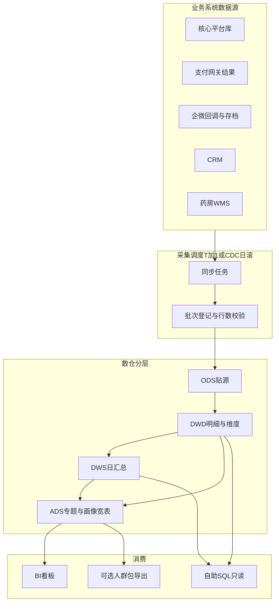
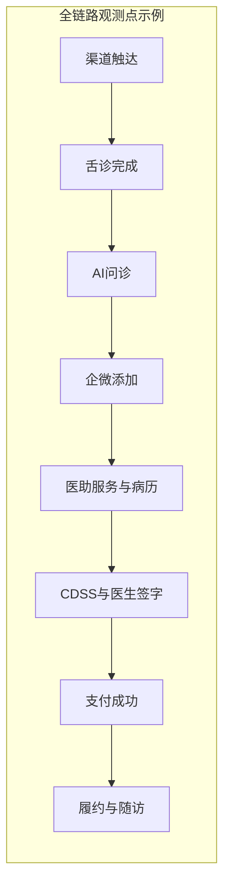
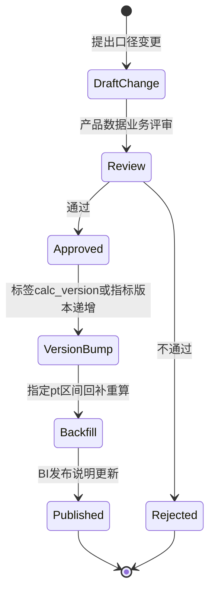
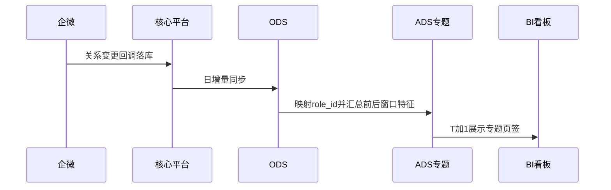

# 数据中台与BI看板业务流程说明

> **文档类型**：业务流程（配合PRD）  
> **版本**：V1.0  
> **创建日期**：2026-05-14  
> **关联文档**：[PRD.md](./PRD.md)、[field-list.md](./field-list.md)、[analysis/data-platform/](../../analysis/data-platform/README.md)

---

## 1. 结论

数据中台与BI的**主流程**是「多源数据→入ODS→DWD整合→DWS汇总→ADS专题→T+1看板/自助分析」，与**业务交易主流程**（舌诊→加微→问诊→开方→支付）为**观测关系**：业务系统产生事实，数仓T+1沉淀指标与标签，运营侧基于看板决策。

---

## 2. 主流程：数据中台端到端（As-Is目标态）

### 2.1 关键节点说明

| 节点编号 | 节点名称 | 触发条件 | 处理逻辑 | 输出 | 异常处理 |
|----------|----------|----------|----------|------|----------|
| N01 | 批次启动 | 调度到达T+1窗口 | 生成`batch_id`，记录水位 | `ods_batch_log` | 上游未就绪则延迟重试并告警 |
| N02 | ODS装载 | N01成功 | CDC/增量抽取写入ODS分区`pt` | 贴源表 | 行数异常触发对账工单 |
| N03 | DWD整合 | ODS分区就绪 | 清洗关联，统一主键与时间 | 事实维表 | 主键缺失进入质量表 |
| N04 | DWS汇总 | DWD就绪 | 按业务日聚合漏斗与GMV | 汇总表 | 分区空跑阻断下游并告警 |
| N05 | 标签计算 | DWD就绪 | 规则/模型产出标签长表 | `dwd_fact_tag_instance_di` | 单标签失败可降级为NULL并记录 |
| N06 | 画像与专题 | N04+N05完成 | 透视宽表、生成ADS专题 | `ads_role_profile_wide_1d`等 | 映射失败进入人工复核队列 |
| N07 | BI刷新 | ADS/DWS分区就绪 | BI数据集绑定`max(pt)` | 看板数据集更新 | 失败回滚展示昨日并提示 |
| N08 | 自助取数 | 分析师查询 | 仅允许脱敏视图与分区裁剪 | 查询结果/导出审批单 | 越权拒绝并审计 |

---

## 3. 业务主流程与数据观测点映射（业务视角）

下列节点与[4. 核心业务流程详解.md](../../context/公司业务信息/4.%20核心业务流程详解.md)对齐，标出**漏斗/标签**常用观测点（非全量字段级）。

| 业务阶段 | 数据观测点（示例） | 备注 |
|----------|--------------------|------|
| 渠道触达 | 落地访问/舌诊创建 | 缺埋点时漏斗起点需评审 |
| 舌诊/AI问诊 | `role_id`级舌诊与问诊事实 | |
| 企微添加 | `user.first_contact_at`、企微回调 | 私域沉淀关键步 |
| 医助服务 | 对话线程、响应时长、阶段状态机 | 服务阶段标签输入 |
| 诊疗与签字 | 病历完成、处方签字时间 | |
| 支付 | `order.paid_at`、`paid_amount` | GMV与转化终态 |
| 履约与随访 | WMS事件、随访满意度 | 体验与复购分析 |

---

## 4. 子流程：口径变更（逆向/治理）

| 流转 | 触发条件 | 操作角色 |
|------|----------|----------|
| DraftChange→Review | 漏斗定义/标签规则/归因规则变化 | 产品发起 |
| Review→Approved | 三方签字（产品、业务、数据） | 评审会 |
| Backfill→Published | 任务成功且抽样对账通过 | 数据工程 |

---

## 5. 子流程：拉黑医助专题（业务关注点）

**说明**：映射规则（`user_id`事件→`role_id`）以PRD规则R04及指标字典评审为准。

---

## 6. 异常场景清单

| 场景 | 现象 | 处理 |
|------|------|------|
| E01 | 上游延迟导致`pt`空分区 | 阻断发布，展示昨日数据并顶部横幅提示 |
| E02 | 对账差异超阈值 | 质量告警+数据工单，禁止发布新口径卡片 |
| E03 | 导出超量 | 拦截并要求走审批与水印导出 |
| E04 | BI权限配置错误 | 紧急回滚权限集并审计日志追责 |

---

## 7. 修订记录

| 版本 | 日期 | 修订内容 | 修订人 |
|------|------|----------|--------|
| V1.0 | 2026-05-14 | 初版 | 产品 |
