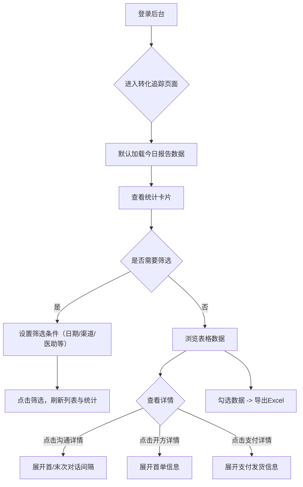

```markdown
# 产品需求文档（PRD）- 用户转化追踪明细表 V1.0

| 文档版本 | 修改日期 | 修改人 | 修改内容 |
| :--- | :--- | :--- | :--- |
| V1.0 | 2026-05-27 | PM | 初始版本，基于可交互Demo定稿 |

## 1. 项目背景与目标
### 1.1 背景
当前业务需要跟踪用户从“添加企微医助” → “沟通” → “开方” → “支付成交”的全流程转化数据。管理人员需要在一个页面上查看所有原始明细，并能够按多种维度筛选，以定位不同渠道、医助的转化效率。

### 1.2 目标
1.  **数据透明**：展示所有添加医助的用户明细，包含线索、沟通、成交三大模块的全部字段。
2.  **高效筛选**：提供基于时间、渠道、医助、状态等多维度筛选，支持快捷日期切换。
3.  **高效浏览**：支持表格横向滚动、分页，关键字段合并展示，次要详情折叠。
4.  **数据导出**：支持将筛选后的数据导出为 Excel 文件。

## 2. 业务流程图（用户视角）


## 3. 功能范围（Scope）
### 3.1 包含功能
-   统计卡片（5个核心指标）
-   多维度筛选器（含快捷日期）
-   数据明细表（15列，含三级折叠详情）
-   Excel 数据导出
-   分页

### 3.2 不包含（V1.0）
-   图表可视化（趋势图、占比图）
-   用户画像弹窗
-   批量操作（批量删除/批量备注）
-   自定义列显示/隐藏

## 4. 详细功能需求

### 4.1 页面布局
采用“上-中-下”三段式布局：
-   **顶部**：筛选条件区域
-   **中部**：5个统计卡片
-   **下部**：数据明细表格 + 分页组件

### 4.2 筛选器
| 筛选项 | 控件类型 | 数据源/规则 | 说明 |
| :--- | :--- | :--- | :--- |
| **时间快捷** | 按钮组 | 今日/昨日/近7天/近30天 | 默认选中“今日”，基于**报告时间**筛选 |
| **报告日期起止** | 日期选择器 | - | 联动快捷按钮，支持自定义区间 |
| **所属渠道** | 下拉单选 | 动态读取 | 联动“子渠道” |
| **子渠道** | 下拉单选 | 根据所选渠道加载 | 渠道变更时重置选项 |
| **所属团队** | 下拉单选 | B组 / ... | 原“业务组”字段 |
| **医助名** | 文本输入 | 模糊匹配 | 支持输入医助姓名/账号进行搜索 |
| **响应状态** | 下拉单选 | 优/良/差 | 根据首末次响应秒数计算 |
| **开方状态** | 下拉单选 | 已开方/未开方 | 根据首单编号是否为空判断 |
| **成交状态** | 下拉单选 | 已成交/未成交 | 根据支付时间是否为空判断 |
| **昵称/编号** | 文本输入 | 模糊匹配 | 支持患者微信名/编号搜索 |

**交互逻辑**：
-   任何筛选条件变化后，需点击“筛选”按钮生效。
-   “重置”按钮将清空所有筛选条件并恢复默认（今日数据）。

### 4.3 统计卡片
| 卡片名称 | 计算口径 | 说明 |
| :--- | :--- | :--- |
| 添加用户数 | 筛选范围内去重用户总数 | - |
| 已开口用户 | 筛选范围内客户对话数 > 0 的用户数 | 原名“已沟通用户” |
| 已开方用户 | 筛选范围内首单编号非空的用户数 | - |
| 成交用户数 | 筛选范围内支付时间非空的用户数 | - |
| 总成交金额 | 筛选范围内首单金额之和 | 单位：元 |

### 4.4 数据明细表
#### 4.4.1 表头结构
表格共 **15列**，分为三大区块，支持横向滚动。

| 区块 | 列名 | 字段来源 | 展示规则 |
| :--- | :--- | :--- | :--- |
| **选择** | ☑️ | - | 多选框 |
| **线索信息** | 患者(编号/昵称) | 微信名 + 编号 | 昵称主显示，编号副显示 |
| | 医助(名/账号) | 医助名 + 账号 | 姓名主显示，账号副显示 |
| | 所属团队 | 所属业务组 | - |
| | 渠道 | 所属渠道 | - |
| | 子渠道 | 子渠道 | - |
| | 报告时间 | 报告时间 | 用于时间筛选 |
| | 加粉时间 / 状态标识 | 加粉时间、是否删除、重复添加 | 上行加粉时间，下行状态(正常/重复添加/已删除) |
| **沟通信息** | 客户对话数 | 客户对话数 | - |
| | 医助回复数 | 医助对话数 | - |
| | 图片数 | 客户图片数 | - |
| | 响应状态/沟通详情 | 响应状态 + 折叠按钮 | 显示“优/良/差”徽章，右侧按钮点击展开详情 |
| **成交信息** | 开方状态/开方详情 | 是否开方 + 详情按钮 | 显示“已开方/未开方”，点击按钮展开首单详情 |
| | 成交状态/支付详情 | 是否成交 + 详情按钮 | 显示“已成交/未支付/未开方”，点击按钮展开支付详情 |

#### 4.4.2 折叠详情内容
-   **沟通详情**：客户首次对话时间、医助首次对话时间、首轮间隔(秒)、客户末次对话时间、医助末次对话时间、末次间隔(秒)。
-   **开方详情**：首单编号、开单医生、首单金额、首单创建时间。
-   **支付详情**：首单支付时间、物流发货时间、进线成交天数。

#### 4.4.3 状态判定规则
| 状态名称 | 判定逻辑 | 前端样式 |
| :--- | :--- | :--- |
| 响应状态(优) | 首轮间隔 ≤ 60秒 且 末次间隔 ≤ 60秒 | 绿色徽章 |
| 响应状态(良) | 首轮间隔 ≤ 300秒 且 末次间隔 ≤ 300秒 | 黄色徽章 |
| 响应状态(差) | 不满足以上条件 | 红色徽章 |
| 开方状态 | 首单编号不为空 -> 已开方 | 文本 |
| 成交状态 | 首单支付时间不为空 -> 已成交 | 文本 |
| 加粉状态 | 是否删除=是 -> 已删除；重复添加=是 -> 重复添加；否则正常 | 文本（红/黄/绿） |

### 4.5 分页
-   每页显示 **10** 条数据。
-   支持“上一页”、“下一页”按钮翻页。
-   显示当前页/总页数。

### 4.6 数据导出
-   **触发**：点击“导出Excel”按钮。
-   **范围**：导出当前筛选条件下的**全部数据**（不分页）。
-   **格式**：`.xlsx` (Excel) 文件。
-   **字段**：包含原始数据表中所有字段（共25列，含是否删除/重复添加等）。

## 5. 非功能需求
### 5.1 性能要求
-   首屏加载时间 < 1.5秒（按1000条数据模拟）。
-   筛选、导出操作响应时间 < 2秒。

### 5.2 兼容性
-   支持 Chrome 90+、Edge 90+ 浏览器。
-   表格宽度 > 1300px 时需出现横向滚动条。

### 5.3 数据口径
-   所有统计与明细均基于 **报告时间** 进行主维度筛选（而非加粉时间）。

## 6. 数据字段映射表（供后端/开发）
| 前端展示字段 | 后端字段名 | 数据类型 | 备注 |
| :--- | :--- | :--- | :--- |
| 患者微信编号 | patient_wx_id | string | - |
| 患者微信名 | patient_nickname | string | - |
| 医助名 | doctor_name | string | - |
| 医助账号 | doctor_account | string | - |
| 所属业务组 | doctor_group | string | 展示为“所属团队” |
| 所属渠道 | channel_lv1 | string | - |
| 子渠道 | channel_lv2 | string | - |
| 报告时间 | report_time | datetime | 筛选主键 |
| 加粉时间 | add_time | datetime | - |
| 是否删除 | is_deleted | bool | 是/否 |
| 重复添加 | is_duplicate | bool | 是/否 |
| 客户对话数 | customer_msg_cnt | int | - |
| 医助对话数 | doctor_msg_cnt | int | - |
| 客户图片数 | customer_img_cnt | int | - |
| 客户首次对话时间 | first_customer_msg_time | datetime | - |
| 医助首次对话时间 | first_doctor_msg_time | datetime | - |
| 首轮间隔/秒 | first_response_gap | int | 单位：秒 |
| 客户末次对话时间 | last_customer_msg_time | datetime | - |
| 医助末次对话时间 | last_doctor_msg_time | datetime | - |
| 末次间隔/秒 | last_response_gap | int | 单位：秒 |
| 首单编号 | first_order_id | string | - |
| 开单医生 | prescribing_doctor | string | - |
| 首单金额 | first_order_amount | decimal(10,2) | - |
| 首单创建时间 | first_order_create_time | datetime | - |
| 首单支付时间 | first_order_pay_time | datetime | - |
| 物流发货时间 | delivery_time | datetime | - |
| 进线成交天数 | conversion_days | int | - |

## 7. 附录：Demo 交互补充说明
1.  **响应状态计算逻辑**：
    ```javascript
    if (first_gap <= 60 && last_gap <= 60) return "优";
    if (first_gap <= 300 && last_gap <= 300) return "良";
    return "差";
    ```
2.  **加粉状态优先级**：已删除 > 重复添加 > 正常。
3.  **医助搜索**：同时匹配 `医助名` 和 `医助账号` 字段，支持模糊搜索。
```