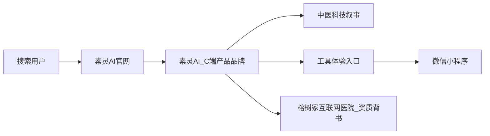
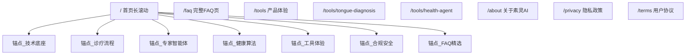
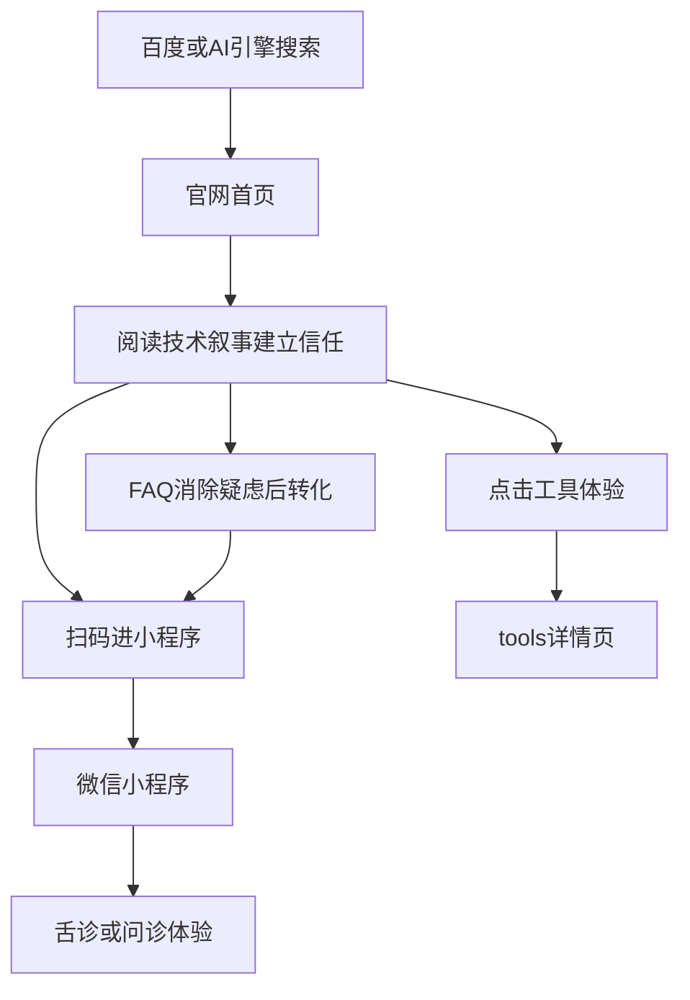

# 素灵AI 官网信息架构与模块内容规划（V2）

> 本版变更：① 响应式自适应（PC + 移动端并重）；② 对齐 GEO/SEO 行业规范三支柱；③ 融合 [素灵官网PLAN_冯老师.md](prds/官网/素灵官网PLAN_冯老师.md) 中医科技专业叙事。

---

## 一、产品定位与核心策略

### 1.1 用户画像与搜索意图

| 维度 | 说明 |
|------|------|
| 来源 | 百度大搜 + AI 引擎（ChatGPT、DeepSeek、Kimi、Perplexity 等） |
| 关键词 | 「素灵AI」「素灵AI 是什么」「素灵AI 舌诊」「AI 中医」等 |
| 意图分层 | **品牌认知** → **专业可信度判断** → **工具体验/扫码转化** |
| 设备 | **PC 与移动端并重**（百度移动占比高，但 PC 搜索与 AI 引擎引用场景不可忽视） |
| 核心痛点 | 无官网 → 流量被百度/第三方截留 → 品牌无法沉淀用户 |

### 1.2 品牌关系（已确认）



- **前台主品牌**：素灵AI
- **专业定位**：以人工智能重构中医科技（参考冯老师方案）
- **信任锚点**：成都青羊榕树家互联网医院（机构背书，弱化个人医生形象）
- **转化终点**：微信小程序二维码 + H5 工具体验深链

### 1.3 双目标 + 内容边界

| 目标 | 设计手段 |
|------|----------|
| 人看（专业+信任+转化） | 中医科技叙事建立专业感；首屏/侧栏可见二维码；明确「AI 辅助 + 医师复核」 |
| 机器看（GEO/SEO） | 三支柱技术配置 + 答案优先内容结构 + 实体 Schema |

**内容边界（必须遵守，来自冯老师方案）**：

- ✅ 只介绍素灵AI 的中医科技能力、合规与服务
- ❌ 禁止出现：融资、估值、营收、盈利、商业模式、市场规模、转化率、获客、供应链商业闭环、价格策略、增长计划

---

## 二、响应式布局策略（PC + 移动端）

### 2.1 设计原则：自适应，非「仅移动端」

| 断点 | 宽度 | 布局策略 |
|------|------|----------|
| Mobile | < 768px | 单列纵向；二维码居中；汉堡菜单 |
| Tablet | 768–1279px | 双列卡片；Hero 可上下分块 |
| Desktop | ≥ 1280px | Hero 左文右码；技术模块 2×2 或 3 列网格；固定顶栏 |

### 2.2 全局框架（PC vs Mobile）

**Desktop（≥1280px）**

```
┌──────────────────────────────────────────────────────────────┐
│ 顶栏：Logo | 锚点导航（技术/流程/产品/合规/FAQ）| [微信体验]   │
├──────────────────────────────────────────────────────────────┤
│ Hero 双栏：左 60% 标题+实体定义+CTA  |  右 40% 二维码+信任条  │
├──────────────────────────────────────────────────────────────┤
│ 技术底座（4 列卡片）                                          │
├──────────────────────────────────────────────────────────────┤
│ 多模态诊疗流程（横向步骤条 / 时间轴）                          │
├────────────────────────────┬─────────────────────────────────┤
│ 专家智能体（左）            │ 全周期健康算法（右）              │
├────────────────────────────┴─────────────────────────────────┤
│ 工具体验入口（3 列卡片）                                      │
├──────────────────────────────────────────────────────────────┤
│ 合规安全 | FAQ 双栏 | Footer                                  │
└──────────────────────────────────────────────────────────────┘
```

**Mobile（<768px）**

- 单列纵向滚动；锚点导航收至汉堡菜单
- Hero：Three.js 全屏背景 + 文字叠层（无卡片遮挡）；二维码紧随 CTA 下方
- 各模块改为单列卡片栈；CTA 热区 ≥ 44px

### 2.3 视觉与动效（参考冯老师方案）

- **风格**：Apple / SpaceX 级科技感；黑场首屏、渐变发光、电路几何元素
- **首屏**：Three.js 全屏 3D 流体/粒子背景（React + Vite 实现）
- **滚动动效**：区块淡入、发光路径、轻微视差
- **无障碍**：`prefers-reduced-motion` 下降级为静态或低频动画
- **品牌标识**：暂无正式 Logo 时，使用「抽象几何科技标识 + 素灵AI」文字组合

### 2.4 技术交付形态

- **框架**：React + Vite，中文内容，配置数据驱动（`navItems`、`techPillars`、`diagnosisSteps` 等）
- **首版范围**：静态展示 + 前端动效；无后端 API、无登录、无真实问诊功能
- **子路由**：首页长滚动 + 独立 SEO 页（`/faq`、`/tools/*`、`/privacy`）采用 SSG/多路由

---

## 三、站点地图（IA）

采用 **「首页长滚动 + SEO 独立子页」** 混合架构：



**全局 Header**

- 锚点：技术底座 | 诊疗流程 | 产品体验 | 合规安全 | 常见问题
- 右侧 CTA：**「微信体验」**（PC 悬停展示二维码弹层；Mobile 锚点跳转）

---

## 四、首页模块拆解（专业叙事 + 转化）

共 **10 个模块**，内容融合冯老师方案的专业结构与原有转化目标。

### 模块 1：Hero 首屏

| 元素 | 内容 |
|------|------|
| 主标题 | **以人工智能重构中医科技** |
| 副标题 | 素灵AI — 融合中医语义系统、知识图谱与多模态识别的智能健康平台 |
| 实体定义段（GEO 核心，50–80 字） | 素灵AI 是面向消费者的 AI 中医健康产品品牌，基于中医语义系统与多模态识别技术，提供舌象分析、智能问诊与辨证辅助服务；关键诊疗环节保留执业医师复核，由成都青羊榕树家互联网医院提供合规保障。 |
| 主 CTA | 「微信扫一扫，立即体验」+ 小程序二维码 |
| 次 CTA | 「了解技术底座 ↓」「体验 AI 工具 →」 |
| 视觉 | Three.js 全屏背景，文字直接叠在场景上，不放卡片 |

**PC**：左文右码双栏；**Mobile**：全屏背景 + 二维码紧随 CTA

---

### 模块 2：技术底座（Tech Pillars）

**目标**：面向大众与专业人士，建立技术可信度

| 支柱 | 标题 | 内容要点 |
|------|------|----------|
| P1 | 中医语义系统 | 面向中医领域的语义理解与术语标准化，支撑问诊、辨证等场景的结构化表达 |
| P2 | 中医知识图谱 | 融合经典理论与临床知识的关系网络，为 AI 推理提供可解释的知识基础 |
| P3 | 多模态识别 | 舌象图像、语音问诊、文本病历等多源信息的联合感知与分析 |
| P4 | 隐私计算与数据安全 | 健康数据加密传输与存储，遵循医疗数据合规要求 |

**布局**：Desktop 4 列；Tablet 2×2；Mobile 单列

---

### 模块 3：多模态诊疗流程（Diagnosis Pipeline）

**目标**：展示完整 AI 辅助诊疗链路，强调「医师复核」

| 步骤 | 名称 | 说明 |
|------|------|------|
| 1 | 舌象采集 | 标准化拍摄引导，提取舌色、苔质、舌形等特征 |
| 2 | 问诊语音转写 | 多轮对话采集症状信息，语音/文字双通道 |
| 3 | 病历信息抽取 | 从对话中结构化提取主诉、现病史、既往史等 |
| 4 | 辨证辅助 | 基于知识图谱与多模态数据的辨证推理与报告生成 |
| 5 | 医师复核 | 执业医师审核关键诊疗环节，全程留痕 |

**布局**：Desktop 横向步骤条/时间轴；Mobile 纵向卡片

**Schema**：输出 `HowTo` JSON-LD（5 步流程）

---

### 模块 4：专家智能体（Expert Agents）

**目标**：展示专业深度，非个人医生营销

| 元素 | 内容 |
|------|------|
| 标题 | 专家智能体 — 名医辨证思路的结构化沉淀 |
| 正文 | 将资深中医师的辨证逻辑、经验方义与临证要点进行结构化建模，形成可复用、可校准的智能体能力；持续通过临床反馈迭代优化 |
| 表达原则 | 强调「思路沉淀」「结构化」「持续校准」；不出现具体医生头像/姓名/「专家坐诊」 |

---

### 模块 5：全周期健康算法（Health Algorithms）

| 能力 | 说明 |
|------|------|
| 体质辨识 | 基于舌象与问诊数据的体质倾向分析 |
| 慢病管理 | 长期健康指标跟踪与趋势提醒 |
| 随访调衡 | 用药/调理过程中的动态评估与方案调整建议 |
| 治未病 | 健康风险预警与生活方式干预方向 |

---

### 模块 6：工具体验入口（转化核心）

| 工具 | 标题 | 描述 | CTA |
|------|------|------|-----|
| AI 舌诊 | 素灵AI 舌诊 | 拍一张舌头照片，获取 AI 舌诊分析报告 | 立即体验 → `/tools/tongue-diagnosis` |
| AI 问诊 | 素灵AI 健康问诊 | 描述症状，AI 助手 7×24 初步分析 | 立即体验 → `/tools/health-agent` |
| 更多工具 | 即将上线 | 体质辨识、健康自测等持续更新 | 敬请期待 |

**PC**：3 列卡片 + 右侧固定二维码侧栏（可选 sticky）；**Mobile**：单列 + Footer 二次曝光

---

### 模块 7：合规安全（Compliance）

| 区块 | 内容 |
|------|------|
| 医师审核 | 关键诊疗环节保留执业医师复核，非纯 AI 自动决策 |
| 诊疗留痕 | 问诊、分析、复核全流程可追溯 |
| 数据安全 | 健康数据加密传输与存储，不对外出售用户数据 |
| 医疗合规 | 成都青羊榕树家互联网医院资质；卫健委备案可查 |
| AI 边界 | AI 分析结果仅供参考，不能替代专业医疗诊断；如有不适请及时就医 |
| 资质信息 | 医疗机构执业许可证编号、统一社会信用代码（外链卫健委查询） |

**禁止项**：医生个人头像/姓名/职称、「专家坐诊」

---

### 模块 8：品牌与机构关系（About Teaser）

| 元素 | 内容 |
|------|------|
| 标题 | 关于素灵AI |
| 正文 | 素灵AI 是榕树家旗下专注「AI + 中医科技」的消费级产品品牌。我们以中医语义系统、知识图谱与多模态识别为底座，让专业、可解释、合规的 AI 健康服务触手可及。 |
| 链接 | 「了解更多 →」`/about` |

---

### 模块 9：FAQ 精选（GEO 最高 ROI 模块）

首页展示 6 条，完整版见 `/faq`。每条答案 **40–60 字**，首句直接回答，可独立引用。

| 问题 | 答案要点 |
|------|----------|
| 素灵AI 是什么？ | AI 中医健康产品品牌，基于中医语义系统与多模态识别，提供舌诊与智能问诊，互联网医院合规背书 |
| 素灵AI 的核心技术是什么？ | 中医语义系统、知识图谱、多模态识别、隐私计算四大技术底座 |
| 素灵AI 如何保证诊疗安全？ | AI 辅助定位，关键环节执业医师复核，诊疗全程留痕 |
| 素灵AI 怎么用？ | 微信扫码进入小程序，或访问官网工具体验入口 |
| 素灵AI 和榕树家是什么关系？ | 素灵AI 是榕树家旗下产品品牌，医疗服务由榕树家互联网医院合规提供 |
| 使用素灵AI 安全吗？ | 数据加密存储，遵循医疗数据合规，详见隐私政策 |

**HTML 结构**：使用 `<dl>/<dt>/<dd>` 定义列表（行业规范：定义列表被 AI 引用率比纯段落高 30–40%）

**Schema**：`FAQPage` JSON-LD + `Speakable` 标记 `.answer-capsule` 段落

---

### 模块 10：Footer

- 导航 / 备案号 / 版权
- 二维码（PC 与 Mobile 均展示）
- 隐私政策 / 用户协议链接

---

## 五、子页面模块内容

### 5.1 `/tools` 与工具详情页

保持 V1 结构，文案对齐技术叙事：

- **舌诊页**：多模态识别能力、特征类型、使用步骤、注意事项、体验入口
- **问诊页**：中医语义系统支撑的多轮问诊、适用场景、合规声明、体验入口

### 5.2 `/about`

- 品牌定义与使命
- 品牌 ← 榕树家 ← 互联网医院 关系链
- 四大技术底座详述
- 合规与 AI 边界

### 5.3 `/faq`（GEO 内容库）

5 类共 25–35 问：品牌与产品 / 技术能力 / AI 舌诊 / AI 问诊 / 合规与隐私

**写作规范（行业规范）**：

- H2 用问句格式（匹配 AI 查询模式）
- 每个 H2 下首段为 **answer-capsule**（40–60 字自给自足段落）
- 首次出现概念即给出定义
- 禁止代词指代（「它」「上述」），每条答案可独立被 AI 摘录

### 5.4 `/privacy`、`/terms`

合规页为 GEO 信任信号，需含 AI 辅助定位与数据安全条款。

---

## 六、GEO / SEO 标准规范（对齐易研研究院蓝皮书）

> 参考来源：**易研研究院《AI时代网站建设 GEO+SEO 标准规范蓝皮书》**（2025年10月）。蓝皮书核心观点：SEO 与 GEO 是**双路径协同**——SEO 负责「排名→点击→转化」，GEO 负责「内容权威→AI 信任→品牌嵌入 AI 答案」；两者协同可实现全域触达提升与品牌搜索量增长。

### 6.0 蓝皮书六章体系 → 素灵AI 落地映射

| 蓝皮书章节 | 素灵AI 官网落地 |
|-----------|----------------|
| 一、AI 搜索变革数据洞察 | 明确双路径目标：百度品牌词收录 + AI 引擎「素灵AI 是什么」零位引用 |
| 二、技术架构标准体系 | 性能指标、TDK、Schema、AI 爬虫配置（本章 6.1–6.4） |
| 三、内容策略体系 | 四类意图内容 + 质量评分 + 语义 HTML（本章 6.5） |
| 四、权威建立与信任体系 | E-E-A-T + 机构合规 + 数据透明（合规模块） |
| 五、监测分析与优化体系 | GEO/SEO 双指标看板（本章 6.7） |
| 六、行业实施指南 | 三阶段路线图 + 30 天启动计划（本章 6.8） |

### 6.1 技术架构：核心性能指标（蓝皮书 §2.1）

| 指标 | 目标值 | 素灵AI 注意事项 |
|------|--------|----------------|
| LCP（最大内容绘制） | < 2.5s | Three.js 首屏异步加载，不阻塞 LCP 元素 |
| FID（首次输入延迟） | < 100ms | 减少首屏 JS 体积；Vite 代码分割 |
| CLS（累积布局偏移） | < 0.1 | 图片/二维码预留 width/height；字体 fallback |
| TTFB（首字节时间） | < 0.8s | CDN 静态部署；SSG 预渲染 |

实现要点：`loading="lazy"` 非首屏图、`fetchpriority="high"` 给 Logo/二维码、PerformanceObserver 监控 LCP。

### 6.2 技术架构：TDK 标准化体系（蓝皮书 §2.2）

**Title 模板（按页面类型）**：

| 页面类型 | 模板 | 素灵AI 示例 |
|----------|------|-------------|
| 首页 | 品牌名 - 核心业务定位 \| 独特价值主张 | 素灵AI - 以人工智能重构中医科技 \| AI舌诊·智能问诊 |
| 产品/工具页 | 产品名+核心功能 - 关键参数 \| 品牌名 | 素灵AI舌诊 - 多模态舌象AI分析 \| 素灵AI |
| 内容/FAQ页 | 问题解决方案 - 深度内容定位 \| 品牌专业领域 | 素灵AI常见问题 - 是什么/怎么用/安全吗 \| 素灵AI |
| 分类页 | 类别名 - 产品/服务范围 \| 品牌名 | 产品体验 - AI中医健康工具 \| 素灵AI |

**Description 公式**：`[痛点解决] + [核心功能] + [权威背书] + [行动号召]`

> 示例：想了解 AI 中医健康服务但找不到官方入口？（痛点）素灵AI 提供 AI 舌诊与智能问诊，（功能）由成都青羊榕树家互联网医院合规背书，（权威）微信扫码立即体验。（号召）

**Keywords 布局**：品牌词（素灵AI）+ 产品功能词（AI舌诊/智能问诊）+ 解决方案词（中医AI/体质辨识）+ 长尾需求词（素灵AI是什么/素灵AI怎么用）

### 6.3 技术架构：结构化数据（蓝皮书 §2.3）

#### JSON-LD Schema 优先级矩阵

| Schema 类型 | 优先级 | 部署位置 |
|-------------|--------|----------|
| `FAQPage` | P0 最高 | 首页 FAQ 区 + `/faq`（蓝皮书：AI 引用率最高 Schema 类型） |
| `Organization` | P0 | 首页 + `/about`（含 parentOrganization、sameAs） |
| `MedicalOrganization` | P0 | 合规模块（互联网医院实体） |
| `SoftwareApplication` | P0 | `/tools/*`（HealthApplication） |
| `HowTo` | P0 | 多模态诊疗流程模块 |
| `Article` + author/Person | P1 | 技术底座/关于页（E-E-A-T 作者实体，用机构团队非个人医生） |
| `WebSite` + SearchAction | P1 | 首页 |
| `BreadcrumbList` | P1 | 所有子页 |
| `Speakable` | P1 | 各模块 answer-capsule 段落 |
| `VideoObject` | P2 | 若后续增加产品演示视频 |

**质量要求**：属性完整（author、datePublished、dateModified、publisher）；不完整 Schema 的 AI 引用率显著低于完整 Schema。

#### 语义 HTML（蓝皮书 §3.3）

- 主内容 `<main>`；模块 `<section id="..." aria-labelledby>`
- 文章型内容 `<article>` + `<header>` + `<time datetime>`
- 定义型内容 `<dl>/<dt>/<dd>`；多媒体 `<figure>/<figcaption>` + 描述性 `alt`
- 关键段落 `class="answer-capsule speakable-intro"`

### 6.4 技术架构：AI 爬虫友好配置（蓝皮书 §2.4）

#### robots.txt

- 为 **14+ AI 爬虫** 显式配置 `Allow: /`：`GPTBot`、`OAI-SearchBot`、`ChatGPT-User`、`ClaudeBot`、`anthropic-ai`、`PerplexityBot`、`Google-Extended`、`Bingbot`、`Bytespider`（字节/DeepSeek 生态）等
- **百度搜索**：`Baiduspider`、`Baiduspider-mobile` 明确 Allow
- 区分训练爬虫 vs 搜索引用爬虫，按法务策略决策
- 末尾声明 `Sitemap: https://domain/sitemap.xml`

#### llms.txt（根目录，Markdown 格式）

按 [llmstxt.org](https://llmstxt.org) 规范：

1. `# 素灵AI`（H1，必填）
2. `>` blockquote：2–3 句品牌实体定义（AI 最常原文引用的段落）
3. 补充段落：技术定位、合规主体、内容边界
4. `## 核心页面`：8–12 条高权重 URL，每类不超过 12 条
5. `## Optional`：链至 `llms-full.txt`

#### llms-full.txt（P1）

- 核心页面全文 Markdown 合集，供 RAG 模式 LLM 检索
- 可选：各页提供 `/page-slug.md` 无导航噪声的纯净 Markdown 版

#### sitemap.xml

- 全站 URL + `<lastmod>` 日期
- 核心页面设置较高优先级

#### IndexNow（P1）

- 页面上线/更新时推送百度 IndexNow + Bing IndexNow，加速收录

### 6.5 内容策略体系（蓝皮书 §3）

#### 四类搜索意图 → 素灵AI 页面映射

| 意图类型 | 用户阶段 | 素灵AI 对应内容 |
|----------|----------|----------------|
| 信息型 | 认知阶段 | 技术底座、FAQ「是什么/核心技术」、关于页 |
| 导航型 | 考虑阶段 | 工具体验入口、产品对比（舌诊 vs 问诊） |
| 交易型 | 决策阶段 | 二维码转化、CTA「立即体验」 |
| 体验型 | 使用阶段 | 使用流程、注意事项、隐私政策 |

#### 内容质量评分体系（蓝皮书 §3.2，满分 100）

| 维度 | 分值 | 素灵AI 落地要求 |
|------|------|----------------|
| 技术深度 | 30 | 中医语义系统/知识图谱/多模态识别等术语准确、有原理说明 |
| 实用价值 | 30 | 解决「怎么用/能做什么/是否安全」等实际问题 |
| 可读体验 | 20 | 结构清晰、PC/Mobile 自适应、图文协调 |
| 权威可信 | 20 | 互联网医院背书、合规声明、数据透明、定期更新 |

#### 内容更新节奏（蓝皮书 §3.4）

| 频率 | 更新内容 |
|------|----------|
| 月度 | FAQ 补充新搜索词、工具页功能更新 |
| 季度 | 技术能力描述迭代、合规信息核查 |
| 按需 | 新工具上线时新增对应页面与 llms.txt 条目 |

### 6.6 权威与信任体系（蓝皮书 §4）

- **E-E-A-T**：Experience（200万+服务经验口径需法务确认）/ Expertise（四大技术底座）/ Authoritativeness（互联网医院资质）/ Trustworthiness（数据透明+AI边界声明）
- **机构化表达**：用 `Organization` + `MedicalOrganization` Schema 建立实体，不用个人医生营销
- **数据透明模块**：`<section class="data-transparency">` 列出健康数据采集目的、存储方式、共享策略（对齐隐私政策）

### 6.7 监测分析与优化（蓝皮书 §5）

#### GEO 核心指标

| 指标 | 定义 | 监测方式 |
|------|------|----------|
| AI 引用率 | 品牌/内容被 AI 引擎引用的频次 | 定期在 DeepSeek/Kimi/ChatGPT/百度AI+ 提问「素灵AI是什么」 |
| 零位答案 | AI 回答中是否直接呈现品牌信息 | 同上，记录是否被作为首选答案 |
| 品牌搜索量 | 「素灵AI」百度搜索指数变化 | 百度指数 / 站长平台 |

#### SEO 核心指标

| 指标 | 目标 |
|------|------|
| 品牌词排名 | 「素灵AI」官网百度自然排名第一 |
| Core Web Vitals | LCP/FID/CLS 全部达标 |
| 索引覆盖率 | sitemap 提交页面 100% 被收录 |

#### 转化指标

- 二维码曝光/长按、工具 CTA 点击（`?from=official_site`）

#### 推荐工具（蓝皮书附录）

- 免费：百度站长平台、PageSpeed Insights、Lighthouse、Rich Results Test
- 付费（可选）：SEMrush / Ahrefs 竞品词监控

#### 优化迭代节奏

| 周期 | 动作 |
|------|------|
| 每日 | 站点可用性、品牌词排名 |
| 每周 | 流量来源、FAQ 展开率、AI 引用抽检 |
| 每月 | 性能审计、内容质量评分、Schema 完整性检查 |
| 每季度 | GEO/SEO 策略复盘、FAQ 扩展规划 |

### 6.8 实施路线图（蓝皮书 §6）

#### 三阶段路线

| 阶段 | 周期 | 目标 |
|------|------|------|
| 第一阶段：基础构建 | 1–2 月 | 官网上线、TDK/Schema/llms.txt 部署、5–10 页核心内容、百度收录 |
| 第二阶段：体系扩展 | 3–6 月 | FAQ 扩展、内容专栏、多渠道分发（公众号/知乎等）、A/B 测试 Hero 文案 |
| 第三阶段：卓越运营 | 长期 | 与搜索结果过度页打通、AI 引用率持续优化、第三方权威引用 |

#### 30 天快速启动计划

| 周次 | 任务 |
|------|------|
| 第 1 周 | 技术诊断：域名/备案/性能基线；关键词矩阵（品牌词+功能词+长尾问句） |
| 第 2 周 | 定稿 TDK 标准、内容质量评分基准、Schema 模板 |
| 第 3 周 | 核心页 TDK 上线、JSON-LD 部署、robots.txt + llms.txt + sitemap |
| 第 4 周 | 百度站长验证与提交、AI 引用率首次抽检、性能达标验证 |

---

## 七、转化路径



---

## 八、MVP 范围与迭代

### MVP（第一版）

- 响应式首页 10 模块 + Three.js Hero（支持 reduced-motion 降级）
- `/faq`、`/tools/*`、`/about`、`/privacy`
- robots.txt + llms.txt + sitemap + 全站 JSON-LD
- 百度站长验证；配置驱动内容（React + Vite）
- 文案审计：无商业计划类内容；合规表达齐全

### V1.1（2–4 周）

- llms-full.txt + 页面 `.md` 纯净版
- IndexNow 自动推送
- FAQ 基于搜索词扩展；GEO 引用率抽检
- 「更多工具」真实入口上线

### V2

- 健康内容专栏（SEO 长尾 + GEO 知识库）
- 与 [搜索结果过度页](prds/搜索结果过度页/) 体系打通
- AI 搜索引擎专项优化（第三方引用矩阵）

---

## 九、待确认项

1. 正式 Logo / 品牌字体规范何时提供？
2. 互联网医院资质编号等对外公示字段
3. 域名与 ICP 备案主体
4. Three.js 首屏动效是否在 MVP 必做，还是 V1.1 增强？
5. 小程序正式名称是否与「素灵AI」一致

---

## 十、参考文档

- [素灵官网PLAN_冯老师.md](prds/官网/素灵官网PLAN_冯老师.md) — 中医科技内容、视觉风格、内容边界
- [搜索结果过度页规划](prds/搜索结果过度页/搜索结果过度页规划-6b159a.md) — 机构信任表达原则
- **易研研究院《AI时代网站建设 GEO+SEO 标准规范蓝皮书》**（2025年10月）— 本 plan 第六章对齐来源
