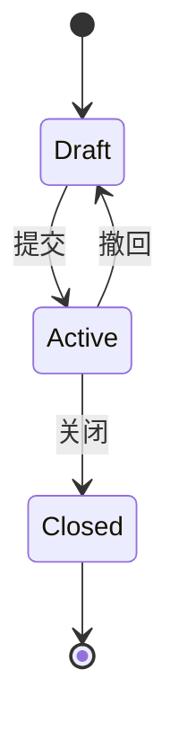

# PRD 文档模板（精简版）

> **文档类型**：PRD（产品需求文档）  
> **版本**：V1.0  
> **创建日期**：YYYY-MM-DD  
> **最后更新**：YYYY-MM-DD  
> **作者**：[作者名称]  
> **关联文档**：[原型链接] · [关联 PRD 链接]

> **使用说明**：本模板适用于小功能迭代、字段调整、规则优化等场景。带有「条件必填」标识的章节，仅在触发条件时需要补齐；未触发则写「无 / 不涉及」。

---

## 1. 需求背景与目标

### 1.1 业务背景

[描述业务背景，说明为什么需要这个功能]

| 问题 | 现状 | 影响 |
| ---- | ---- | ---- |
| [问题1] | [现状描述] | [业务影响] |
| [问题2] | [现状描述] | [业务影响] |

### 1.2 需求目标

| 目标编号 | 目标描述 | 衡量方式 |
| -------- | -------- | -------- |
| G01 | [目标描述] | [可量化指标] |
| G02 | [目标描述] | [可量化指标] |

### 1.3 需求范围

**包含**：

| 编号 | 功能名称 | 功能描述 | 优先级 |
| ---- | -------- | -------- | ------ |
| F01 | [功能名称] | [功能描述] | P0 |
| F02 | [功能名称] | [功能描述] | P1 |

**不包含**：

- [明确不包含的功能]

---

## 2. 角色与权限

### 2.1 角色定义

| 角色 | 说明 | 本页权限 |
| ---- | ---- | -------- |
| 管理员 | 系统管理员 | [权限说明] |
| 操作员 | 业务操作人员 | [权限说明] |
| 审核员 | 业务审核人员 | [权限说明] |

### 2.2 权限矩阵

| 操作 | 管理员 | 操作员 | 审核员 |
| ---- | ------ | ------ | ------ |
| 新增 | ✅ | ✅ | ❌ |
| 编辑 | ✅ | ✅（仅自己创建的） | ❌ |
| 删除 | ✅ | ✅（仅自己创建的） | ❌ |
| 查看 | ✅ | ✅ | ✅ |
| 审核 | ✅ | ❌ | ✅ |
| 导出 | ✅ | ✅ | ❌ |

---

## 3. 字段说明

> 无新增 / 变更字段时，写「沿用现状，无变更」。

### 3.1 主表字段

| 字段名 | 类型 | 必填 | 说明 |
| ------ | ---- | ---- | ---- |
| id | String | 是 | 唯一标识 |
| code | String | 是 | 编码，格式：XXX-YYYYMMDD-001 |
| name | String | 是 | 名称，最大长度 100 |
| status | Enum | 是 | 状态，见 3.3 枚举值定义 |

### 3.2 明细字段（如有）

| 字段名 | 类型 | 必填 | 说明 |
| ------ | ---- | ---- | ------ |
| itemId | String | 是 | 明细 ID |
| [其他字段] | [类型] | [必填] | [说明] |

### 3.3 枚举值定义

#### status（状态）

- Draft：草稿
- Active：生效
- Closed：关闭

---

## 4. 业务规则

| 规则编号 | 规则描述 | 适用场景 |
| -------- | -------- | -------- |
| R01 | [规则描述] | [适用场景] |
| R02 | [规则描述] | [适用场景] |

**详细说明**（复杂规则展开，简单规则可省略）：

### R01：[规则名称]

- **规则描述**：[详细描述规则内容]
- **适用场景**：[什么情况下应用此规则]
- **处理逻辑**：[如何处理]
- **示例**：[举例说明]

---

## 5. 状态与流转

> **条件必填**：涉及单据 / 流程状态时填写；纯查询 / 展示类页面写「无 / 不涉及」。

### 5.1 状态定义

| 状态值 | 状态名称 | 状态说明 |
| ------ | -------- | -------- |
| Draft | 草稿 | 初始状态 |
| Active | 生效 | 已生效状态 |
| Closed | 关闭 | 已关闭状态 |

### 5.2 状态流转图

### 5.3 流转条件说明

| 流转 | 触发条件 | 操作人权限 | 备注 |
| ---- | -------- | ---------- | ---- |
| Draft → Active | 数据验证通过 | 创建人 / 审核人 | 不可逆 |
| Active → Closed | 业务完成 | 管理员 | 不可逆 |

---

## 6. 页面与交互

### 6.1 页面结构

[简述页面布局，例如：筛选栏 → 统计卡片 → 数据列表 → 分页]

### 6.2 列表页

#### 6.2.1 筛选项

| 筛选项 | 类型 | 默认值 | 说明 |
| ------ | ---- | ------ | ---- |
| 编码 | 输入框 | — | 支持模糊搜索 |
| 状态 | 下拉单选 | 全部 | — |
| 创建时间 | 日期范围 | 近 7 天 | — |

#### 6.2.2 列表展示

| 列名 | 字段 | 格式 | 排序 |
| ---- | ---- | ---- | ---- |
| 编码 | code | 原样 | 支持 |
| 名称 | name | 原样 | 支持 |
| 状态 | status | Badge | — |
| 创建时间 | createdAt | YYYY-MM-DD HH:mm:ss | 支持 |

#### 6.2.3 操作按钮

| 操作 | 权限要求 | 状态限制 | 说明 |
| ---- | -------- | -------- | ---- |
| 新增 | [角色] | — | — |
| 编辑 | [角色] | 仅 Draft | — |
| 删除 | [角色] | 仅 Draft | — |
| 查看 | 无限制 | — | — |
| 导出 | [角色] | — | — |

### 6.3 详情页 / 表单页

#### 页面布局

**基础信息**：

- 编码
- 名称
- 状态

**业务信息**：

- [业务字段 1]
- [业务字段 2]

**明细列表**（如有）：

[表格展示]

**操作日志**（如有）：

[操作记录]

---

## 7. 异常处理

| 异常场景 | 触发条件 | 处理规则 | 提示信息 |
| -------- | -------- | -------- | -------- |
| 数据验证失败 | 必填项为空 | 阻止提交 | 请填写必填项：[字段名] |
| 并发冲突 | 同时编辑 | 后提交失败 | 数据已被他人修改，请刷新后重试 |
| 导出超时 | 数据量过大 | 异步导出 | 导出任务已提交，请稍后查看 |

---

## 8. 取消规则

> **条件必填**：涉及可取消单据时填写；否则写「无 / 不涉及」。

### 8.1 取消条件

- 状态为 [Draft / Active]
- 操作人有取消权限

### 8.2 取消影响

- 单据状态变更为 [Cancelled]
- 关联单据状态变更（如有）：[说明影响]
- 关联数据变更（如有）：[说明影响]

### 8.3 取消流程

1. 用户点击「取消」按钮
2. 系统验证取消条件
3. 系统更新单据状态
4. 系统处理关联影响
5. 返回操作结果

---

## 9. 关闭规则

> **条件必填**：涉及可关闭单据时填写；否则写「无 / 不涉及」。

### 9.1 关闭条件

- 状态为 [Active]
- 业务已完成
- 操作人有关闭权限

### 9.2 关闭影响

- 单据状态变更为 [Closed]
- 不可再编辑
- 不影响历史数据

---

## 10. 验收标准

| 编号 | 验收项 | 预期结果 |
| ---- | ------ | -------- |
| AC01 | [验收项] | [预期结果] |
| AC02 | [验收项] | [预期结果] |

---

## 附录

### A. 修订记录

| 版本 | 日期 | 修订内容 | 修订人 |
| ---- | ---- | -------- | ------ |
| V1.0 | YYYY-MM-DD | 初始版本 | [姓名] |

### B. 参考文档

- [相关 PRD 文档链接]
- [业务流程文档链接]
- [交互原型链接]
